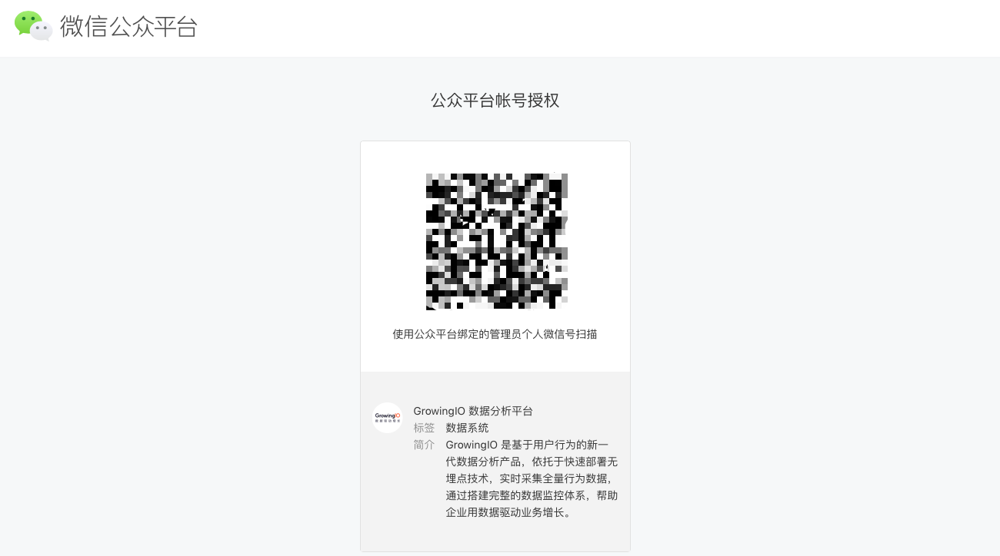
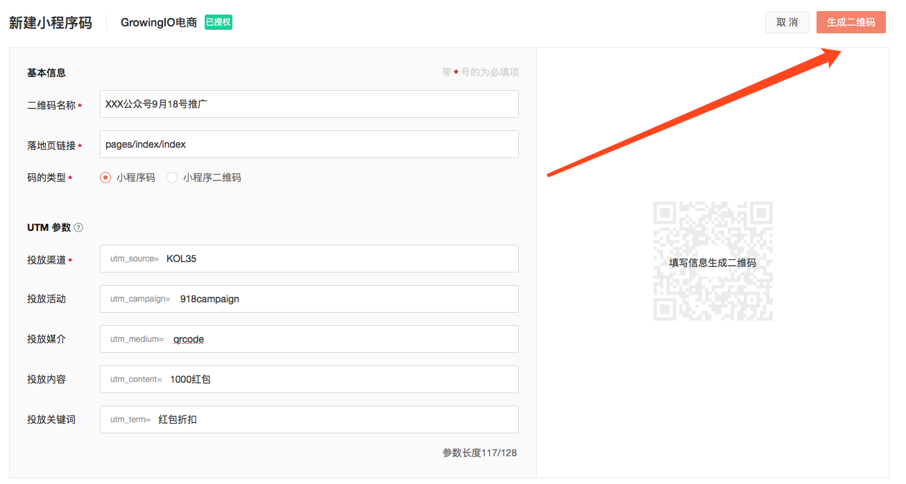
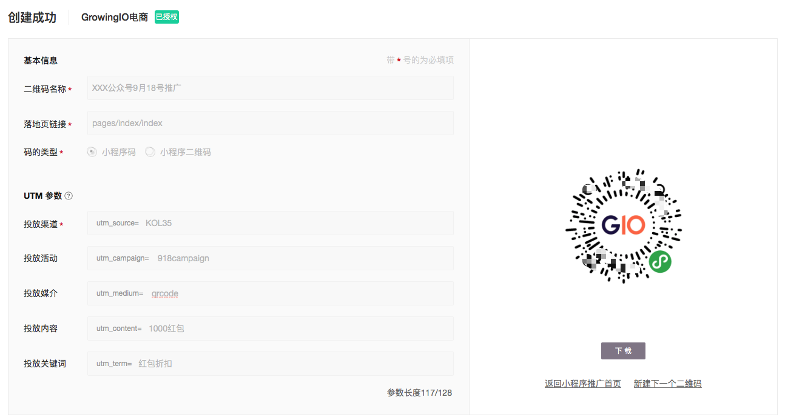
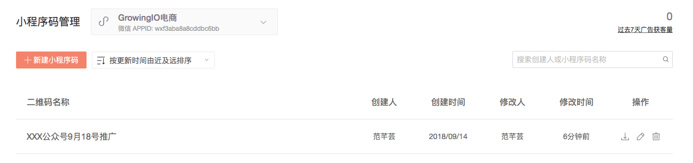
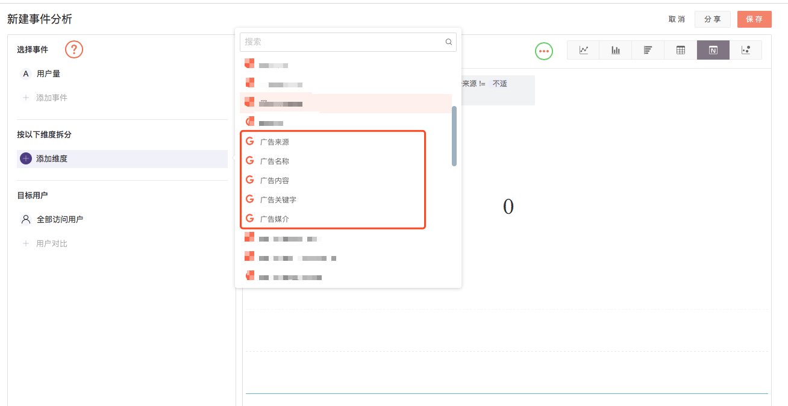
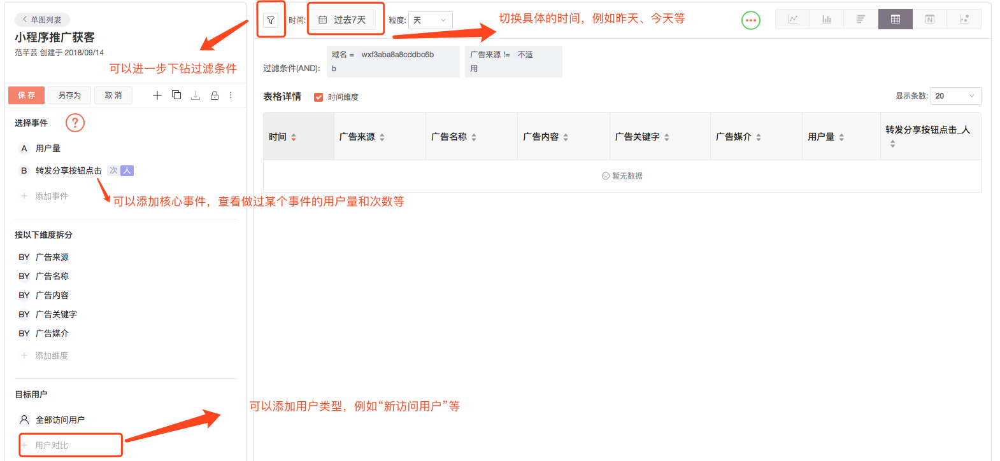
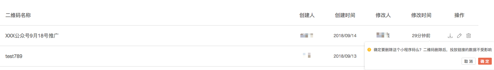

# 创建小程序的推广码

## 常见场景介绍

在小程序推广的常见场景下，市场和运营人员，有在其他公众号、合作渠道进行推广的需求。常见的手段有以下几种：1、在媒体、合作渠道等进行推广；2、利用其他小程序互相引流；3、进行微信广告平台的投放；4、进行线下场景的引流等。

其中1、2、4等场景，常见的推广手段之一，就是利用小程序码、或者二维码等，引导用户扫码打开小程序。

## 功能使用说明

点击导航栏“获客管理”，进入推广码创建 & 管理的功能。

### 第一步：进行小程序推广码创建的授权操作

在开始新建小程序码之前，**为了小程序账号安全的角度考虑，首先需要小程序推广码生成的授权操作**（如果您不是小程序的管理员，可以点击右上角“邀请”按钮，邀请小程序的管理员进入项目）；进入“获客管理"，点击 ”+立即新建“，再点击“前往微信授权”，即会进入微信公众平台账号授权页面，扫码，即可以完成授权。或者也可以在公众平台账号授权页面，请小程序管理员直接扫码，完成授权。

完成授权后，会显示“已授权”，接下来就可以进行二维码的创建工作。

### 第二步：创建推广码

例如需要在某个公众号生成某个活动的推广小程序码，推广内容是给用户1000元红包折扣，用户扫码后直接进入小程序首页；则建议可以按照如下方式进行填写后，点击右上角“生成码”。

  
创建成功后，可以直接下载码，进行推广使用。

注：腾讯对二维码参数中的字节长度进行了规范，最多128字节，故在填写时，需要注意参数长度。

### 第三步：管理推广码

如图，返回推广首页，即可以看到创建的二维码，在这个界面上，可以进行下载，修改二维码名称，和删除此二维码的操作。点击具体二维码，可以在侧边栏中查看具体的参数信息。

### 第四步：推广后，查看推广效果

点击右上角“过去7天广告获客量”，会自动跳转到新建事件分析页面，此页面展示了过去7天使用过UTM参数投放获客的用户量；想要进一步查看具体的投放细节，可以在“添加维度”中，选择广告几个维度，查看具体信息（维度值包含创建二维码填写的参数）。

保存此事件分析，可以调整事件分析的时间，进行下钻，还可以查看不同用户群，加入核心事件等。

**注意**：GrowingIO调用A和C接口生成小程序码和小程序二维码，腾讯支持调用A\C接口共生成10w个码。具体的生成接口、生成限制、以及开发者文档，请参考如下链接：[https://developers.weixin.qq.com/miniprogram/dev/framework/open-ability/qr-code.html](https://developers.weixin.qq.com/miniprogram/dev/framework/open-ability/qr-code.html)

## 其他功能说明

**删除二维码，仅仅是在GrowingIO平台上删除生成的码，不能再下载被使用；**如果二维码在投放中继续使用，也会持续收集新数据；已收集的数据也不会被删除。

