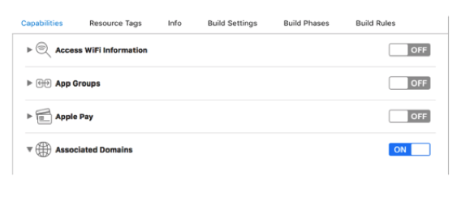
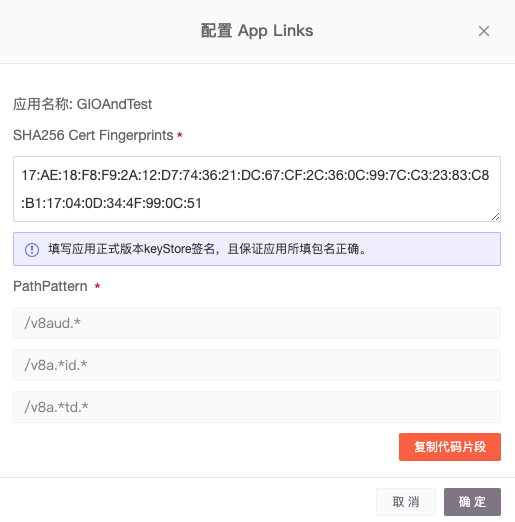

# 深度链接配置

* [深度链接配置入口](shen-du-lian-jie-pei-zhi.md#shen-du-lian-jie-pei-zhi-ru-kou)
* [iOS 应用配置](shen-du-lian-jie-pei-zhi.md#ios-ying-yong-pei-zhi)
  * [应用基本信息](shen-du-lian-jie-pei-zhi.md#ying-yong-ji-ben-xin-xi)
  * [Universal Links](shen-du-lian-jie-pei-zhi.md#universal-links)
* \*\*\*\*[Android 应用配置](shen-du-lian-jie-pei-zhi.md#android-ying-yong-pei-zhi)
  * [应用基本信息](shen-du-lian-jie-pei-zhi.md#ying-yong-ji-ben-xin-xi-1)
  * [App Links](shen-du-lian-jie-pei-zhi.md#applinks)
  * [配置应用宝下载](shen-du-lian-jie-pei-zhi.md#pei-zhi-ying-yong-bao-wei-xia-zai)
* [下载引导中间页](shen-du-lian-jie-pei-zhi.md#xia-zai-yin-dao-zhong-jian-ye)

### 

### 深度链接配置入口

在广告监测产品菜单栏下找到深度链接配置项，其中会展示当前项目下集成的所有移动端 App。


### iOS 应用配置


找到需要配置的 iOS 应用，查看当前应用的配置。其中将包含所有当前应用的全部 DeepLink 配置信息。

#### **应用基本信息**

其中包含当前应用的基本信息配置，如果您需要更改此处信息，请前往「应用管理」中进行更改。


#### 

#### Universal Links

Universal Links 是 Apple 在 iOS 系统中提供的原生方案，如果您希望在 DeepLink 流程中达成更好的跳转体验，需对此进行配置。

Universal Links 适用于 iOS 9 及以上的版本，当用户设备系统版本在 iOS 9 以下时，DeepLink 将会自动回落至 URL Scheme 方案进行跳转。


详细配置步骤：

**一、在您的 Xcode 中勾选如下功能**



**二、添加GIO域名到 Xcode**


注：添加至Domain的链接为：

```text
applinks:gio.ren
applinks:datayi.cn
```

（请注意该 Domain 链接内容的正确填写）

**三、在苹果开发者网站中找到 Team ID 与 Bundle ID**


**四、将 Team ID / Bundle ID 到 GrowingIO 后台,并勾选“我已完成Xcode配置，开启Universal Link跳转”，同时确认您的 SDK 版本并进行确认。**


### Android 应用配置


找到需要配置的 Android 应用，查看当前应用的配置。其中将包含所有当前应用的全部 DeepLink 配置信息。

#### **应用基本信息**

其中包含当前应用的基本信息配置，如果您需要更改此处信息，请前往「应用管理」中进行更改。


#### AppLinks

App Links 是 Google 在 Android 系统中提供的原生方案，如果您希望在 DeepLink 流程中达成更好的跳转体验，需对此进行配置。

App Links 适用于 Android 6.0 及以上的版本，当用户设备系统版本在 Android 6.0 以下时，DeepLink 将会自动回落至 URL Scheme 方案进行跳转。


详细配置步骤：

**一、获取应用签名 SHA256 指纹证书**

1.1 使用命令行进入你的证书目录，一般签名分为 debug keystore 和 release keystore ，开发期间建议先配置为 debug keystore ，上线前一定要更新为 release keystore 。如果担心忘记，建议新建应用。

1.2 执行以下命令 ：

```text
keytool -list -v -keystore my-release-key.keystore
```

1.3 执行后你将看到类似下面这样的结果，请复制下来并填写进 GrowingIO 对应的应用配置中。



**二、在 Manifest.xml 中配置 Intent Filter** 

2.1 点击「复制代码片段」

2.2 进入您的安卓应用源码中的 manifest.xml 文件中，找到您的主页面，建议复制在主页，即为 Launcher Activity 中。

2.3 复制完成后，您的 manifest.xml 文件将类似这样：

```markup
 <activity
            android:name=".LauncherActivity"
            android:launchMode="singleTop"
            android:theme="@style/AppTheme">
            <intent-filter>
                <action android:name="android.intent.action.MAIN" />

                <category android:name="android.intent.category.LAUNCHER" />
            </intent-filter>
            <intent-filter android:autoVerify="true">
                <action android:name="android.intent.action.VIEW" />

                <category android:name="android.intent.category.DEFAULT" />
                <category android:name="android.intent.category.BROWSABLE" />

                <data
                    android:host="gio.ren"
                    android:pathPattern="/v8aud.*"
                    android:scheme="https" />
                <data
                    android:host="gio.ren"
                    android:pathPattern="/v8a.*id.*"
                    android:scheme="https" />

                <data
                    android:host="gio.ren"
                    android:pathPattern="/v8a.*td.*"
                    android:scheme="https" />
                <data
                    android:host="datayi.cn"
                    android:pathPattern="/v8aud.*"
                    android:scheme="https" />


                <data
                    android:host="datayi.cn"
                    android:pathPattern="/v8a.*id.*"
                    android:scheme="https" />

                <data
                    android:host="datayi.cn"
                    android:pathPattern="/v8a.*td.*"
                    android:scheme="https" />
            </intent-filter>

        </activity>
```


* GrowingIO 暂不支持自定义 App Links 的 host，请不要修改复制的代码块中的 host；
* 不要尝试修改或者合并 GIO 的 intent filter ，[Google 官方解释](https://developer.android.com/training/app-links/deep-linking#adding-filters)。


**三、测试并验证您的 App Links** 

3.1 完成上述配置后，安装在手机上

3.2 执行以下命令：

```text
adb shell dumpsys package d
```

3.3 上述命令执行后的结果中，查找您应用的包名，只有 Status 为 always 才通过了系统校验。示例如下：

```text
  Package: com.growingio.android.test  
  Domains: datayi.cn gio.ren
  Status:  always
```


Domains 为 manifest.xml 文件中配置 Intent filter 中的 host , GIO 可能后续会更改广告的域名，一切以您复制得到的代码片段为准即可。


3.4 在 Callback 中接收自定义参数并跳转页面

在上文中，建议各位开发者将 GIO Intent Filter 代码块配置在 Launcher Activity 下，在用户点击短链后打开 App ，系统将自动跳转到 Launcher Activity ，此时 GIO DeepLink Callback 则会返回您在 GIO 官网广告监测中配置的自定义参数，此时您需要接收您的自定义参数，跳转到指定页面。

详见 [Android DeepLink CallBack 接收参数](https://docs.growingio.com/docs/sdk-integration/android-sdk/android-sdk#deep-link-hui-tiao-can-shu-huo-qu)文档。

#### 配置应用宝微下载

GrowingIO 提供跳转到应用宝微下载的功能，应用宝微下载为腾讯应用宝体系下的微下载链接。使用应用宝微下载，在微信等腾讯旗下软件中将转至微下载逻辑。

腾讯微下载介绍：[https://wiki.open.qq.com/index.php?title=mobile/应用宝微下载](https://wiki.open.qq.com/index.php?title=mobile/%E5%BA%94%E7%94%A8%E5%AE%9D%E5%BE%AE%E4%B8%8B%E8%BD%BD)​



在确认开启应用宝微下载前，请确认您已经达到腾讯微下载服务的量级标准，并且审核通过，否则直接开启将导致用户使用体验下降。



### 下载引导中间页


当您认为 GrowingIO 提供的默认下载引导页风格无法满足您的需求时，您可以对 DeepLink 中的下载引导页面进行定制，使其更符合您产品的风格，其中将提供两种方式对下载页面进行定制，简易布局和自由布局。

**简易布局**

在默认页面风格中对页面元素进行简单调整，如替换背景图片，对按钮颜色进行更换等。

**自由布局**

在此布局中，页面将只保留必要的操作按钮在页面底部，其余空间全部开放，您可以通过对背景图的自由设计，来实现任何您想要的关键元素或页面风格设计。


### 

