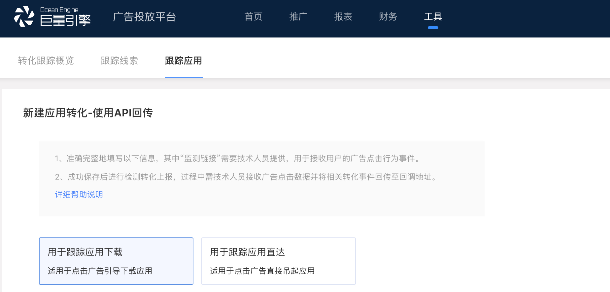

# 今日头条

1、进入头条广告投放平台，在“工具”中找到“转化跟踪”，创建应用转化跟踪。

2、选择“用户跟踪应用下载”，并填写应用下载地址，iOS 应用请填写 APP 的 iTunes 下载地址，Android 应用请填写投放 APP 对应的下载地址。

3、在 GIO 中创建广告监测，推广渠道选择【今日头条】，创建监测链接。

4、将 GIO 生成的监测链接填写至头条“点击监测链接”当中，如果需要监测广告曝光数据，请一并填写“展示监测链接”。

5、监测链接配置完后，请按照今日头条联调流程进行调试，联调成功后即可开启正式投放。

