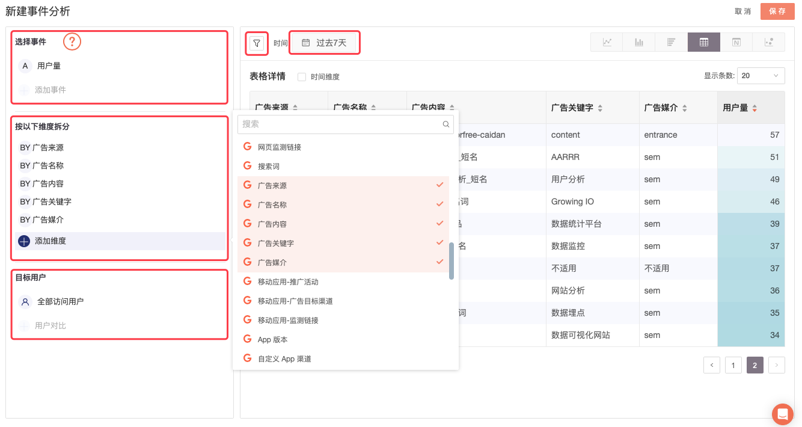

# 推广网站

对于网站/H5 产品，GrowingIO通过 UTM 参数区分不同链接来源，进行访问，跳出率等行为统计。您也可以自行[参考学习资料进行 UTM 参数的配置](utm-parameters.md)，区别在于通过「广告监测」创建的链接可以统计链接点击数据。

* [1.链接新建与管理](web-marketing.md#1)
  * [1.1 新建链接](web-marketing.md#11)
  * [1.2 推广管理](web-marketing.md#12)
* [2.数据报表](web-marketing.md#2)
  * [2.1 基础数据](web-marketing.md#21)
    * [2.1.1 数据指标概念](web-marketing.md#2-1-1-shu-ju-zhi-biao-gai-nian)
    * \*\*\*\*[2.1.2 全局设定](web-marketing.md#2-1-2-quan-ju-she-ding)\*\*\*\*
    * [2.1.3 广告活动和渠道效果分析](web-marketing.md#2-1-3-guang-gao-huo-dong-he-qu-dao-xiao-guo-fen-xi)
    * [2.1.4 活动效果对比](web-marketing.md#2-1-4-huo-dong-xiao-guo-dui-bi)
    * [2.1.5 报表详情数据](web-marketing.md#2-1-5-bao-biao-xiang-qing-shu-ju)
  * [2.2 深度行为分析](web-marketing.md#22)
* [3.数据说明](web-marketing.md#3)

### 1.链接新建与管理 

#### 1.1 新建链接 

1. 点击进入 GIO 后台，广告监测，选择网站推广。
2. 进入“配置与管理”模块“推广管理”，点击“新建监测”。
3. 按照系统要求填写内容。监测链接为您自定义命名，示例：百度 618 投放。
4. 点击保存。
5. 获取监测链接（或二维码），用于投放。

#### 1.2 推广管理 

可进行链接的增删改查。

### 2.数据报表 

#### 2.1 基础数据 

#### 2.1.1 数据指标概念

* 点击：GrowingIO 监测链接的点击数统计。
* 进入量：访问用户进入网站进行访问的数量。
* 访问用户量：访问用户的数量。 
*  新访问用户量：过去 365 天内首次访问用户的数量。

#### **2.1.2 全局设定**

**全局时间控件**

可通过时间控件设定当前报表数据统计时间段，时间范围设定后将应用在报表全局。（上图位置 1 所示）

**添加转化指标**

可以添加您关注的业务转化指标，该业务指标在下方图表中将作为基本的分析数据指标。（上图位置 2 所示 ）

**全局数据**

展示当前 Web 端广告投放环节的基本监控指标数据。（上图位置 3 所示 ）

周期对比：根据当前选择的时段，计算周期对比，当前为周对比，并提供说明本周期与上周期时间计算区间。


全局数据中各指标间数据无发生先后顺序逻辑关联，各指标数据为单指标独立统计的加和数据。


#### 2.1.3 广告活动和渠道效果分析

以线图、柱图的方式展示当前选择的时段下，广告活动和广告渠道的数据情况，并在图表右侧提供简单洞察，可快速发现执行效果最优的广告活动以及广告渠道。

#### 2.1.4 活动效果对比

**访问用户量/点击量**

在活动效果对比中，可直接结合用户行为数据，对比不同活动间的转化效果，使用折线图来比较广告活动访问用户量、广告活动点击数据，分析对比两个活动间的同期效果。

**转化漏斗**

以转化漏斗形式展示从广告活动点击到目标页访问（落地页），再到设定的转化目标，各环节的转化情况，对比不同活动间的转化效率。

**访问人数渠道贡献**

展示在到达目标页面的访问人数中，不同渠道的访问人数占比，对比各渠道的投放效果。

#### 2.1.5 报表详情数据

**推广详情**

推广详细可查看各链接级别的详细统计数据，上方数据图表中展示的数据依照该推广日报。

支持按字段聚合展示数据，支持的字段包括：时间、推广活动、目标渠道、监测链接**。**

此报表支持数据导出，通过右上角下载按钮即可导出当前表格数据。

#### 2.2 深度行为分析 

GrowingIO 对广告监测数据提供深度分析，按照以下步骤可以对不同渠道来源的数据进行深度分析：

1. 通过导航栏进入“分析-事件分析”；
2. 新建“事件分析”，并选择要分析的事件；
3. 在广告监测分析中，可选择以下维度来分析该事件：广告来源、广告名称、广告内容、广告关键字、广告媒介；
4. 也可结合定义的“用户分群”来做不同目标用户的效果分析。

同样，在分群、漏斗分析中，引用相关数据即可进行深度分析。

### 3.数据说明 

1. 点击：链接的点击次数之和。
2. 访问用户量：对网站、App 有过访问的用户的数量。
3. 新访问用户量：对网站、App 有过访问的新用户数量。过去 365 天内对网站、App 没有过访问的用户定义为新用户。
4. 访问量：网站、App 的访问的数量。用户从进入网站（打开App）到离开为止的一个相对完整连续的操作过程定义为一个访问。当访问量被页面级维度分解时，访问量指对当前页面级维度的当前元素有过页面浏览（一次或多次，至少一次）的访问的次数。
5. 跳出率：在对网站的访问过程中，只有一个页面浏览的访问占所有访问的比率。当该指标被页面级维度分解时，指从当前页面级维度的当前元素进入访问里面，只有一个页面浏览的访问的比率。
6. 平均访问时长（分钟）：平均每次访问时长，以分钟作为单位展示。由 总访问时长（分钟）/访问量 计算得到。
7. 每次访问页面浏览量：平均每次访问带来的页面浏览的数量。当该指标被页面级维度分解时，指有过当前页面级维度的当前元素的页面浏览的那些访问对当前维度的当前元素的页面浏览量。

