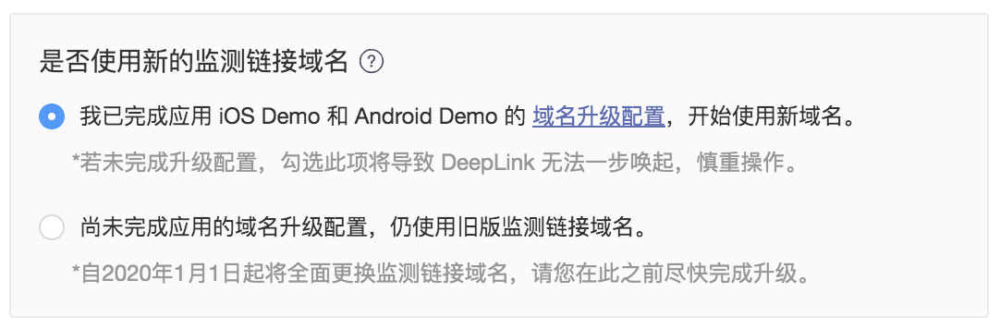

# DeepLink 启用新域名

* [一、DeepLink 基础配置](deeplink-qi-yong-xin-yu-ming.md#yi-deeplink-ji-chu-pei-zhi)
  * [1.1 SDK 配置](deeplink-qi-yong-xin-yu-ming.md#11-sdk-pei-zhi)
  * [1.2 GrowingIO 产品配置](deeplink-qi-yong-xin-yu-ming.md#12-growingio-chan-pin-pei-zhi)
* [二、添加新域名支持](deeplink-qi-yong-xin-yu-ming.md#er-tian-jia-xin-yu-ming-zhi-chi)
  * [2.1 SDK 版本升级](deeplink-qi-yong-xin-yu-ming.md#21-sdk-ban-ben-sheng-ji)
  * [2.2 在 SDK 中添加对应支持项](deeplink-qi-yong-xin-yu-ming.md#22-zai-sdk-zhong-tian-jia-dui-ying-zhi-chi-xiang)
* [三、使用新域名创建 DeepLink](deeplink-qi-yong-xin-yu-ming.md#san-shi-yong-xin-yu-ming-chuang-jian-deeplink)

GrowingIO 的 DeepLink 产品目前已经支持系统原生方案，如您需要借助 Universal Links 以及 App Links 原生方案来实现  App 一步唤起跳转效果，需要在配置中增加对新域名 datayi.cn 的配置。

请先确认您的 DeepLink 服务的配置情况，如果您从未对 GrowingIO 的提供的 DeepLink 做过配置，请先在产品中以及 SDK 中完成基本配置，再进行 datayi.cn 域名的启用。

### 一、DeepLink 基础配置

#### 1.1 SDK 配置

SDK 端配置：[iOS 端](https://docs.growingio.com/docs/sdk-integration/ios-sdk-1/ios-sdk#deeplink-hui-tiao-can-shu-huo-qu)、[Android 端](https://docs.growingio.com/docs/sdk-integration/android-sdk/android-sdk#deep-link-hui-tiao-can-shu-huo-qu)​

#### 1.2 GrowingIO 产品配置

Universal Links 配置：[配置方法](https://docs.growingio.com/docs/configuration/project-configuration#pei-zhi-universal-linksios)​

App Links 配置：[配置方法](https://docs.growingio.com/docs/configuration/project-configuration#pei-zhi-app-linksandroid)​

### 二、添加新域名支持

#### 2.1 SDK 版本升级

确认您的 SDK 版本已经集成至 2.8.5 或更高版本。

#### 2.2 在 SDK 中添加对应支持项

如果您是首次使用 GrowingIO DeepLink 的新用户，请按照上方 DeepLink 基础配置完成所有配置即可，最新文档中已包含新域名支持，无需再额外操作，可跳过该环节。

如果您的应用之前配置过 GrowingIO 的 DeepLink，请参照下方说明，在 Universal Links、App Links 中增加配置。

**Universal Links \( iOS \)**

1、将新域名添加至 Xcode 配置中，新域名 Domain 链接为：

```text
applinks:datayi.cn
```

2、添加新域名后，您的 Associated Domains 结果应为：

```text
applinks:gio.ren
applinks:datayi.cn
```

（为保证您的旧链接有效，旧域名 gio.ren 需继续在列表当中）

**App Links \( Android \)**

1、在 App Links 配置下重新获取 PathPattern 信息，其中将会包含支持新域名的代码片段。


2、在 Manifest.xml 中重新配置 Intent Filter 代码，将代码片段更新到您的 Manifest.xml 当中。

3、验证有效性，当 Status 为 always 表示通过了校验，添加成功。

```text
Package: com.growingio.android.test
Domains: datayi.cn gio.ren
Status: always
```

### 三、使用新域名创建 DeepLink

如果您的应用之前创建过 DeepLink 类型链接，DeepLink 创建流程中会出现该提示，如果提示中的应用已经完成了开启新域名所需的配置工作，请选择【已完成】，后续将会使用新域名创建链接。




