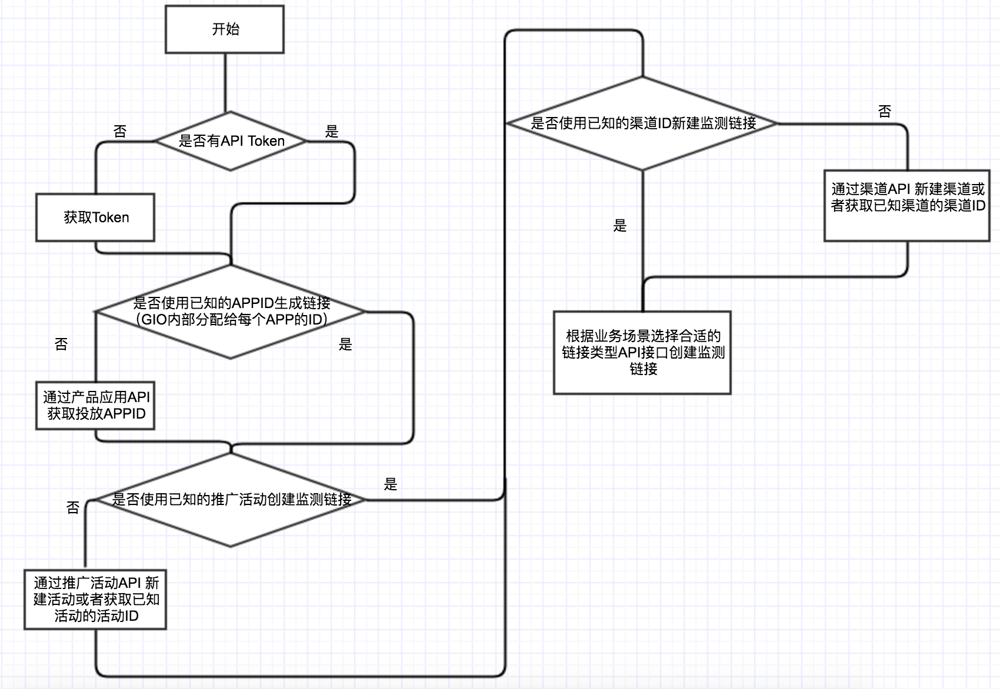
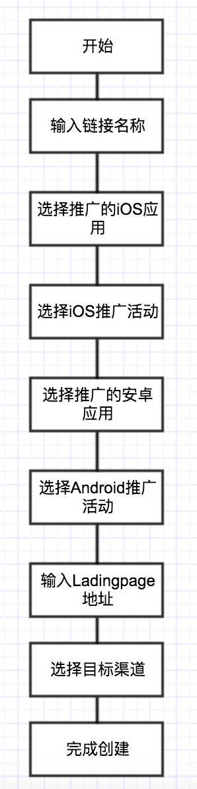
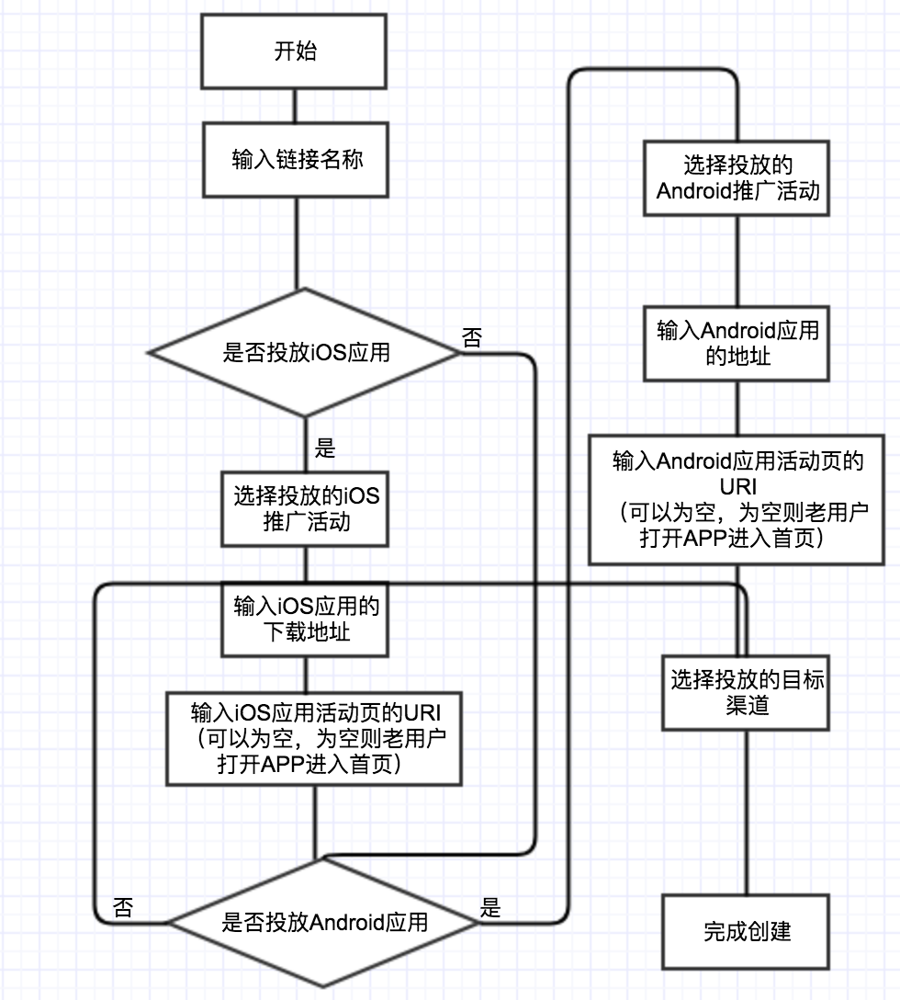

# 广告监测链接创建服务 API

* [1.概述](ads-tracking-api.md#introduction)
* [2.名词及概念解释](ads-tracking-api.md#terminology)
* [3.系统校验规则说明](ads-tracking-api.md#explaination)
  * [3.1 AI 与应用相关](ads-tracking-api.md#ai-product)
  * [3.2 推广活动相关](ads-tracking-api.md#marketing-info)
  * [3.3 渠道相关](ads-tracking-api.md#channel-info)
  * [3.4 监测链接相关](ads-tracking-api.md#link-info)
* [4.使用流程](ads-tracking-api.md#user-flow)
* [5.认证说明](ads-tracking-api.md#authentication)
* [6.API 接口详细](ads-tracking-api.md#6api-jie-kou-xiang-xi)
  * [6.1 应用 API](ads-tracking-api.md#app-api)
  * [6.2 推广活动相关 API](ads-tracking-api.md#markerting-api)
  * [6.3 渠道管理 API](ads-tracking-api.md#channel-api)
  * [6.4 链接创建与查询 API](ads-tracking-api.md#link-api)
    * [6.4.1 增加 App 下载量（推广 IOS 或 Android 单个平台）](ads-tracking-api.md#normallink)
    * [6.4.2 增加 App 下载量（同时推广 IOS 和 Android 两个平台）](ads-tracking-api.md#onelink)
    * [6.4.3 吸引用户直接打开 App](ads-tracking-api.md#deeplink-api)
    * [6.4.4 推广网页](ads-tracking-api.md#normallink-2)
    * 

### 1.概述 <a id="introduction"></a>

为满足广大客户更灵活创建广告监测链接的诉求，GrowingIO（以下简称GIO）提供了一套创建监测链接的API。本文档旨在说明一些调用流程，逻辑及相关接口说明。

### 2.名词及概念解释 <a id="terminology"></a>

GIO广告监测链接信息架构


因此，GIO中生成一条监测链接至少需要涵盖以下信息： 

* 项目：项目ID ，即 AI 可在项目管理的项目概览里获得这串ID，也是集成 SDK 时 setAccountId 所用的部分。 
* 应用：应用ID，推广应用在GIO后台的分配的唯一应用ID。 
* 推广活动：自定义的一个维度。示例：百度信息流推广，湖南区域推广等。
* 监测链接：一条链接（或二维码），可跟踪后续的点击，激活等事件。

### 3.系统校验规则说明 <a id="explaination"></a>

#### 3.1 AI 与应用相关： <a id="ai-product"></a>

规则一：推广的应用是否隶属于当前AI。

#### 3.2 推广活动相关： <a id="marketing-info"></a>

规则一：同AI下推广活动不能重名。 规则二：推广活动名称限制50个字符，仅支持中英文数字-/\_,。

#### 3.3 渠道相关： <a id="channel-info"></a>

规则一：同AI下渠道名称不能重名，包括自定义渠道及系统预定义渠道。 规则二：渠道名称限制50个字符，仅支持中英文数字-/\_,。

#### 3.4 监测链接相关 <a id="link-info"></a>

规则一：同AI下监测链接不能重名。 规则二：监测链接名称限制50个字符，仅支持中英文数字-/\_,。 规则三：针对跳转地址有URL基本校验（是否可跳转，格式校验）。 规则四：必填校验。详见后续不同监测链接的创建逻辑。

### 4.使用流程 <a id="user-flow"></a>

为保证数据安全，GrowingIO所有的API服务，请求Head中需要携带Token。

Token获取详见：[“GrowingIO接口认证”文档](authentication.md)


完整的监测链接创建流程见下图： 



### 5.认证说明 <a id="authentication"></a>

详细的认证过程请参考：[认证说明](authentication.md#authorization)，[参考代码](https://github.com/growingio/tracking-link-examples/blob/master/src/main/scala/io/growing/openapi/AuthUtils.scala)。

| 名字 | 类型 | 描述 | 示例 |
| :--- | :--- | :--- | :--- |
| X-Client-Id | String | GrowingIO 分配的公钥，请在GrowingIO后台“项目配置”页面获取 | 略 |
| Authorization | String | 认证后获取到的 Token | 略 |

### 6.API 接口详细

所有接口的路径参数在 POST 和 GET 的意义相同，示例数据仅供形式上的参考，不同接口上下文无关联：

| 字段名 | 字段格式 | 说明 | 示例 |
| :--- | :--- | :--- | :--- |
| project\_id | String | 项目UID | LlFEWfn |


#### 6.1 应用 API <a id="app-api"></a>

新建应用请在GIO后台操作，此接口仅提供应用ID的查询。（GET 和 POST 请求Head中均需要携带X-Client-Id和Authorization），[参考代码](https://github.com/growingio/tracking-link-examples/blob/master/src/main/scala/io/growing/openapi/AppOpenApi.scala)。

GET `https://www.growingio.com/api/v1/projects/:project_id/meta/products` 

Response: Status Code: 200 OK

| 字段名 | 字段格式 | 说明 | 示例 |
| :--- | :--- | :--- | :--- |
| id | String | 产品id | GQPDxPNm |
| name | String | 名字 | Growingio 测试产品 |
| displayName | String | 产品显示名称，展示在deeplink页面 | gio |
| activated | Boolean | 是否有效 | true |
| spn | String | app包名 | www.gioee.com |
| urlSchema | String | 产品的url schema | 8137d31f4e7b819f |
| platform | String | 平台 | ios |
| createdAt | Long | 创建时间 | 1522019721098 |

Response 示例：

```text
[
    {
        "displayName": "renrendai",
        "name": "renrendai",
        "activated": true,
        "spn": "com.hecom.Guanghua",
        "id": "Lj9yBRyD",
        "createdAt": 1480635903152,
        "urlSchema": "8137d31f4e7b819f",
        "platform": "android"
    },
    {
        "displayName": "gio",
        "name": "Growingio 测试产品",
        "activated": true,
        "spn": "www.gioee.com",
        "id": "GQPDxPNm",
        "createdAt": 1522019721098,
        "urlSchema": "8137d31f4e7b819f",
        "platform": "ios"
    }
]
```


#### 6.2 推广活动相关 API <a id="markerting-api"></a>

此部分相关接口可以查询已有活动的活动ID或者创建新的活动。（GET 和 POST 请求Head中均需要携带X-Client-Id和Authorization），[参考代码](https://github.com/growingio/tracking-link-examples/blob/master/src/main/scala/io/growing/openapi/CampaignsOpenApi.scala)。

POST `https://www.growingio.com/api/v1/projects/:project_id/meta/campaigns` 

Request:

| 字段名 | 字段格式 | 说明 | 示例 |
| :--- | :--- | :--- | :--- |
| name | String | 名字 | 双十一推广 |

示例：

```text
{
  "name":"双十一推广"
}
```

Response: Status Code: 200 OK

| 字段名 | 字段格式 | 说明 | 示例 |
| :--- | :--- | :--- | :--- |
| id | String | 活动 id | gnPNkoWA |
| name | String | 名字 | 双十一推广 |

示例：

```text
{
  "id": "gnPNkoWA",
  "name":"双十一推广"
}
```

GET `https://www.growingio.com/api/v1/projects/:project_id/meta/campaigns` 

Response: Status Code: 200 OK

| 字段名 | 字段格式 | 说明 | 示例 |
| :--- | :--- | :--- | :--- |
| id | String | 活动id | gnPNkoWA |
| name | String | 名字 | 双十一推广 |

Response 示例：

```text
[
  {
    "id": "gnPNkoWA",
    "name": "双十一推广"
  },
  {
    "id": "La9BwRne",
    "name": "美丽星辰"
  }
]
```


####  6.3 渠道管理 API <a id="channel-api"></a>

此相关部分API可以进行渠道的ID查询及新建渠道。（GET 和 POST 请求Head中均需要携带X-Client-Id和Authorization），[参考代码](https://github.com/growingio/tracking-link-examples/blob/master/src/main/scala/io/growing/openapi/ChannelsOpenApi.scala)。

POST `https://www.growingio.com/api/v1/projects/:project_id/meta/channels` 

Request:

| 字段名 | 字段格式 | 说明 | 示例 |
| :--- | :--- | :--- | :--- |
| name | String | 名字 | 二维码推广 |

示例：

```text
{
  "name":"二维码推广"
}
```

GET `https://www.growingio.com/api/v1/projects/:project_id/meta/channels` 

Response: Status Code: 200 OK

| 字段名 | 字段格式 | 说明 | 示例 |
| :--- | :--- | :--- | :--- |
| id | String | 渠道id | HnKoPtrq |
| name | String | 名字 | 今日头条 |

Response 示例：

```text
[
  {
    "id": "gnPNkoWA",
    "name": "二维码推广"
  },
  {
    "id": "HnKoPtrq",
    "name": "今日头条"
  }
]
```


#### 6.4 监测链接创建与查询 API <a id="link-api"></a>

**推广 App：增加 App 下载量，吸引用户直接打开 App，**[**参考代码**](https://github.com/growingio/tracking-link-examples/blob/master/src/main/scala/io/growing/openapi/LinksOpenApi.scala)**。**

* **增加 App 下载量**： 最常见的一种监测链接类型。第一种适用于推广单个移动应用，引导用户进行APP的下载。场景包括广告平台投放等。 特别说明：广点通/智汇推/微信广告平台/Inmobi，此四个渠道由于创建过程中需要获取广告平台的相关参数，故不支持API创建以上平台的监测链接。当需要在一条链接里推广两个移动应用（安卓版和iOS版）时，推荐使用第二种。适用于短信，微信，邮件等不明用户操作系统的推广场景。 其中增加 App 下载量又分为：1、推广 IOS 或 Android 单个平台，[详见 6.4.1](ads-tracking-api.md#normallink) ；2、同时推广 IOS 和 Android 两个平台，[详见 6.4.2](ads-tracking-api.md#onelink)。
* * **吸引用户直接打开 App：** 使用 DeepLink 技术，已安装用户点击链接即可打开APP，未安装用户点击链接跳转到App Store。适用于通过短信/微信下的优惠券发送召唤用户重新打开并使用APP的场景，[详见 6.4.3](ads-tracking-api.md#deeplink-api)。

**推广网页：商品落地页、官网站点，H5 网页、活动促销页，可选择推广网页生成监控链接，**[**详见 6.4.4**](ads-tracking-api.md#normallink-2)**。**


请根据您的实际业务推广场景，选择合适的监测链接类型。


#### **6.4.1 增加 App 下载量（**推广 IOS 或 Android 单个平台） <a id="normallink"></a>

链接创建逻辑（GET 和 POST 请求Head中均需要携带X-Client-Id和Authorization）：

 

POST `https://www.growingio.com/api/v1/projects/:project_id/meta/normallinks` 

Request:

| 字段名 | 字段格式 | 说明 | 示例 |
| :--- | :--- | :--- | :--- |
| name | String | 链接名称,必填.长度50个字符内，同一个账号下系统会进行链接的同名校验，请勿重复提交同名链接。 | normallinkstest2 |
| productId | String | 应用 id，必填  | LPdgKARN |
| channelId | String | 渠道 id，必填 | yYo10lPl |
| campaignId | String | 活动 id，必填 | G39l3o20 |
| redirectUrl | String | 跳转链接，必填 | http://www.growingio.com |

示例：

```text
 {
        "name": "normallinkstest2",
        "productId": "LPdgKARN",
        "channelId": "yYo10lPl",
        "campaignId": "G39l3o20",
        "redirectUrl": "http://www.growingio.com"
 }
```

Response: Status Code: 200 OK

| 字段名 | 字段格式 | 说明 | 示例 |
| :--- | :--- | :--- | :--- |
| linkId | String | 监测链接id | reJmomJ |
| id | String | 资源id | GPn0j0q9 |
| name | String | 链接名称 | normallinkstest2 |
| projectId | String | 项目 UID | 4PYJMWoM |
| productId | String | 产品id | LPdgKARN |
| appId | String | app id | com.demo.app.androidsdkdemo\_android |
| trackingUrl | String | GrowingIO 分配的追踪链接 | https://gio.ren/reJmomJ |
| redirectUrl | String | 跳转链接  | http://www.growingio.com |
| channelId | String | 渠道 id | yYo10lPl |
| channelName | String | 渠道名称 | 测试渠道 |
| campaignId | String | 推广活动 id | G39l3o20 |
| campaignName | String | 推广活动名称 | 智汇推验证\_android |
| status | String | 状态 | activated |
| creatorId | String | 创建人id | AwoVvo28 |
| creatorName | String | 创建人名称 | 系统 |
| updaterId | String | 最后更新人id | AwoVvo28 |
| updaterName | String | 最后更新人名称 | 系统 |
| createdAt | Long | 创建时间 | 1566188740225 |
| updatedAt | Long | 更新时间 | 1566188740225 |
| params | String | 腾讯社交广告参数 | null |

示例：

```text
{
    "id": "GPn0j0q9",
    "linkId": "reJmomJ",
    "name": "normallinkstest2",
    "projectId": "4PYJMWoM",
    "productId": "LPdgKARN",
    "appId": "com.demo.app.androidsdkdemo_android",
    "trackingUrl": "https://gio.ren/reJmomJ",
    "redirectUrl": "http://www.growingio.com",
    "impressionUrl": null,
    "campaignId": "G39l3o20",
    "campaignName": "智汇推验证_android",
    "channelId": "yYo10lPl",
    "channelName": "测试渠道",
    "status": "activated",
    "creatorId": "AwoVvo28",
    "creatorName": "系统",
    "updaterId": "AwoVvo28",
    "updaterName": "系统",
    "createdAt": 1566188740225,
    "updatedAt": 1566188740225,
    "params": null
}
```

查询链接：

GET `https://www.growingio.com/api/v1/projects/:project_id/meta/normallinks`

Response: Status Code: 200 OK

| 字段名 | 字段格式 | 说明 | 示例 |
| :--- | :--- | :--- | :--- |
| id | String | 资源id | La9BwRne |
| linkId | String | 监测链接id | r3A5LOd |
| name | String | 链接名称 | 测试链接二 |
| projectId | String | 项目UID | 4PYJMWoM |
| productId | String | 产品id | LPdgKARN |
| appId | String | app  id | com.demo.app.androidsdkdemo\_android |
| trackingUrl | String | GrowingIO 分配的追踪链接 | https://gio.ren/r3A5LOd |
| redirectUrl | String | 跳转链接 | null |
| impressionUrl | String | 曝光检测链接 | null |
| campaignId | String | 推广活动id | d4PYjoME |
| campaignName | String | 推广活动名称 | 大夜宵活动 |
| channelId | String | 渠道id | GQPDxPNm |
| channelName | String | 渠道名称 | 多盟 |
| status | String | 状态 | activated |
| creatorId | String | 创建人id | nPNgQkoW |
| creatorName | String | 创建人名称 | fowindhe111 |
| updaterId | String | 最后更新人id | nPNgQkoW |
| updaterName | String | 最后更新人名称 | fowindhe111 |
| createdAt | Long | 创建时间 | 1521642287367 |
| updatedAt | Long | 更新时间 | 1521642287367 |
| params | String | 腾讯社交广告参数 | null |

示例：

```text
[
    {
        "id": "La9BwRne",
        "linkId": "r3A5LOd",
        "name": "测试链接二",
        "projectId": "4PYJMWoM",
        "productId": "LPdgKARN",
        "appId": "com.demo.app.androidsdkdemo_android",
        "trackingUrl":"https://gio.ren/r3A5LOd",
        "redirectUrl": null,
        "impressionUrl": null,
        "campaignId": "d4PYjoME",
        "campaignName": "大夜宵活动",
        "channelId": "GQPDxPNm",
        "channelName": "多盟",
        "status": "activated",
        "creatorId": "nPNgQkoW",
        "creatorName": "fowindhe111",
        "updaterId": "nPNgQkoW",
        "updaterName": "fowindhe111",
        "createdAt": 1521642287367,
        "updatedAt": 1521642287367,
        "params": null
    }
]
```


#### **6.4.2 增加 App 下载量（**同时推广 IOS 和 Android 两个平台） <a id="onelink"></a>

链接创建逻辑（GET 和 POST 请求Head中均需要携带X-Client-Id和Authorization）：

  

POST `https://www.growingio.com/api/v1/projects/:project_id/meta/onelinks`

Request:

| 字段名 | 字段格式 | 说明 | 示例 |
| :--- | :--- | :--- | :--- |
| name | String | 链接名称,必填.长度50个字符内，同一个账号下系统会进行链接的同名校验，请勿重复提交同名链接。 | tt3ts |
| productIdAndroid | String | Android产品id，必填 \(从应用 API获取\) | LPdgKARN |
| productIdIos | String | iOS产品id， 必填 \(从应用 API获取\) | rREJ88PL |
| channelId | String | 渠道 id，必填 | yYo10lPl |
| campaignIdIos | String | iOS 推广活动 id，必填 | 4AovZoza |
| campaignIdAndroid | String | Android 推广活动id，必填 | G39l3o20 |
| redirectUrl | String | 跳转链接，必填 | http://www.download.com |

示例：

```text
{
    "name": "tt3ts",
    "productIdIos": "rREJ88PL",
    "productIdAndroid": "LPdgKARN",
    "redirectUrl": "http://www.download.com",
    "campaignIdIos": "4AovZoza",
    "campaignIdAndroid": "G39l3o20",
    "channelId": "yYo10lPl"
}
```

Response: Status Code: 200 OK

| 字段名 | 字段格式 | 说明 | 示例 |
| :--- | :--- | :--- | :--- |
| linkId | String | 监测链接id | oBWXRgK |
| id | String | 资源id | bR7mgxzo |
| name | String | 链接名称 | tt3ts |
| projectId | String |  项目 UID | 4PYJMWoM |
| productIdAndroid | String | Android 产品id | LPdgKARN |
| productNameAndroid | String | Android 产品名称 | Android SDK Demo |
| productIdIos | String | iOS 产品id | rREJ88PL |
| productNameIos | String | iOS 产品名称 | RnTestiOS |
| trackingUrl | String | GrowingIO 分配的追踪链接 | https://gio.ren/oBWXRgK |
| redirectUrl | String | 跳转链接 | http://www.download.com |
| channelId | String | 渠道id | yYo10lPl |
| channelName | String | 渠道名称 | 测试渠道 |
| campaignIdIos | String | iOS 推广活动id | 4AovZoza |
| campaignIdAndroid | String | Android 推广活动id | G39l3o20 |
| campaignNameIos | String | iOS 推广活动名称 | 今日头条ios |
| campaignNameAndroid | String | Android 推广活动名称 | 智汇推验证\_android |
| status | String | 状态 | activated |
| creatorId | String | 创建人id | AwoVvo28 |
| creatorName | String | 创建人名称 | 系统 |
| updaterId | String | 最后更新人id | AwoVvo28 |
| updaterName | String | 最后更新人名称 | 系统 |
| createdAt | Long | 创建时间 | 1566187356083 |
| updatedAt | Long | 更新时间 | 1566187356083 |

示例：

```text
{
    "id": "bR7mgxzo",
    "linkId": "oBWXRgK",
    "name": "tt3ts",
    "projectId": "4PYJMWoM",
    "productIdIos": "rREJ88PL",
    "productNameIos": "RnTestiOS",
    "productIdAndroid": "LPdgKARN",
    "productNameAndroid": "Android SDK Demo",
    "trackingUrl": "https://gio.ren/oBWXRgK",
    "redirectUrl": "http://www.download.com",
    "campaignIdIos": "4AovZoza",
    "campaignNameIos": "今日头条ios",
    "campaignIdAndroid": "G39l3o20",
    "campaignNameAndroid": "智汇推验证_android",
    "channelId": "yYo10lPl",
    "channelName": "测试渠道",
    "status": "activated",
    "creatorId": "AwoVvo28",
    "creatorName": "系统",
    "updaterId": "AwoVvo28",
    "updaterName": "系统",
    "createdAt": 1566187356083,
    "updatedAt": 1566187356083
}
```

查询链接：

GET `https://www.growingio.com/api/v1/projects/:project_id/meta/onelinks`

Response: Status Code: 200 OK

示例：

| 字段名 | 字段格式 | 说明 | 示例 |
| :--- | :--- | :--- | :--- |
| id | String | 资源id | nxog09md |
| linkId | String | 监测链接id | dGVr8e9 |
| name | String | 链接名称 | qwe |
| projectId | String | 项目UID | 4PYJMWoM |
| productIdIos | String | iOS产品id | xRxVp0o5 |
| productNameIos | String | iOS产品名称 | TestAPP |
| productIdAndroid | String | Android产品id | j9yEwm9y |
| productNameAndroid | String | Android产品名称 | 123测试编辑编辑 |
| trackingUrl | String | GrowingIO 分配的追踪链接 | https://gio.ren/dGVr8e9 |
| redirectUrl | String | 跳转链接 | http://123.com |
| campaignIdIos | String | iOS推广活动id | j9yB1nRy |
| campaignNameIos | String | iOS推广活动名称 | 321上线 |
| campaignIdAndroid | String | Android推广活动id | xoga4DRm |
| campaignNameAndroid | String | Android推广活动名称 | 321上线验证1 |
| channelId | String | 渠道id | 34RzeX9V |
| channelName | String | 渠道名称 | 123测试编辑编辑 |
| status | String | 状态 | activated |
| creatorId | String | 创建人id | nRbm8d93 |
| creatorName | String | 创建人名称 | xx |
| updaterId | String | 最后更新人id | nRbm8d93 |
| updaterName | String | 最后更新人名称 | xx |
| createdAt | Long | 创建时间 | 1521642287367 |
| updatedAt | Long | 更新时间 | 1521642287367 |

示例：

```text
[
    {
        "id": "nxog09md",
        "linkId": "dGVr8e9",
        "name": "qwe",
        "projectId": "4PYJMWoM",
        "productIdIos": "xRxVp0o5",
        "productNameIos": "TestAPP",
        "productIdAndroid": "j9yEwm9y",
        "productNameAndroid": "123测试编辑编辑",
        "trackingUrl": "https://gio.ren/dGVr8e9",
        "redirectUrl": "http://123.com",
        "campaignIdIos": "O4PKxoEb",
        "campaignNameIos": "321上线",
        "campaignIdAndroid": "xoga4DRm",
        "campaignNameAndroid": "321上线验证1",
        "channelId": "34RzeX9V",
        "channelName": "123测试编辑编辑",
        "status": "activated",
        "creatorId": "nRbm8d93",
        "creatorName": "xx,
        "updaterId": "nRbm8d93",
        "updaterName": "xx",
        "createdAt": 1521642287367,
        "updatedAt": 1521642287367
    }
]
```

#### **6.4.3** 吸引用户直接打开 App <a id="deeplink-api"></a>

链接创建逻辑（GET 和 POST 请求Head中均需要携带X-Client-Id和Authorization）：



POST `https://www.growingio.com/api/v1/projects/:project_id/meta/deeplinks`

Request:

| 字段名 | 字段格式 | 说明 | 示例 |
| :--- | :--- | :--- | :--- |
| name | String | 链接名称,必填.长度50个字符内，同一个账号下系统会进行链接的同名校验，请勿重复提交同名链接。 | 0523信息流推广 |
| productIdAndroid | String | Android产品id \(从应用 API获取\) 选填,\(iOS Android 至少填一个\)  | Lj9yBRyD |
| productIdIos | String | iOS产品id \(从应用 API获取\) 选填,\(iOS Android 至少填一个\) | rREJ88PL |
| channelId | String | 渠道 id | d4PY3M9M |
| campaignIdIos | String | iOS 活动 id 选填 \(iOS Android 必填至少一个\) | 4RzMvWd9 |
| campaignIdAndroid | String | Android活动id 选填 \(iOS Android 必填至少一个\) | La9BwRne |
| downloadUrlIos | String | iOS下载链接，选填 | http://www.growingio.com |
| downloadUrlAndroid | String | Android下载链接，选填 | http://www.growingio.com |
| iosParams | String | iOS 唤醒参数，选填 | {"uri":"key1:value1&key2:value2"} |
| androidParams | String | Android 唤醒参数，选填 | {"uri":"key1:value1&key2:value2"} |

示例：

```text
{
        "name": "0523信息流推广",
        "productIdIos": "rREJ88PL",
        "channelId": "d4PY3M9M",
        "campaignIdIos": "4RzMvWd9",
        "downloadUrlIos": "http://www.growingio.com"
}
```

Response: Status Code: 200 OK

| 字段名 | 字段格式 | 说明 | 示例 |
| :--- | :--- | :--- | :--- |
| linkId | String | 监测链接id | d0B4MKe |
| id | String | 资源id | LlPQka9p |
| name | String | 链接名称 | 0523信息流推广 |
| trackingUrl | String | GrowingIO 分配的追踪链接 | https://gio.ren/d0B4MKe |
| productIdAndroid | String | Android 产品id | Lj9yBRyD |
| productNameAndroid | String | Android 产品名称 | Growingio Android测试产品 |
| productIdIos | String | iOS 产品id | rREJ88PL |
| productNameIos | String | iOS 产品名称 | RnTestiOS |
| channelId | String | 渠道id | d4PY3M9M |
| channelName | String | 渠道名称 | 打点 |
| campaignIdIos | String | iOS 推广活动 id | 4RzMvWd9 |
| campaignIdAndroid | String | Android 推广活动 id | La9BwRne |
| campaignNameIos | String | iOS 推广活动名称 | 测试活动\_ch |
| campaignNameAndroid | String | Android 推广活动名称 | Growingio 测试 |
| downloadUrlIos | String | iOS 下载链接 | http://www.growingio.com |
| downloadUrlAndroid | String | Android 下载链接 | http://www.growingio.com |
| iosParams | String | iOS 唤醒参数 | {"uri":"key1:value1&key2:value2"} |
| androidParams | String | Android 唤醒参数 | {"uri":"key1:value1&key2:value2"} |
| urlSchemaIos | String | iOS url schema | 80310c35a53c9a45 |
| urlSchemaAndroid | String | Android url scheme | 6137d41f4e7b819g |
| status | String | 状态 | activated |
| creatorId | String | 创建人id | AwoVvo28 |
| creatorName | String | 创建人名称 | 系统 |
| updaterId | String | 最后更新人id | AwoVvo28 |
| updaterName | String | 最后更新人名称 | 系统 |
| createdAt | Long | 创建时间 | 1566186819563 |
| updatedAt | Long | 更新时间 | 1566186819563 |

示例：

```text
{
    "id": "LlPQka9p",
    "linkId": "d0B4MKe",
    "name": "0523信息流推广",
    "projectId": "4PYJMWoM",
    "productIdIos": "rREJ88PL",
    "productNameIos": "RnTestiOS",
    "productIdAndroid": null,
    "productNameAndroid": null,
    "trackingUrl": "https://gio.ren/d0B4MKe",
    "downloadUrlIos": "http://www.growingio.com",
    "downloadUrlAndroid": null,
    "urlSchemaIos": "80310c35a53c9a45",
    "urlSchemaAndroid": null,
    "campaignIdIos": "4RzMvWd9",
    "campaignNameIos": "测试活动_ch",
    "campaignIdAndroid": null,
    "campaignNameAndroid": null,
    "iosParams": null,
    "androidParams": null,
    "channelId": "d4PY3M9M",
    "channelName": "打点",
    "status": "activated",
    "creatorId": "AwoVvo28",
    "creatorName": "系统",
    "updaterId": "AwoVvo28",
    "updaterName": "系统",
    "createdAt": 1566186819563,
    "updatedAt": 1566186819563
}
```

查询链接：

GET `https://www.growingio.com/api/v1/projects/:project_id/meta/deeplinks`

Response: Status Code: 200 OK

| 字段名 | 字段格式 | 说明 | 示例 |
| :--- | :--- | :--- | :--- |
| id | String | 资源id | GQPDxPNm |
| linkId | String | 监测链接id | dGVr8e9 |
| name | String | 链接名称 | 321deeplink |
| projectId | String | 项目UID | 4PYJMWoM |
| productIdIos | String | iOS产品id | xRxVp0o5 |
| productNameIos | String | iOS产品名称 | TestAPP |
| productIdAndroid | String | ndroid产品id | LPdgKARN |
| productNameAndroid | String | ndroid产品名称 | Android SDK Demo |
| trackingUrl | String | GrowingIO 分配的追踪链接 | https://gio.ren/dGVr8e9 |
| downloadUrlIos | String | iOS下载链接 | http://baidu.com |
| downloadUrlAndroid | String | Android下载链接 | http://growingio.com |
| urlSchemaIos | String | iOS url schema | c35abef955cd913a |
| urlSchemaAndroid | String | android url schema | 8137d31f4e7b819f |
| campaignIdIos | String | iOS活动id | j9yB1nRy |
| campaignNameIos | String | iOS活动名称 | 321上线 |
| campaignIdAndroid | String | Android活动id | xoga4DRm |
| campaignNameAndroid | String | Android活动名称 | 321上线验证1 |
| iosParams | String | iOS唤醒参数 | null |
| androidParams | String | Android唤醒参数 | null |
| channelId | String | 渠道id | 34RzeX9V |
| channelName | String | 渠道名称 | 123测试编辑编辑 |
| status | String | 状态 | activated |
| creatorId | String | 创建人id | nRbm8d93 |
| creatorName | String | 创建人名称 | xx |
| updaterId | String | 最后更新人id | nRbm8d93 |
| updaterName | String | 最后更新人名称 | xx |
| createdAt | Long | 创建时间 | 1521642287367 |
| updatedAt | Long | 更新时间 | 1521642287367 |

示例：

```text
[
    {
        "id": "GQPDxPNm",
        "linkId": "dGVr8e9",
        "name": "321deeplink",
        "projectId": "4PYJMWoM",
        "productIdIos": "xRxVp0o5",
        "productNameIos": "TestAPP",
        "productIdAndroid": "LPdgKARN",
        "productNameAndroid": "Android SDK Demo",
        "trackingUrl": "https://gio.ren/dGVr8e9",
        "downloadUrlIos": "http://baidu.com",
        "downloadUrlAndroid": "http://growingio.com",
        "urlSchemaIos": "c35abef955cd913a",
        "urlSchemaAndroid": "8137d31f4e7b819f",
        "campaignIdIos": "j9yB1nRy",
        "campaignNameIos": "321上线",
        "campaignIdAndroid": "xoga4DRm",
        "campaignNameAndroid": "321上线验证1",
        "iosParams": null,
        "androidParams": null,
        "channelId": "34RzeX9V",
        "channelName": "123测试编辑编辑",
        "status": "activated",
        "creatorId": "nRbm8d93",
        "creatorName": "xx",
        "updaterId": "nRbm8d93",
        "updaterName": "xx",
        "createdAt": 1521642287367,
        "updatedAt": 1521642287367
    }
]
```

#### \*\*\*\* <a id="onelink"></a>

#### \*\*\*\* <a id="normallink"></a>

#### **6.4.4** 推广网页 <a id="normallink"></a>

链接创建逻辑（GET 和 POST 请求Head中均需要携带X-Client-Id和Authorization）：

POST `https://www.growingio.com/api/v1/projects/:project_id/meta/weblinks`

Request:

| 字段名 | 字段格式 | 说明 | 示例 |
| :--- | :--- | :--- | :--- |
| name | String | 链接名称,必填.长度50个字符内，同一个账号下系统会进行链接的同名校验，请勿重复提交同名链接。 | 测试web8 |
| utmMedium | String | 广告媒介，必填 | 对对对 |
| channelId | String | 渠道 id，必填 | vnomv9zJ |
| campaignId | String | 活动 id ，必填 | xogjZQ2P |
| redirectUrl | String | 跳转链接，必填 | http://www.www.www |
| utmTerm | String | 广告关键字，选填 | 免费观看 |
| utmContent | String | 广告内容，选填 | 内容 |
| comments | String | 备注，选填 | 备注 |

示例：

```text
{
    "redirectUrl":"http://www.www.www",
    "utmMedium":"对对对",
    "utmTerm":"免费观看",
    "utmContent":"内容",
    "comments":"备注",
    "name":"测试web8",
    "campaignId":"xogjZQ2P",
    "channelId":"vnomv9zJ"
}
```

Response: Status Code: 200 OK

| 字段名 | 字段格式 | 说明 | 示例 |
| :--- | :--- | :--- | :--- |
| linkId | String | 监测链接id | xogvY0Pm |
| id | String | 资源id | xogvY0Pm |
| name | String | 链接名称 | 测试web8 |
| projectId | String | 项目 UID | 4PYJMWoM |
| trackingUrl | String | GrowingIO 分配的追踪链接 | https://gio.ren/w/xogvY0Pm |
| redirectUrl | String | 跳转链接  | http://www.www.www |
| impTrackingUrl | String | 曝光检测链接 | https://gio.ren/w/nP2ADLRm?action\_type=imp |
| channelId | String | 渠道 id | vnomv9zJ |
| channelName | String | 渠道名称 | 百度联盟 |
| campaignId | String | 推广活动 id | xogjZQ2P |
| campaignName | String | 推广活动名称 | test0620 |
| utmMedium | String | 广告媒介 | 对对对 |
| utmContent | String | 广告内容 | 内容 |
| utmTerm | String | 广告关键字 | 免费观看 |
| comments | String | 广告备注 | 备注 |
| status | String | 状态 | activated |
| creatorId | String | 创建人id | AwoVvo28 |
| creatorName | String | 创建人名称 | 系统 |
| updaterId | String | 最后更新人id | AwoVvo28 |
| updaterName | String | 最后更新人名称 | 系统 |
| createdAt | Long | 创建时间 | 1569465492862 |
| updatedAt | Long | 更新时间 | 1569465492862 |

示例：

```text
{
    "id": "xogvY0Pm",
    "linkId": "xogvY0Pm",
    "name": "测试web8",
    "projectId": "4PYJMWoM",
    "trackingUrl": "https://gio.ren/w/xogvY0Pm",
    "impTrackingUrl": null,
    "redirectUrl": "http://www.www.www",
    "campaignId": "xogjZQ2P",
    "campaignName": "test0620",
    "channelId": "vnomv9zJ",
    "channelName": "百度联盟",
    "utmMedium": "对对对",
    "utmContent": "内容",
    "utmTerm": "免费观看",
    "comments": "备注",
    "status": "activated",
    "creatorId": "AwoVvo28",
    "creatorName": "系统",
    "updaterId": "AwoVvo28",
    "updaterName": "系统",
    "createdAt": 1569465492862,
    "updatedAt": 1569465492862
}
```

查询链接：

GET `https://www.growingio.com/api/v1/projects/:project_id/meta/weblinks`

Response: Status Code: 200 OK

| 字段名 | 字段格式 | 说明 | 示例 |
| :--- | :--- | :--- | :--- |
| id | String | 资源id | xogvY0Pm |
| linkId | String | 监测链接id | xogvY0Pm |
| name | String | 链接名称 | 测试web8 |
| projectId | String | 项目UID | 4PYJMWoM |
| trackingUrl | String | GrowingIO 分配的追踪链接 | https://gio.ren/w/xogvY0Pm |
| redirectUrl | String | 跳转链接 | http://www.www.www |
| impressionUrl | String | 曝光检测链接 | null |
| campaignId | String | 推广活动id | xogjZQ2P |
| campaignName | String | 推广活动名称 | test0620 |
| channelId | String | 渠道id | vnomv9zJ |
| channelName | String | 渠道名称 | 百度联盟 |
| utmMedium | String | 广告媒介 | 对对对 |
| utmContent | String | 广告内容 | 内容 |
| utmTerm | String | 广告关键字 | 免费观看 |
| comments | String | 备注 | 备注 |
| status | String | 状态 | activated |
| creatorId | String | 创建人id | AwoVvo28 |
| creatorName | String | 创建人名称 | 系统 |
| updaterId | String | 最后更新人id | AwoVvo28 |
| updaterName | String | 最后更新人名称 | 系统 |
| createdAt | Long | 创建时间 | 1569465492862 |
| updatedAt | Long | 更新时间 | 1569465492913 |

示例：

```text
[
    {
        "id": "xogvY0Pm",
        "linkId": "xogvY0Pm",
        "name": "测试web8",
        "projectId": "4PYJMWoM",
        "trackingUrl": "https://gio.ren/w/xogvY0Pm",
        "impTrackingUrl": null,
        "redirectUrl": "http://www.www.www",
        "campaignId": "xogjZQ2P",
        "campaignName": "test0620",
        "channelId": "vnomv9zJ",
        "channelName": "百度联盟",
        "utmMedium": "对对对",
        "utmContent": "内容",
        "utmTerm": "免费观看",
        "comments": "备注",
        "status": "activated",
        "creatorId": "AwoVvo28",
        "creatorName": "系统",
        "updaterId": "AwoVvo28",
        "updaterName": "系统",
        "createdAt": 1569465492862,
        "updatedAt": 1569465492913
    }
]
```

