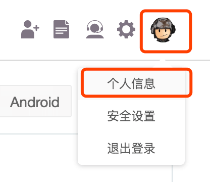
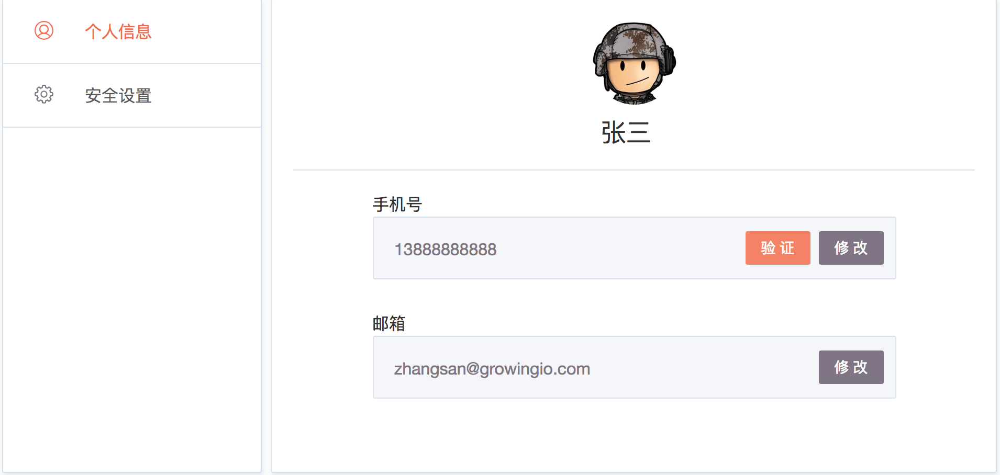
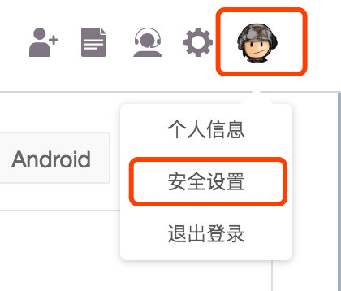
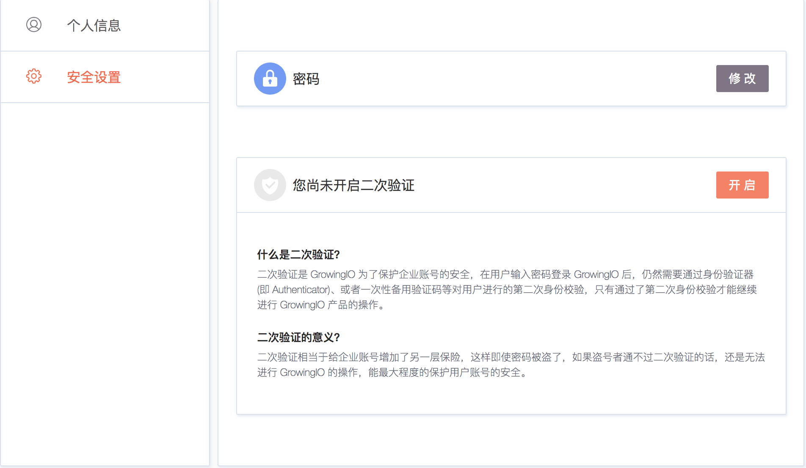
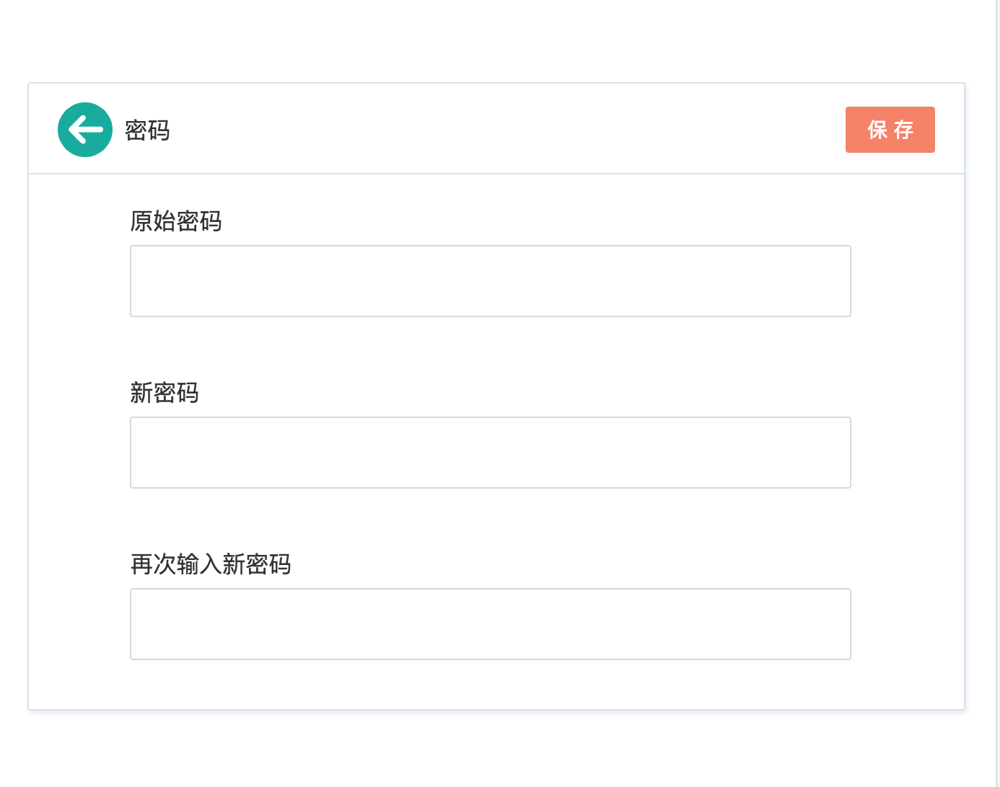
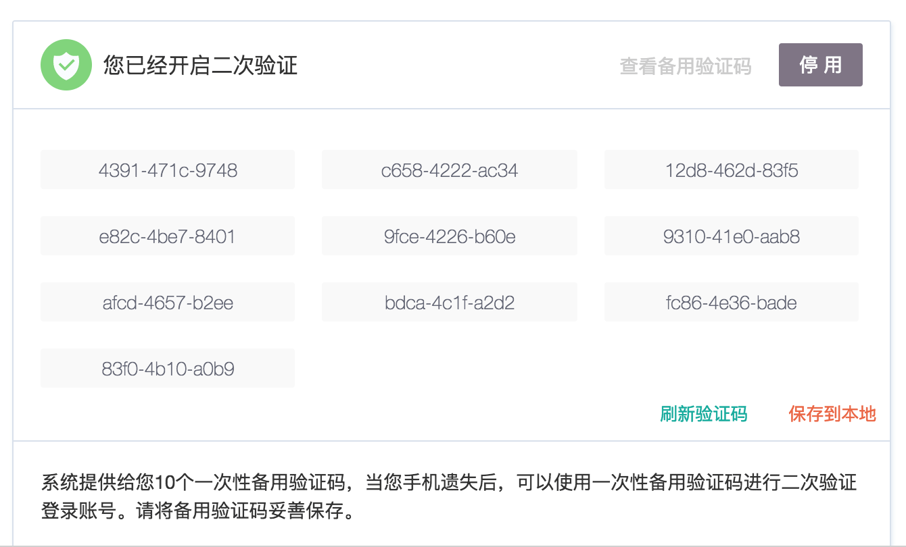

# 账号管理

## 1.个人信息管理

每个用户都可以随时对自己账号的个人信息进行修改。用户登录项目以后点击导航栏中的用户头像，在菜单中点击个人信息，即可进入个人信息设置页面。对账号的头像，姓名，手机号，邮箱等信息进行管理。 

### 1.1 修改头像

点击现在的头像，上传新的头像图片，即可修改自己的头像。


头像图片一经设置，就只能更新，不能删除。


### 1.2 修改姓名

点击现在的姓名，可以进入编辑模式，修改姓名之后点击保存，即可修改成功。

### 1.3 验证手机号

为了您的账号和收据安全，我们强烈建议您完成手机号验证。在个人信息页面点击手机号后面的**验证**按钮，即可进入手机号验证流程。按照指引获取短信验证码，完成验证即可。


如果您的手机号已经验证过，您将不会看到**验证**按钮


### 1.4 验证邮箱

为了您的账号和收据安全，我们强烈建议您完成邮箱验证。在个人信息页面点击邮箱后面的**验证**按钮，即可进入邮箱验证流程。按照指引获取验证码，完成验证即可。


如果您的邮箱已经验证过，您将不会看到**验证**按钮


### 1.5 修改手机号

在个人信息页面点击手机号后面的修改按钮即可进入修改手机号流程。因为手机号对账号安全至关重要，因此在修改手机号之前我们要对您的身份进行再次验证。

1. 身份验证
   1. 如果您的旧手机号仍然可以使用，可以通过短信验证码完成身份验证
   2. 如果您的就手机号已经不可用，可以通过邮箱验证码完成身份验证
   3. 如果您的旧手机号已经不可用，同时您又没有验证过邮箱，需要联系我们的技术支持帮您处理。
2. 设置新手机号
   1. 完成身份验证以后，即可输入新的手机号进行修改。


修改为新手机号后，请您立即对新手机号再次进行验证，以降低您的。


### 1.6 修改邮箱

在个人信息页面点击邮箱后面的修改按钮即可进入修改邮箱修改流程。因为邮箱对账号安全至关重要，因此在修改邮箱之前我们要对您的身份进行再次验证。

1. 身份验证
   1. 如果您验证了手机号，可以通过短信验证码完成身份验证
   2. 如果您没有验证过手机号，可以通过旧邮箱获取验证码，完成身份验证
   3. 如果您没有验证手机号，同时您的旧邮箱已经不可以使用，需要联系我们的技术支持帮您处理。
2. 设置新邮箱
   1. 完成身份验证以后，即可输入新的邮箱进行修改。


修改为新手机号后，请您立即对新邮箱再次进行验证，以降低您的账号安全风险。


## 2. 账号安全管理

每个用户都可以随时对自己账号的个人信息进行修改。用户登录项目以后点击导航栏中的用户头像，在菜单中点击安全设置，即可进入安全设置页面，在此用户可以修改密码，开启或关闭二次认证。

### 2.1 修改密码

在安全设置页面点击密码后面的**修改**按钮，输入原始密码和新密码，点击保存即可完成密码修改。

### 2.2 开启二次认证

在安全设置页面，点击**您尚未开启二次验证**后面的**开启**按钮，输入登录密码点击**继续**按钮，进入二次认证设置对话框，在手机安装 [Authenticator](https://support.google.com/accounts/answer/1066447?hl=zh-Hans)，[Authy](https://authy.com/features/setup/) 等多二次认证令牌管理软件，扫描对话框中的二维码，获取验证码，点击确定，即可开启二次认证。成功开启二次认真过以后，会随机生成 10 个备用验证码，你可以下载备用验证码到您的电脑，以备手机不在身边时使用。每个备用验证码仅可使用一次，您可以随时点击**刷新验证码**按钮，重新生成一批备用验证码。


开启二次认证以后将极大的提升您的账号安全性，在重新登录时，除了输入密码，会要求你输入二次认证验证码，进行验证。


### 2.3 停用二次认证

在安全设置页面，点击**您已经开启二次验证**后面的**停用**按钮，完成手机身份验证，即可停用二次认证。

