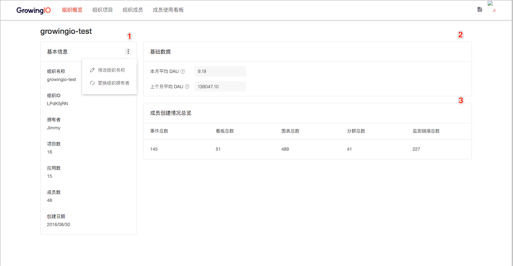

# 组织管理

* [1. 简介](organizations-management.md#1-jian-jie)
* [2. 组织-项目-应用的关系](organizations-management.md#2-zu-zhi-xiang-mu-ying-yong-de-guan-xi)
* [3. 组织管理权限说明](organizations-management.md#3-zu-zhi-guan-li-quan-xian-shuo-ming)
* [4. 组织管理功能使用](organizations-management.md#4-zu-zhi-guan-li-gong-neng-shi-yong)
  * [4.1 组织概览](organizations-management.md#41-zu-zhi-gai-lan)
  * [4.2 组织项目](organizations-management.md#42-zu-zhi-xiang-mu)
  * [4.3 组织成员](organizations-management.md#43-zu-zhi-cheng-yuan)
  * [4.4 计费方案](organizations-management.md#44-ji-fei-fang-an)
  * [4.5 成员使用看板](organizations-management.md#45-cheng-yuan-shi-yong-kan-ban)
* [5. 常见问题](organizations-management.md#5-chang-jian-wen-ti)

## **1. 简介**

GrowingIO 提供了强大而全面的组织管理功能，帮助企业的管理人员在接入 GrowingIO 后以组织为单位对组织、项目和组织成员进行系统性的管理。企业可以为组织成员分配组织成员角色，拥有组织管理权限（组织拥有者与管理员）的用户可以在 GrowingIO 产品内的任意页面点击右上角的齿轮按钮，进入组织管理界面。

## **2. 组织-项目-应用的关系**

组织是您所在公司与 GrowingIO 对接的基本方式，包括对应的销售、技术支持、客户成功等等。GrowingIO 对客户的服务、合同和计费也都会按照组织的方式进行。

当您注册 GrowingIO 时，需要填写公司信息，注册完成时，我们会根据您填写的信息自动生成一个新的组织。后续您创建的所有项目，都会自动关联到这个组织。若您不是自己注册，而是通过被人邀请的方式进入 GrowingIO，您将会被加入到邀请人的组织。

一个组织下可以创建多个项目，GrowingIO 数据统计按照项目的方式进行，不支持跨项目的数据分析。一个项目下可以创建多个应用，Web 端对应不同的域名，移动端对应不同的平台或包名，小程序则对应不同的 AppID。一个项目下的多个应用数据会被合并统计，并在概览中通过平台、AppID 的方式区分。在其他分析模块中，您可以通过“域名”（对应移动端的包名和小程序的 AppID）或“网站/手机应用“维度拆分不同应用数据。

## **3. 组织管理权限说明**

GrowingIO 组织管理预置了三种权限角色，分别为拥有者、管理员与普通成员，不同权限角色在组织管理各功能的操作会受到权限控制，组织的拥有者和管理员可以在邀请成员时给组织成员设置组织权限角色；组织权限角色说明如下：

1. **拥有者：**组织的拥有者；拥有组织管理的最高权限，能在组织管理进行更换组织名称、新建项目、删除项目、邀请成员、移除/禁用成员、查看计费方案与成员使用看板等所有功能的操作，一个组织只能有一个组织拥有者，但组织拥有者可以通过组织概览中的更换组织拥有者功能将拥有者的权限让与组织内的其他成员；
2. **管理员：**组织的管理员，权限由组织拥有者授予，为组织权限第二高的角色。相较组织拥有者，不能使用更换组织名称、转让组织拥有者、删除所有项目（仅能删除自己创建的）、与查看计费方案等功能。我们推荐组织拥有者将组织管理员的权限分配给企业内部负责权限/账号管理，或是与 GrowingIO 对接的组织成员；
3. **普通成员：**组织的普通成员，仅能作为参与角色进入到组织的各项目中，对组织没有管理权限，不能进入组织管理界面，不能使用组织管理的功能；

除了在邀请成员时能为组织成员设置组织权限角色外，组织拥有者也可以在组织成员功能界面中调整既有成员的权限角色；


1. **组织与项目的权限角色说明：**组织与项目的管理功能是分开的，各自拥有独立的权限角色，需要分别配置。一个用户可能在项目中是管理员/超级管理员权限，但是在组织中为普通成员；
2. **如何得知谁是我企业内部的组织拥有者？**若您有组织管理的需求，但没有访问组织管理的权限，您可以联系您组织的组织拥有者为您分配管理员权限。若您不清楚谁是您组织的拥有者的话，您可以联系您的客户经理或是技术支持寻求帮助；


## **4. 组织管理功能使用**

拥有组织拥有者或组织管理员权限角色的用户可以在 GrowingIO 产品内的任意页面通过点击右上角的齿轮按钮进入组织管理界面，组织管理功能包含组织概览、组织项目管理、组织成员管理、计费方案与成员使用看板五部分内容，具体介绍如下：

### 4**.1 组织概览**

组织的拥有者与管理员可以在组织概览功能界面中查看公司组织在 GrowingIO 中的以下内容：

1. **组织基本信息：**包含组织名称、组织 ID \(org\_id\)、组织拥有者、组织项目数、组织应用数、组织成员数与组织创建日期等信息，组织的拥有者与管理员可以通过此模块了解在 GrowingIO 中组织的基本情况。另外，组织拥有者可以在该模块中进行修改组织名称与更换组织拥有者的操作。
2. **组织基础数据：**包含组织本月平均 DAU 与上个月平均 DAU 两部分数据；
   1. **本月平均 DAU（组织）：**组织本月平均 DAU 为本月组织下所有项目本月平均 DAU 之和（计算到本月当日）。DAU 指日活跃用户量，即每日访问项目实际接入产品的用户总数；项目平均 DAU 为项目当月每天 DAU 之和除以当月天数。
   2. **上个月平均DAU（组织）：**组织上个月平均 DAU 为上个月组织下所有项目平均 DAU 之和。DAU 指日活跃用户量，即每日访问项目实际接入产品的用户总数；项目平均 DAU 为项目每天 DAU 之和除以当月天数。
3. **组织成员创建情况总览**：组织成员在组织下所有项目创建事件、看板、图表、分群与监测链接的总数；组织的拥有者与管理员可以通过此模块了解组织成员创建内容的数量。

### **4.2 组织项目**

组织的拥有者与管理员可以在组织项目功能界面中查看公司组织在 GrowingIO 中接入的项目列表以及各项目的基本情况，并进行新建项目、管理项目与删除项目等操作。各功能的操作说明如下：

1. **新建项目：**组织的拥有者与管理员可以通过点击新建项目按钮进行新建项目的操作。组织的拥有者新建项目时，项目角色为超级管理员；组织管理员新建项目时，组织拥有者会和其一起作为项目超级管理员进入到项目当中；
2. **项目管理：**点击项目名称可以进入项目管理界面，但该操作受项目权限控制，只有当组织成员在项目中拥有项目管理权限时，才可以通过点击项目名称进入项目管理界面；
3. **删除项目：**点击删除项目进行删除项目的操作，该功能操作受权限控制，只有当组织成员为组织拥有者或是欲删除项目的的超级管理员时，才可以对项目进行删除的操作；


在组织管理上线后，我们调整了新建项目的入口，将原先项目管理的入口调整到组织管理-组织项目界面当中。我们不再支持项目的超级管理员或是管理员在项目管理界面新建项目，**只有组织的拥有者或是组织管理员能在组织管理新建项目**。


### **4.3 组织成员**

组织的拥有者与管理员可以在组织成员功能界面当中查看公司组织在 GrowingIO 下的所有成员列表与成员基本情况，并进行新邀请成员、管理成员、禁用成员与移除成员等操作。各功能的操作说明如下：

1. **邀请成员：**组织的拥有者与管理员可以邀请成员进到组织与组织下的项目当中。邀请成员时可为组织成员设置组织角色权限，并能够邀请成员至多个项目，并分别为项目权限角色，一次可以邀请多位成员
2. **调成成员组织角色（限组织拥有者）：**组织拥有者能对组织成员分配管理员角色，或是对组织成员的既有角色进行调整；
3. **邀请组织成员到组织既有项目：**成员一经邀请至组织，便不能再重复邀请，若需要将既有成员邀请至项目，可以通过点击“操作”-“邀请至项目”将组织成员邀请到组织其他项目当中。
4. **禁用成员或删除成员：**组织拥有者与管理员可以对组织成员进行禁用、解禁或删除的操作。


1. **邀请成员受权限控制：**邀请成员和邀请成员到组织既有项目时，组织拥有者和管理员只能邀请成员到自己在项目中具有“用户管理”-“新建”功能权限的项目；
2. **禁用成员和删除成员的异同：**成员遭移除或禁用后该成员对应的账号都将不能再登录进入组织内的任一项目。移除与禁用的差异在于成员被禁用后，该成员账号与项目的关联信息仍然被保留，组织拥有者可以通过解禁账号恢复账号访问组织项目的能力；而成员被移除后，账号与项目的关联信息将会被彻底删除，不可恢复，但能通过重新邀请的方式将该用户重新加入组织与项目。


### **4.4 计费方案**

组织的拥有者可以通过计费方案功能界面查看公司组织在 GrowingIO 中的计费方案、每月平均 DAU 趋势，以及每个月的组织与项目 DAU 明细，以了解公司组织在 GrowingIO 的计费方案规则以及流量消耗情况。计费方案界面包含以下三部分内容：

1. **组织计费方案：**包含合同方案有效期、产品版本、计费方式，与接入应用数等信息。组织的拥有者可以通过此模块公司组织在 GrowingIO 中的计费方案规则；若您有接入小程序项目，小程序的方案内容也会包含在这个部分；
2. **组织每月平均 DAU 趋势：**以月为单位显示组织每个月的平均 DAU 情况，数据从合同生效日当月开始；
3. **组织 DAU 明细：**组织 DAU 明细展示了组织每个月的平均DAU，点击下拉按钮可以展开查阅组织下各项目的 DAU 明细；点击右上角“下载数据”按钮，可将每个月流量数据下载保存为 Excel 档案；


组织管理“计费方案"功能只有在客户与 GrowingIO 签订合同后由组织拥有者可见。


### **4.5 成员使用看板**

组织的拥有者与管理员可以在成员使用看板功能界面中查看组织成员过去一段时间在 GrowingIO 上的的情况，成员使用看板包含以下图表：

1. **过去 7 天登录成员数：**展示了过去 7 天登录 GrowingIO 的组织成员总数，以及每天的登录用户数量；
2. **过去 90 天每周登录成员数：**展示了过去 90 天登录 GrowingIO 的组织成员总数，以及每周的登录用户数量；
3. **过去 7 天组织成员访问量：**展示了过去 7 天组织成员访问 GrowingIO 的总访问数量，以及每天组织成员的访问数量；
4. **过去 90 天组织成员每周访问数：**展示了过去 90 天组织成员访问 GrowingIO 的总访问数量，以及每周组织成员的访问数量；
5. **过去 90 天组织成员每周页面浏览量：**展示了过去 90 天组织成员在 GrowingIO上的页面浏览量，以及每周组织成员的页面浏览量；
6. **过去 90 天组织成员每周访问时长：**展示了过去 90 天组织成员访问 GrowingIO的总访问时长，以及每周组织成员的访问时长；
7. **过去 30 天组织成员访问量排名：**展示了过去 30 天组织成员访问 GrowingIO 的前十名用户；
8. **过去 30 天组织成员每周访问量趋势：**展示了过去 30 天每周各个组织成员访问GrowingIO 数量；
9. **过去 30 天最热看板：**展示了过去 30 天在所有组织项目中被组织成员浏览最多的前 10 名看板；
10. **过去 30 天最热单图：**展示了过去 30 天在所有组织项目中被组织成员浏览最多的前 10 名单图；

##  5. 常见问题

1. **我是项目的超级管理员，为什么组织管理上线后我新建不了项目了？**  

   在组织管理上线后，我们调整了新建项目的入口，将原先项目管理的入口调整到组织管理-组织项目界面当中。我们不再支持项目的超级管理员或是管理员在项目管理界面新建项目，**只有组织的拥有者或是组织管理员能在组织管理新建项目**。  

2. **组织与项目的权限角色有什么差别？为什么我是项目的管理员，但是却进不去组织管理功能？**  
  
   组织与项目的管理功能是分开的，各自拥有独立的权限角色，需要分别配置。一个用户可能在项目中是管理员/超级管理员权限，但是在组织中为普通成员。  
  
   若您有组织管理的需求，但没有访问组织管理的权限，您可以联系您组织的组织拥有者为您分配管理员权限。

3. **我不知道我企业内部的组织拥有者是谁，我该怎么做？**  若您不清楚谁是您组织的拥有者的话，您可以联系您的客户经理或是技术支持寻求帮助。 
4. **我们组织拥有者已经离职了，我们该如何调整组织拥有者？**  若您的组织拥有者已经离职了，且在离职前没有进行转让组织拥有者的操作，您可以联系您的客户经理或是点击邀请技术支持协助您更换组织拥有者。

  

