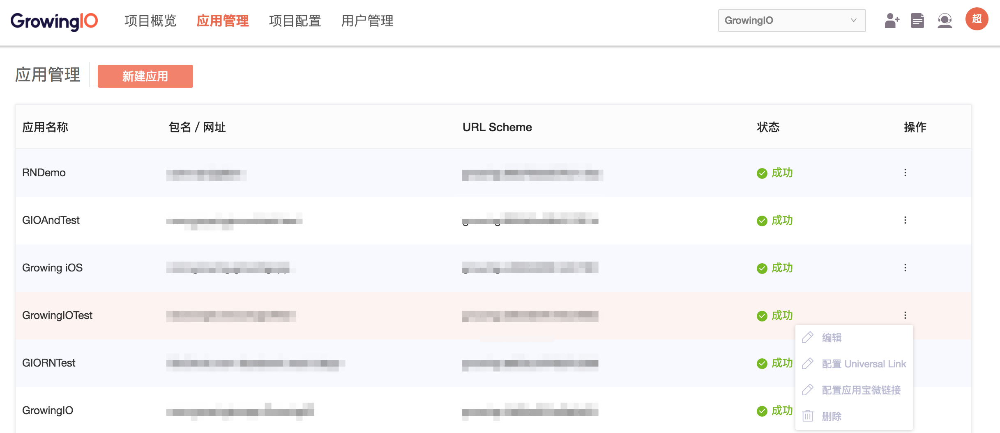
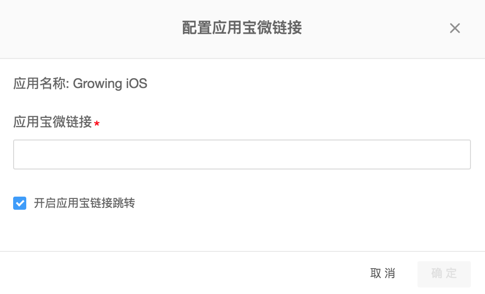

# 项目管理

* [1.简介](project-configuration.md#1)
* [2.组织-项目-应用的关系](project-configuration.md#zuzhi-xiangmu-yingyong)
* [3.项目概览](project-configuration.md#2)
* [4.应用管理](project-configuration.md#3)

### 1.简介 <a id="1"></a>

GrowingIO提供了强大而全面的管理功能，您可以根据您的具体需求来对您的组织和数据进行管理。让您的成员轻松的协作，并且充分保障数据的安全性和私密性。**您可以在任意界面点击右上角的头像，进入项目管理模块。**

### 2.组织-项目-应用的关系 <a id="zuzhi-xiangmu-yingyong"></a>

当您注册 GrowingIO 时，需要填写公司信息，注册完成时，我们会根据您填写的信息生成一个新的组织。后续您创建的所有项目，都会自动关联到这个组织。组织是您所在公司与 GrowingIO 对接的基本方式，包括对应的销售、技术支持、客户成功。我们的服务、合同和计费也会按照组织的方式。

一个组织下可以创建多个项目，GrowingIO 数据统计按照项目的方式进行，不支持跨项目的数据分析。例如访问用户量、登录用户量等，在同一个项目下不同产品内的同一个用户会被合并。

一个项目下可以创建多个应用，Web端对应不同的域名，移动端对应不同的平台或包名，小程序则对应不同的 AppID。一个项目下的多个应用数据会被合并统计，并在概览中通过平台、AppID 的方式区分。在其他分析模块，您可以使用 域名（对应移动端的包名和小程序的 AppID）或 网站/手机应用 拆分不同应用数据。

### 3.项目概览 <a id="2"></a>

项目概览为您呈现项目成员的项目使用情况。


* 本周项目访问量：您的项目每周的页面打开次数，帮助您宏观的了解整个项目的使用情况。
* 7日访问趋势：帮助您了解您的项目在最近7日的使用情况。
* 成员使用情况排名：帮助您了解您的每个成员在项目中的活跃程度。
* 最热单图/最热看板：在您建立的看板/单图中，最常用最受欢迎的看板。
* 活动日志：您的成员在项目中的协作日志，帮助您了解您的分群，事件的新建和改动情况。

### 4.应用管理 <a id="3"></a>

Notice：进入项目管理页面需要管理员权限，请您联系您公司项目的管理员为您开通权限。

在应用管理中，您可以创建多个产品。这些产品可以是不同平台的产品，例如GrowingIO Android,GrowingIO iOS... 这样，您可以对不同产品的数据进行统一的管理和分析，统计不同产品之间的数据差异，分析其中的共性和原因，进行深度的透视。


#### 

#### 4.1配置Universal Link、应用宝微链接

* 在应用管理页面，配置Universal Link，应用宝微链接（可选项）。
* 配置Universal Link将会需要您公司的iOS工程师协同配合，在Xcode客户端进行操作。







* 您需要按照如下提示完成配置Universal Link的配置

1. 在您的Xcode客户端中勾选如下功能


2.添加GIO域名到xcode


注：添加至Domain的链接为：

```text
applinks:gio.ren
```

（请注意该 Domain 链接内容的正确填写）

3.复制您的teamID/bundle ID到Growing后台,并勾选“我已完成Xcode配置，开启Universal Link跳转”


4.应用宝微链接：GrowingIO 提供跳转到应用宝微链接的功能，应用宝微链接为腾讯应用宝体系下的微下载链接

5.完成配置

