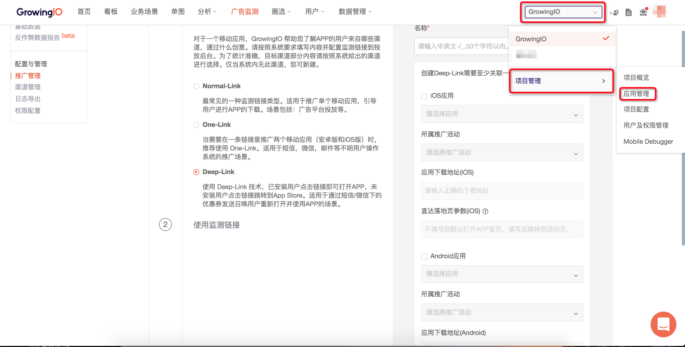
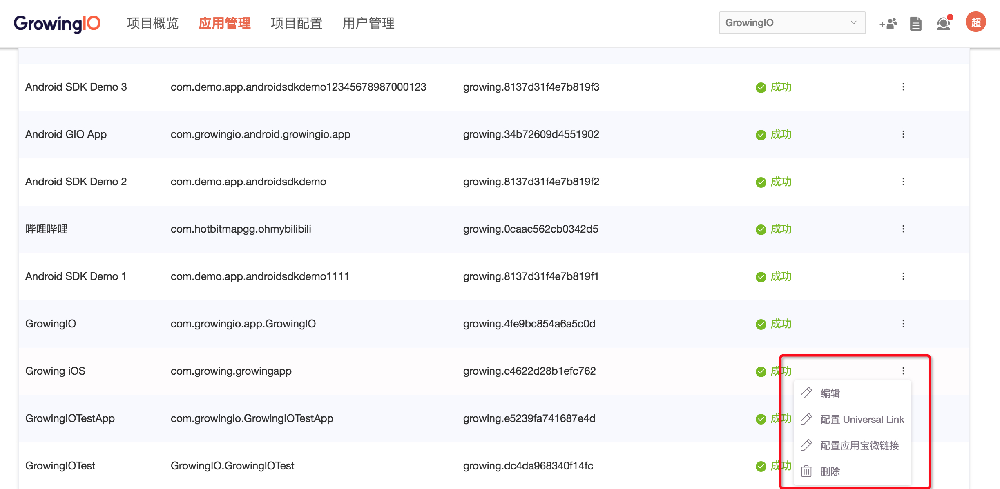
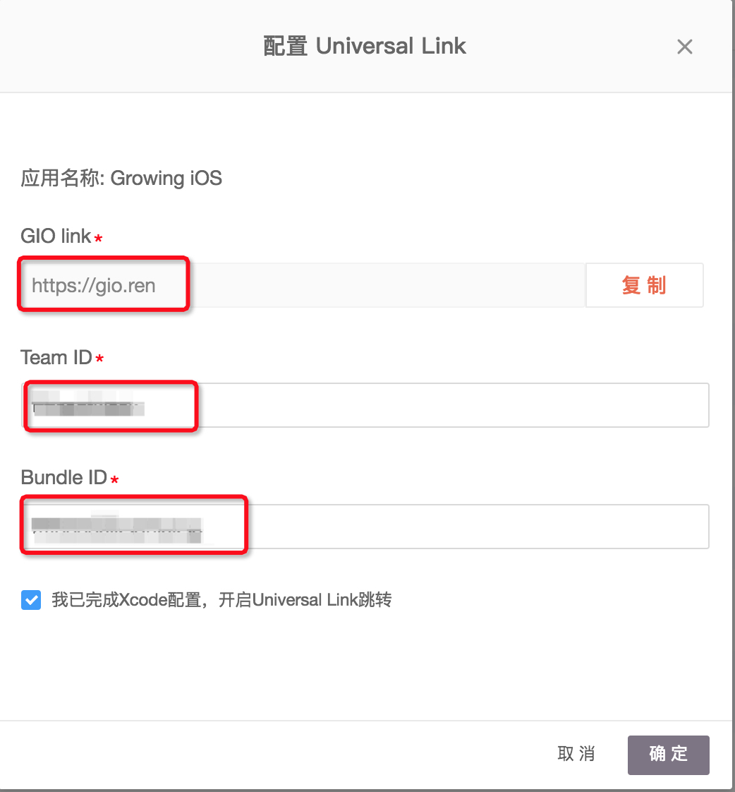

# 项目管理

* [1.简介](project-configuration.md#1)
* [2.项目概览](project-configuration.md#2)
* [3.应用管理](project-configuration.md#3)

### 1.简介 {#1}

GrowingIO提供了强大而全面的管理功能，您可以根据您的具体需求来对您的组织和数据进行管理。让您的成员轻松的协作，并且充分保障数据的安全性和私密性。**您可以在任意界面点击右上角的头像，进入项目管理模块。**

### 2.项目概览 {#2}

项目概览为您呈现项目成员的项目使用情况。

* 本周项目访问量：您的项目每周的页面打开次数，帮助您宏观的了解整个项目的使用情况。
* 7日访问趋势：帮助您了解您的项目在最近7日的使用情况。
* 成员使用情况排名：帮助您了解您的每个成员在项目中的活跃程度。
* 最热单图/最热看板：在您建立的看板/单图中，最常用最受欢迎的看板。
* 活动日志：您的成员在项目中的协作日志，帮助您了解您的分群，事件的新建和改动情况

### 3.应用管理 {#3}

在应用管理中，您可以创建多个产品。这些产品可以是不同平台的产品，例如GrowingIO Android,GrowingIO iOS... 这样，您可以对不同产品的数据进行统一的管理和分析，统计不同产品之间的数据差异，分析其中的共性和原因，进行深度的透视。

#### 

#### 3.1配置Universal Link、应用宝微链接

* 在应用管理页面，配置Universal Link，应用宝微链接（可选项）

* 您需要按照如下提示完成配置Universal Link的配置

1. 在您的Xcode客户端中勾选如下功能

  

 2.添加GIO域名到xcode

3.复制您的teamID/bundle ID到Growing后台,并勾选“我已完成Xcode配置，开启Universal Link跳转”

4.应用宝微链接：GrowingIO 提供跳转到应用宝微链接的功能，应用宝微链接为腾讯应用宝体系下的微下载链接

5.完成配置

