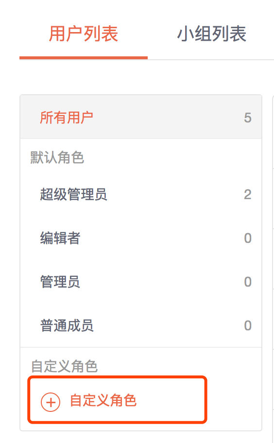
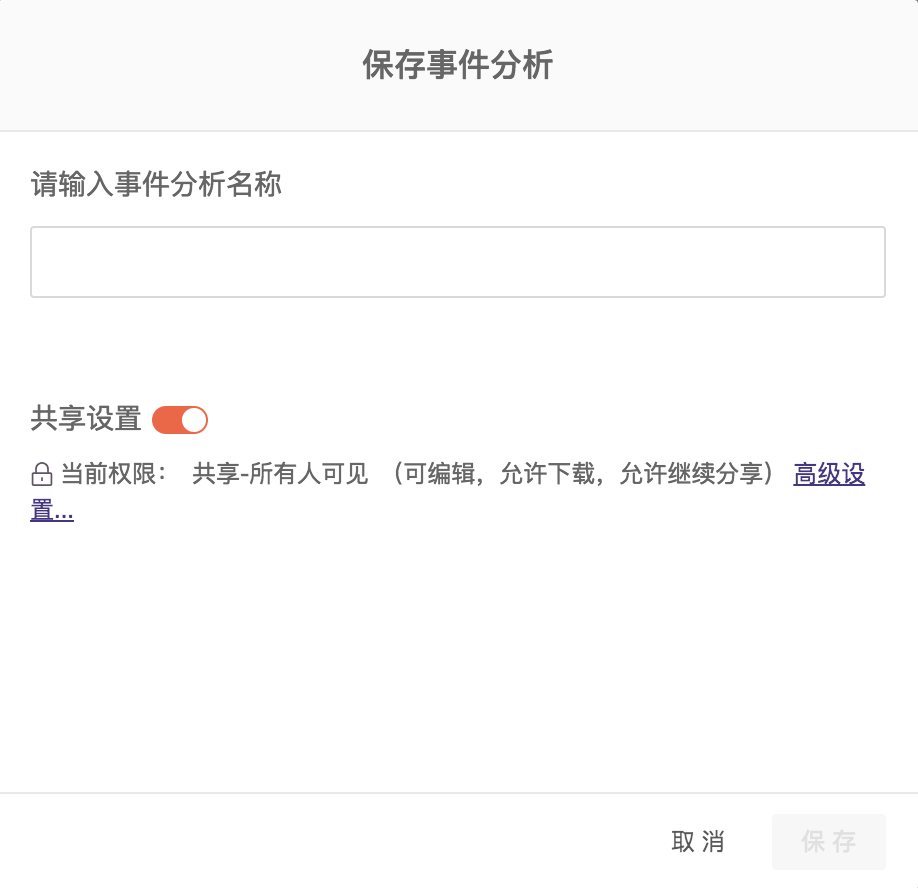

# 权限管理

1. [角色与功能权限](rights-management.md#1-1)
2. [资源权限](rights-management.md#2)
3. [数据权限](rights-management.md#3)
4. [典型应用场景](rights-management.md#4-dian-xing-ying-yong-chang-jing)

## 1. 简介 

GrowingIO 提供了高度自定义的权限方式，方便您管理您项目内部的所有功能，数据，以及用户的权限控制。保障高度的数据安全的同时，帮助您和您的组织实现更好的协作。 在 GrowingIO 项目中我们将权限抽象成**功能权限**、**资源权限**和**数据权限**。


本文中提到的自定义角色，资源权限，数据权限都属于仅对付费客户开放高级功能，如果您发下在自己的项目中无法使用这些功能，请联系我们的技术支持或客户成功经理帮您解决。


## 1.角色与功能权限 

在 GrowingIO 项目中每个基本功能模块，如看板，事件分析，漏斗分析，留存分析等都可以单独控制某个用户是否有权限查看改功能模块，或是否有权限在该功能模块中新近资源。用户功能权限的控制是通过用户角色控制的。每一个用户只能被关联到一个用户角色。


在 GrowingIO 项目预制了 4 种默认角色超级管理员、管理员、编辑者、普通成员。除了超级管理员以外的，其他 3 中角色的功能权限配置均可以被修改。预制角色不满足需要时，还可以新建自定义角色。


目前 GrowingIO 支持的功能权限如下：

1. 概览

   查看：控制导航栏中概览的可见性

2. 实时

   查看：控制导航栏中实时的可见性

   编辑：添加新的实时指标

3. 看板

   查看：控制导航栏中看板的可见性 

   新建：控制产品中所有新建/另存为看板的操作

4. 业务场景

   查看：控制导航栏中业务场景的可见性

5. 单图

   查看：控制导航栏中单图/事件分析的可见性 

   新建：控制产品中所有新建/另存为事件分析的操作

6. 留存魔法师

   查看：控制分析模块下留存魔法师的可见性

7. 智能路径

   查看：控制分析模块下智能路径的可见性

8. 漏斗

   查看：控制分析模块/看板/单图中漏斗入口的可见性 

   新建：控制产品中所有新建/另存为漏斗的操作

9. 留存

   查看：控制分析模块/看板/单图中留存入口的可见性 

   新建：控制产品中所有新建/另存为留存的操作

10. 热图

    查看：控制圈选模块下热图Tab的可见性

11. 圈选

    新建：控制圈选模块下浏览/圈选Tab的可见性，以及圈选指标的保存/另存为等操作

12. 用户细查

    查看：控制用户模块下用户细查入口的可见性

13. 用户分群

    查看：控制用户模块下用户分群入口的可见性 

    新建：控制产品中所有新建分群的操作

14. 圈选指标

    查看：控制数据管理模块下圈选指标入口的可见性 

    新建：控制是否可以在圈选指标中，新建复合指标与合并指标

15. 事件和变量

    查看：控制数据管理模块下事件和变量入口的可见性

    新建：控制是否可以创建新的自定义事件及各种类型的变量

16. 广告监测

    配置与管理-日志数据下载：控制用户是否可下载激活日志数据。

    配置与管理-权限管理：控制用户是否可见&可编辑不同用户的渠道资源权限。

    推广活动-查看：控制用户是否可见推广活动。

    推广活动-新建/编辑/删除：控制用户是否可新建&编辑&删除推广活动。

    监测链接-查看：控制用户是否可查看监测链接数据。

    监测链接-新建/编辑/删除：控制用户是否可编辑&新建&删除监测链接。

    基础数据-报表数据下载：控制用户是否可下载数据报表。

    基础数据-移动端-激活概览查看：控制用户是否可见激活概览模块。

    基础数据-移动端-推广详细查看：控制用户是否可见移动端的推广详细报表。

    基础数据-网页端-推广详细查看：控制用户是否可见网页端的推广详细报表。

17. 项目管理
    1. 角色管理

       查看：控制角色管理入口的可见性 新建/编辑/删除：控制是否可以新建/编辑/删除一个角色

    2. 项目管理

       查看：控制项目概览/项目配置入口的可见性 新建/编辑/删除：控制是否可以新建/编辑/删除项目配置

    3. 用户管理

       查看：控制用户管理入口的可见性 新建/编辑/删除：控制是否可以新建/编辑/删除一个用户

    4. 邀请技术支持

       允许邀请：控制是否可以邀请GIO工程师进入项目

    5. 应用管理

       查看：控制应用管理入口的可见性 新建/编辑/删除：控制是否可以新建/编辑/删除一个应用

### 1.1 修改角色功能权限

有用户管理及角色管理权限的用户，进入用户管理页面，选中要修改的角色，点击右侧的编辑角色权限按钮，即可进入对应角色的配置页面，修改相应的配置后保存即可。

### 1.2  新建自定义角色

同时具有用户管理和角色管理权限的用户可以在用户列表点击**自定义角色**按钮来新建自定义角色。在新建自定义角色页面输入角色名称，设置权限配置，然后保存，即可完成新角色创建。

## 2.资源权限 

资源权限是只用户可以对项目中的资源进行共享设置，从而控制该资源的是否可以被其他用户查看资源内容、修改资源内容，修改共享范围，下载资源数据。资源权限通过设置共享权限和共享范围共同完成。


什么是资源？

在 GrowingIO 项目中，我将用户创建的看板，图表，指标等内容统称为资源。资源的创建者可以对每一个资源实体进行共享设置。

目前在 GrowingIO 项目中的资源有以下几种：

1. 看板
2. 单图
   1. 事件分析图表
   2. 漏斗分析图表
   3. 留存分析图表
3. 用户分群
4. 圈选指标
   1. 圈选简单指标
   2. 合并指标
   3. 复合指标
5. 广告监测
   1. 推广活动
   2. 推广链接。


### 2.1 资源共享权限说明

* **仅查看**

  资源共享设置为仅查看时，该资源共享范围内的用户只可以查看该资源的内容，不可以编辑。例如设置一个事件分析图表为所有人可见（仅查看），则其他用户在单图列表都可以找到该图表，并且可以将该图表加入到看板，可以进入图表详情页查看该图表内容，但是不可以编辑该图表内容并保存。如果共享用户有新建事件分析的功能权限，该用户可以将次图表另存为自己的图图表，进行编辑。

* **可编辑**

  资源共享设置为可编辑时，该资源共享范围内的用户可以查看并编辑该资源的内容，不可以编辑。例如设置一个事件分析图表为所有人可见（可编辑），则其他用户在单图列表都可以找到该图表，并且可以将该图表加入到看板，可以进入图表详情页查看该图表内容，并可以编辑该图表内容并保存。

* **允许继续分享**

  资源共享设置为允许继续分享时，该资源共享范围内的用户可以修改共享用户范围，但是不允许修改具体的共享权限设置。例如设置一个事件分析图表为部分用户可见（仅查看，允许继续分享），则共享范围内的用户可以修改部分用户列表添加或移除用户，或者改为所有人可见。但是不允许修改为可编辑。

* **允许下载**

  资源共享设置为允许下载分享时，该资源共享范围内的用户可以下载该资源。例如设置一个事件分析图表为部分用户可见（仅查看，允许下载），则共享范围内的用户可以下载该图表数据。（注：部分资源没有下载功能所以没有下载设置，如看板）


仅资源的创建者或者项目的超级管理员有权限删除资源。其中资源的创建者可以删除自己创建的资源。超级管理员可以删除所有人创建的资源。资源被删除以后将不可以再被恢复，请谨慎操作。


### 2.2 资源共享范围

* 仅自己可以见

  该资源不可以被其他用户看到。例如一个事件分析图表被设置为仅自己可见，则其他用户在单图列表中无法看到这张图表。

* 所有人可见

  该资源可以被所有其他用户看到。例如一个事件分析图表被设置为所有人可见，则其他用户都可以在单图列表中看到这张图表。

* 部分用户可见

  该资源仅可以被部分用户列表中指定的用户看到。例如一个事件分析图表被设置为部分用户可见（张三，李四），则张三和李四在单图列表中可以看到这张图表，其他用户在单图列表中不可以看到这张图表。


对于任意资源，超级管理员拥有与资源创建则通的的权限。这意味着即使是仅自己可见的资源，超级管理员仍然有权限查看，编辑，甚至删除该资源。


### **2.3 共享权限设置**

在新建资源时或新建资源后资源的创建者都可以对资源的共享设置进行修改。新建资源保存时您会看到如下对话框，可以点击共享设置开关在**私有-仅自己可见**和**共享-所有人可见**之间快速切换，当设置为共享-所有人可见时，可以点击高级设置，进一步进行共享权限和共享范围设置

### 2.4 用户小组

用户小组功能是为了方便对资源权限进行设计的，在设置资源权限时可以选择小组，批量的将小组包含的用户加入到资源权限列表中。


目前用户小组功能还在实验阶，设置资源权限时选择小组仅是批量将小组包含的用户一次性加入到资源列表。后续修改小组的成员，如添加或移除小组成员，都不会对已经分配的资源权限产生影响。


**新建小组**

由用户管理权限的用户可以在用户管理页面，小组标签页中找到新建和管理小组的入口。您可以自由的将任意用户加入到小组中，一个用户可以从属于多个小组中。

### **2.5 广告监测资源权**

广告监测资源权限不同于看板，单图等通用资源的权限设置。您可以在广告监测的资源权限管理模块可以对不同角色不同用户进行不同的推广活动权限控制。

## 3. 数据权限 

可以对每一个用户设置多个数据访问限制条件，并在全局生效，所有访问数据的节点都会被控制。该功能可以有效的控制数据的可见范围，实现同一张图表不同的用户看到不同的数据。


**数据权限使用场景**

假设您希望北京的区域经理只可以看到北京地区的数据，上海的区域经理只可以看到上海的数据。则可以设置北京的区域经理的数据权限为”城市=北京“，上海的区域经理的数据权限为”城市=上海“。此时同一张图表对于两个区域经理将显示不同的数据。


**支持设置的维度包括**：

1. **系统默认维度**：访问来源、一级访问来源、浏览器、操作系统、城市、地区、国家代码、国家名称、域名、网站/手机应用、设备类型、广告来源等。
2. **自定义维度**：全部

**支持的条件组合包括**：

1. =：等于
2. ≠：不等于
3. In：在给定的值之中
4. Not in：在给定值之外

**设置数据权限**

有用户管理权限的用户进入用户管理页面，找到需要设置数据权限的账号，点击用户名称，即可打开用户信息修改对话框，修改该用户的数据受限设置确定即可。


数据权限对用户分群无效。因为用户分群计算量庞大，GrowingIO 每天对晚上对用户分群数据进行离线计算，因此无法对每一个设置数据权限的用户单独计算一份分群数据。


## 4.典型应用场景

1. **指定一名人员主要负责圈选，不做其他操作**

   通过创建一个圈选角色，只分配功能权限中的圈选和指标管理即可。

2. **在内部流程中，将数据的生产和消费划分的十分清晰**

   通过创建至少3个角色，分别为

   **圈选角色：**只分配功能权限中的圈选和指标管理，主要负责维护公司级别的指标体系，供生产者使用

   **生产角色：**分配功能权限中看板/单图/漏斗/留存/分群的查看/新建/分享权限，主要负责制作分析资源并进行传播

   **消费角色：**分配功能权限中概览/实时/业务模板/看板/单图/漏斗/留存/分群的查看权限，主要消费生产者制作的分析内容和系统默认的分析模板，必要时，可以开通功能权限中看板/单图/漏斗/留存/分群的分享权限，利于再传播

3. **指定一名管理员，负责系统的日常管理**

   通过创建一个管理员角色，只分配功能权限中的角色管理/用户管理/项目管理/应用管理的查看/编辑功能，负责日常创建新应用、创建新角色/用户并分配权限等操作。

4. **将某一指标视为核心数据，不需要全员公开**

   由该指标的创建人在分享指标时，选择部分用户可见，并指定操作仅为查看。如此，在分享名单之外的用户，即使访问使用了该指标的看板或单图时，也无法查看到指标数据。

5. **针对同一看板，需要区分不同人员的可访问数据范围**

   通过对用户设置数据权限来限定数据访问范围，例如：设置用户A只可访问地区=北京的数据，那么在任一看板中，相当于默认做了维度地区=北京的数据过滤。

