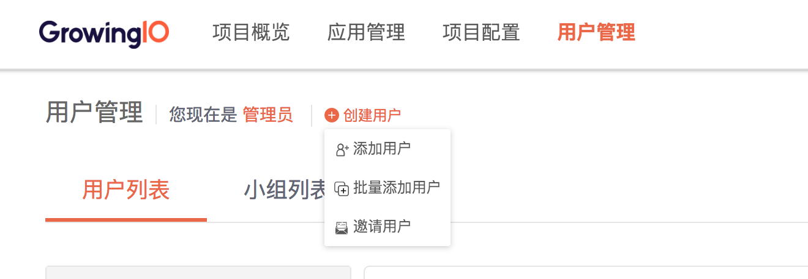
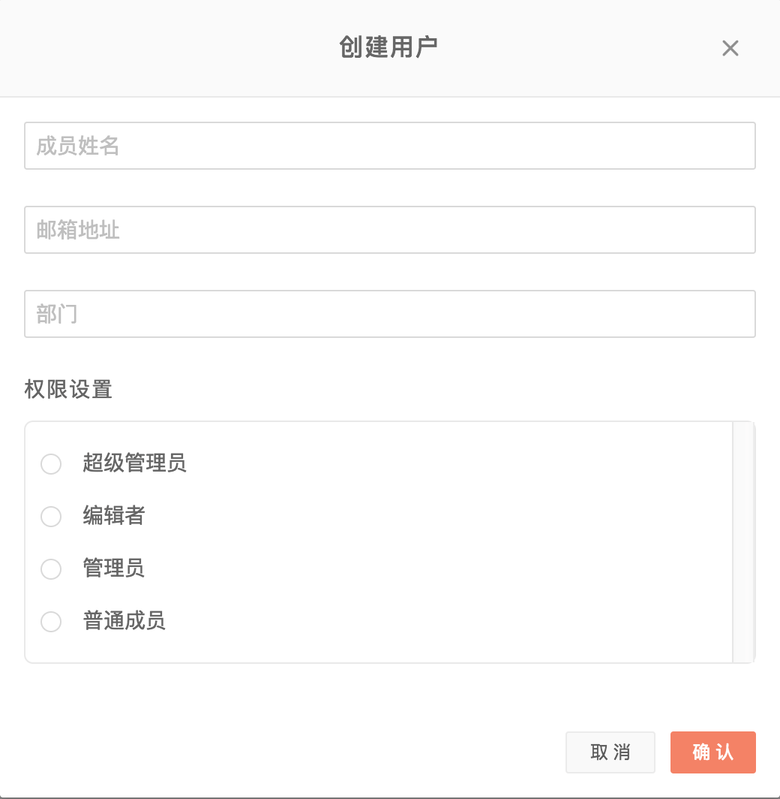
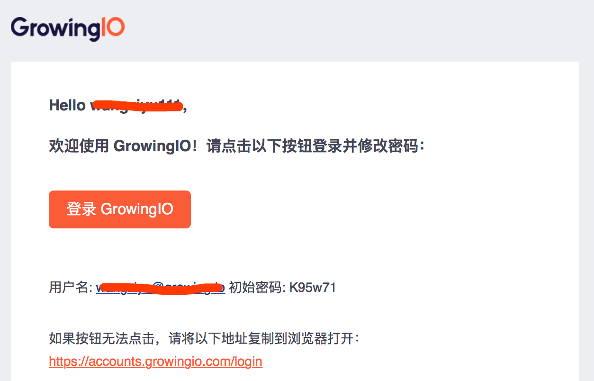
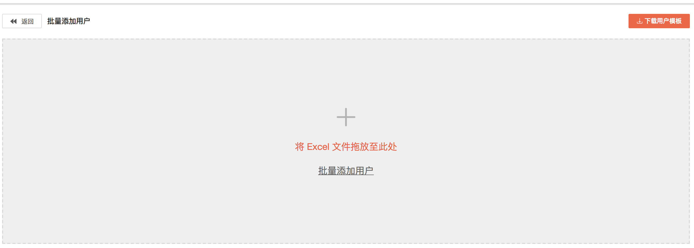
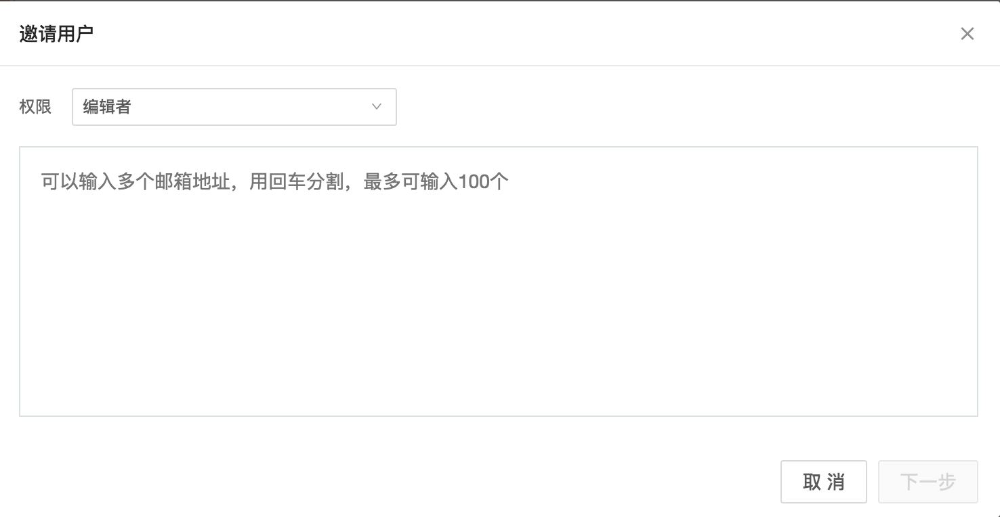
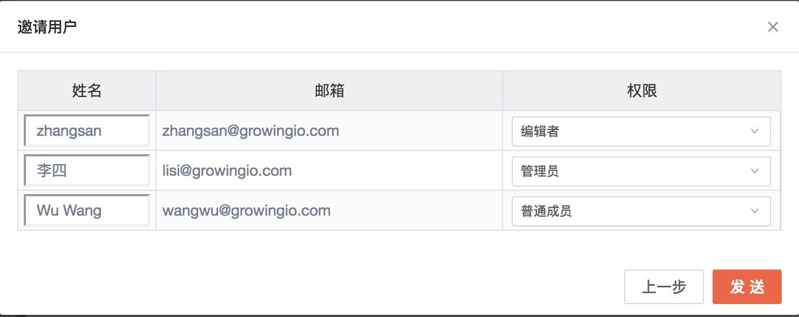
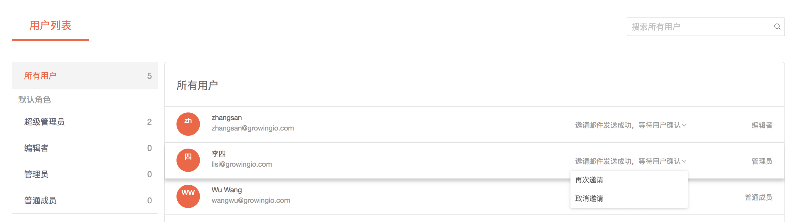
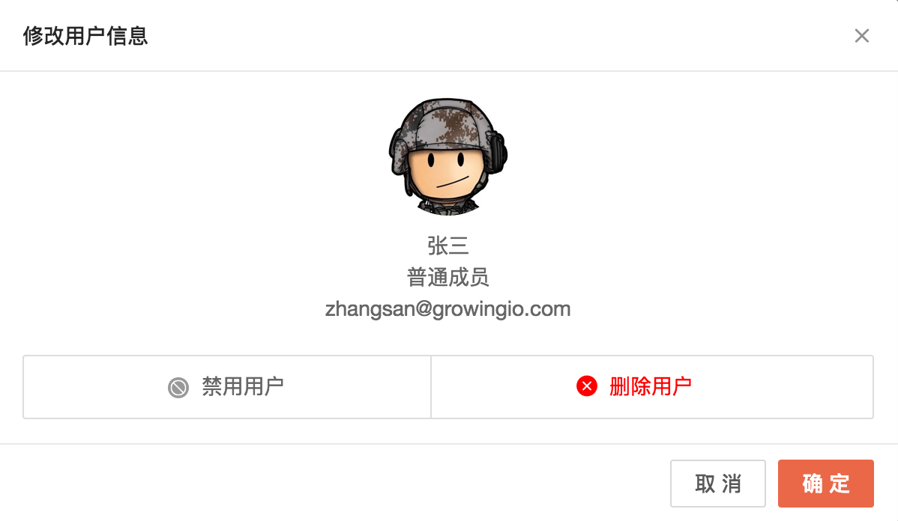

# 用户管理

1. [简介](user-configuration.md#1-jian-jie)
2. [创建用户](user-configuration.md#2-chuang-jian-yong-hu)
3. [邀请用户](user-configuration.md#3-yao-qing-yong-hu)
4. [禁用或删除用户](user-configuration.md#4-jin-yong-huo-shan-chu-yong-hu)

## 1.简介

GrowingIO 提供多种添加用户的功能，帮助企业方便的邀请新用户，添加新用户或批量添加新用户进入项目。

## 2. 创建用户

有用户管理权限的项目成员可以通过添加用户或批量添加用户功能直接在系统中添加用户，通过管理员添加的用户，在添加完成后，该用户邮箱会收到一封初始邮件，包含初始登录密码和系统登录地址，用户在首次登录时，需要修改自己的登录密码。

### 2.1 添加单个用户

管理员在直接添加用户时，需要输入该用户的名称、邮箱、部门等信息，同时选择该用户绑定的角色，并点击**确认**。随后，该用户邮箱会收到系统发送的初始邮件，按照邮件引导完成首次登录。  

### 2.2 批量添加用户

管理员通过批量添加用户功能，可以一次性最多批量创建 1000 名用户。首先通过系统下载用户模板，并在模板中添加好将要创建的用户名称、邮箱等信息，然后将保存后的文件直接拖入系统，系统会自动检测模板内填写的内容是否符合规范，如不符合规范，请修改后重新上传。


姓名、邮箱等信息不要使用空格、特殊字符；

每个用户必须制定对应的角色，且制定的角色必须是系统中已经存在的。不同用户可以指定不同的角色。

已经创建成功的用户无法再次创建，如果重复上传已经创建的用户，该用户会收到登录引导邮件，而不是初始密码邮件。


## 3. 邀请用户

任何项目成员都可以邀请其他已注册用户或未注册新用户进入当前项目。如果发起邀请的成员具有角色管理的权限，在邀请用户时还可以指定被邀请的角色，反之被邀请用户只能能和发起邀请的成员具有相同的角色。邀请发出后，被邀请用户会受到包含邀请链接的邮件，被邀请用户需要打开邀请链接，完成登录或注册即可进入新项目。

项目导航栏右侧第一个图表按钮即为邀请用户按钮，点击后可打开邀请用户对话框

在邀请用户对话框输入被邀请用户的邮箱，如果需要邀请多个用户可以，输入多个邮箱，每行一个。

邀请用户第二步可以对用户姓名（默认为邮箱账号名称）进行修改。如果有角色管理权限的用户此时还可以修改被邀请用户的角色，多个被邀请用户可以为被指定为不同的角色。点击发送按钮即可完成邀请，被邀请人会受到对应的邀请邮件，按照邮件指引完成操作即可进入项目。

具有用户管理权限的成员可以在用户管理界面，查看邀请用户的状态，对还没有完成邀请流程的用户可以重新发送邀请邮件或取消邀请。

## 4. 禁用或删除用户

具有用户管理权限的成员可以对已有用户进行禁用、解禁或删除。具体操作如下：


禁用用户与删除用户的异同

用户账号被禁用或删除后对应的账号都将不能再登录进入该项目。

用户账号被禁用以后，账号与项目的关联信息仍然被保留，管理员可以通过解禁账号恢复账号访问项目的能力。账号被删除后，账号与项目的关联信息被彻底删除，不可恢复，只能通过重新邀请或添加用户重新进入项目。


进入用户管理页面，找到要操作的用户。

点击用户名称，打开修改用户信息对话框。点击**禁用/解禁用户**或**删除用户**按钮完成对应的操作，然后点击**确定**按钮，保存修改。

