# KPI看板（企业版）

## KPI看板可以做什么

KPI看板可以帮助业务负责人在 GrowingIO 平台上监控 KPI 数据，判断 KPI 是否符合预期。若数据与预期不符，用户可以借助维度拆解和下钻，迅速找到影响KPI表现的原因。

您可以将您的 KPI 放在 KPI 看板上，一站式获得KPI所有信息，避免KPI分散在各处。每一个KPI看板可以创建 8 个KPI指标，您可以把对您的组织最重要的KPI 放在一个看板里，对核心指标一览无余。

**以某电商公司 KPI 看板为例子：**

我们将销售量，销售额，用户量，复购，转发等放在KPI看板。您打开KPI看板后，借助 大数字图，所有核心指标表现一览无余，帮您迅速了解整体表现和有异常的 KPI。比如，我们可以看到 复购这个KPI出现了问题。同比出现了超过20%的下降。

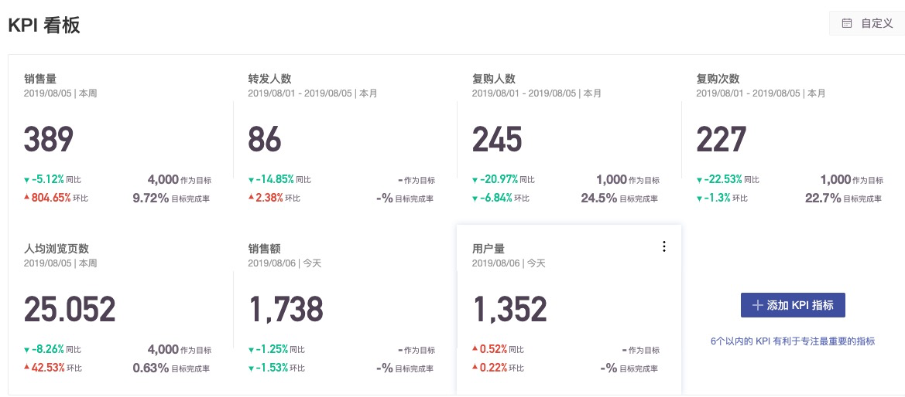

## **如何配置一个这样的KPI看板**

首先要确定什么是你的KPI，其次确定要通过哪些维度去监控拆解KPI。（ 如果已经进行了对KPI的规划和实施，此步骤可以忽略 ）

若购买成功是你的核心KPI，你会通过 商品品类，渠道，会员等级去监控购买。那么你可以设置购买成功为自定义事件，用商品品类，渠道，会员等级为变量。

将这些数据上传给 GrowingIO之后，即可借助以下步骤看到这个KPI对应的数据。（详情：事件和变量的上传）

您需要创建每一个需要监控的KPI，形成KPI 单图。

如图所示：

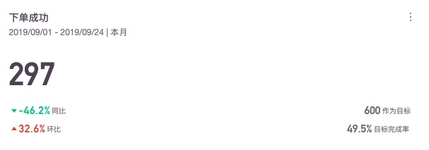

<table>
  <thead>
    <tr>
      <th style="text-align:left">&#x53C2;&#x6570;</th>
      <th style="text-align:left">&#x8BF4;&#x660E;</th>
    </tr>
  </thead>
  <tbody>
    <tr>
      <td style="text-align:left">&#x6807;&#x9898;</td>
      <td style="text-align:left">&#x6211;&#x4EEC;&#x9ED8;&#x8BA4;&#x7528;&#x4E86;&#x4E8B;&#x4EF6;&#x540D;&#x79F0;&#x6765;&#x6307;&#x4EE3;&#x6807;&#x9898;&#xFF0C;&#x60A8;&#x53EF;&#x4EE5;&#x901A;&#x8FC7;KPI&#x5355;&#x56FE;&#x53F3;&#x4E0A;&#x89D2;&#x7684;&#x64CD;&#x4F5C;&#x6309;&#x94AE;&#x8FDB;&#x884C;&#x7F16;&#x8F91;&#x3002;&#x5EFA;&#x8BAE;&#x6807;&#x9898;&#x8BBE;&#x7F6E;&#x4E00;&#x5B9A;&#x8981;&#x7B80;&#x5355;&#x660E;&#x4E86;&#xFF0C;&#x6240;&#x6709;&#x4EBA;&#x770B;&#x5230;&#x6807;&#x9898;&#x540E;&#x5C31;&#x80FD;&#x660E;&#x767D;&#x5B83;&#x7684;&#x4E1A;&#x52A1;&#x542B;&#x4E49;&#x3002;</td>
    </tr>
    <tr>
      <td style="text-align:left">&#x65F6;&#x95F4;&#x8303;&#x56F4;</td>
      <td style="text-align:left">&#x8003;&#x5BDF;KPI&#x7684;&#x8303;&#x56F4;&#xFF0C;&#x4E00;&#x822C;&#x60C5;&#x51B5;&#x4E0B;&#x516C;&#x53F8;&#x7528;&#x4ECA;&#x5929;&#x3001;&#x672C;&#x5468;&#x3001;&#x672C;&#x6708;&#x6765;&#x770B;KPI&#x7684;&#x8868;&#x73B0;&#x3002;</td>
    </tr>
    <tr>
      <td style="text-align:left">&#x540C;&#x6BD4;</td>
      <td style="text-align:left">
        
&#x540C;&#x6BD4;&#x662F;&#x4E00;&#x4E2A;&#x4E1A;&#x52A1;&#x6982;&#x5FF5;&#xFF0C;&#x662F;&#x57FA;&#x4E8E;&#x4E1A;&#x52A1;&#x5468;&#x671F;&#x7684;&#x5B9A;&#x4E49;&#x3002;

        
&#x5BF9;&#x6BD4;&#x89C4;&#x5219;&#xFF1A;&#x672C;&#x5468;&#x6BD4;&#x4E0A;&#x5468;&#x3001;&#x672C;&#x6708;&#x6BD4;&#x4E0A;&#x6708;&#x3001;&#x4ECA;&#x5E74;&#x6BD4;&#x53BB;&#x5E74;&#x3002;

        
&#x5982;&#x679C;&#x4ECA;&#x5929;&#x662F;&#x5468;&#x4E09;&#xFF0C;&#x90A3;&#x4E48;&#x672C;&#x5468;&#x6BD4;&#x4E0A;&#x5468;&#x5C31;&#x662F;&#x672C;&#x5468;&#x4E00;&#x4E8C;&#x4E09;&#x7684;&#x6570;&#x636E;&#x6BD4;&#x4E0A;&#x5468;&#x4E00;&#x4E8C;&#x4E09;&#x7684;&#x6570;&#x636E;&#x3002;

      </td>
    </tr>
    <tr>
      <td style="text-align:left">&#x73AF;&#x6BD4;</td>
      <td style="text-align:left">
        
&#x5B9A;&#x4E49;&#x4E3A;&#x8FD9;&#x4E2A;N&#x5929;&#x6BD4;&#x4E0A;&#x4E2A;N&#x5929;&#x3002;

        
&#x6BD4;&#x5982;&#xFF1A;&#x4ECA;&#x5929;&#x6BD4;&#x6628;&#x5929;&#xFF0C;&#x8FC7;&#x53BB;7&#x5929;&#x7684;&#x6570;&#x636E;&#x6BD4;&#x8FC7;&#x53BB;8~14&#x5929;&#x6570;&#x636E;&#xFF0C;&#x73AF;&#x6BD4;&#x66F4;&#x5173;&#x6CE8;&#x4E1A;&#x52A1;&#x7684;&#x8FDE;&#x7EED;&#x6027;&#x3002;

      </td>
    </tr>
    <tr>
      <td style="text-align:left">&#x76EE;&#x6807;</td>
      <td style="text-align:left">
        
&#x7ED9;&#x4E88;&#x6240;&#x9009;&#x65F6;&#x95F4;&#x8303;&#x56F4;&#x548C;&#x7C92;&#x5EA6;&#x7684;&#x76EE;&#x6807;&#x3002;&#x6BD4;&#x5982;&#x672C;&#x5468;&#x76EE;&#x6807;&#xFF0C;&#x672C;&#x6708;&#x76EE;&#x6807;&#x7B49;&#x3002;&#x5BF9;&#x4E8E;&#x6240;&#x9009;&#x65F6;&#x95F4;&#x8303;&#x56F4;&#x548C;&#x7C92;&#x5EA6;&#x7684;KPI&#x60A8;&#x53EF;&#x4EE5;&#x8BBE;&#x5B9A;&#x5BF9;&#x5E94;&#x7684;&#x76EE;&#x6807;&#x3002;

        
&#x6CE8;&#xFF1A;&#x5F53;&#x6240;&#x9009;&#x65F6;&#x95F4;&#x8303;&#x56F4;&#x53D1;&#x751F;&#x53D8;&#x5316;&#x65F6;&#xFF0C;&#x76EE;&#x6807;&#x9700;&#x8981;&#x91CD;&#x65B0;&#x586B;&#x5199;&#x3002;

      </td>
    </tr>
    <tr>
      <td style="text-align:left">&#x76EE;&#x6807;&#x5B8C;&#x6210;&#x7387;</td>
      <td style="text-align:left">&#x5B9E;&#x9645;KPI&#x8868;&#x73B0;/&#x76EE;&#x6807;&#x503C;&#xFF0C;&#x60A8;&#x53EF;&#x4EE5;&#x501F;&#x52A9;&#x76EE;&#x6807;&#x5B8C;&#x6210;&#x7387;&#x6765;&#x8FFD;&#x8E2A;&#x8FDB;&#x7A0B;&#x662F;&#x5426;&#x7B26;&#x5408;&#x9884;&#x671F;&#x3002;</td>
    </tr>
  </tbody>
</table>创建过程：

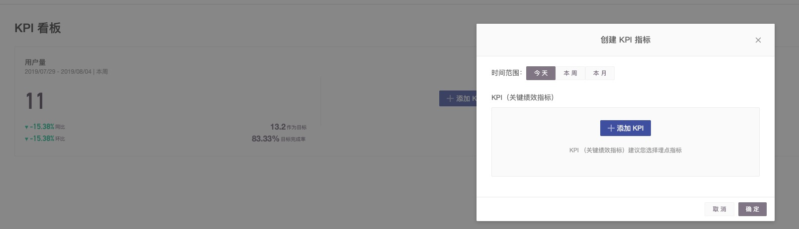

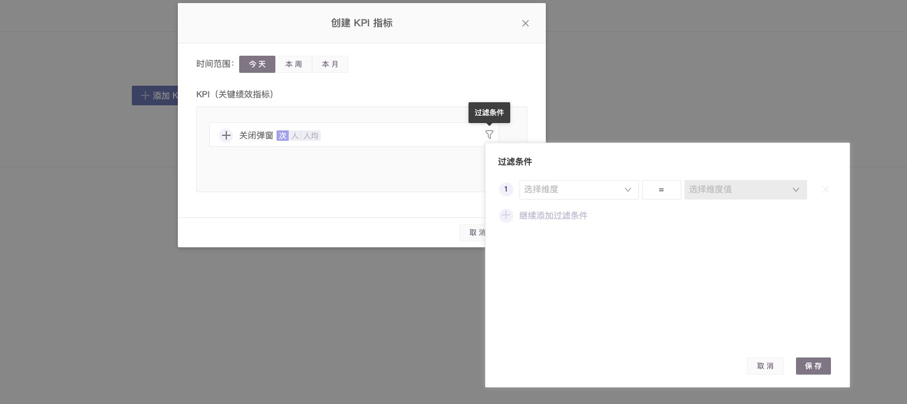

创建 KPI：

1.你可以选择时间范围，选择 今天 本周 本月 来监测 KPI 指标的时间范围。

* 若您选择今天可以看到今天的小时级别数据，如果你对某一个指标的关注度是每小时都会看一看，或者每半天都会看一下，建议选择 今天。
* 若您选择本周您可以看到本周的天级别数据（不包括今天）如果你对某一个指标的关注度是天都会看一看，周末会做一个总结报告，建议选择本周。
* 若您选择本月，您可以看到本月天级别的KPI数据，（不包括今天）如果你对某一个指标的关注度是每天或者周都会看一看，月会做一个总结报告，建议选择本月。

2 选择KPI

KPI 由 事件，事件的度量方式（人 次 人均）和 过滤条件构成，以下指标都可以是 KPI

那么 购买人数， 购买次数 ，平均购买次数， 购买金额，手机购买量 等都可以成为选项。

他可以借助事件 “购”买， “购买”事件的度量方式  人， 次， 人均， 事件的变量：金额，品类等组合构成。

注：KPI 作为核心业务指标，需要通过业务维度对其进行拆解，同时对数据的准确性稳定性有较高的要求，我们更建议您采用埋点指标。埋点指标请参考[埋点事件](../data-model/event-model/custom-event/)。

保存完毕后获得如下图：

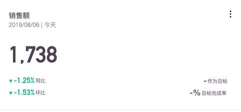

您可以设置目标人群，以便于了解特殊人群的KPI表现，如重新购买，新注册等。

点击KPI单图右上角，可以进入编辑页面，在编辑页面，您可以在目标用户选择想要监控的用户群体，如全部登录用户、全部购买用户、新购买用户等。

您可以对KPI设置目标，即使观察目标进度是否符合预期。

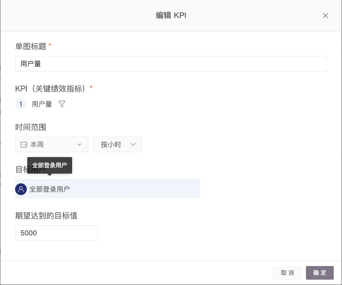

设置完毕后，你可以在右下角看到KPI的完成率情况，以便于您判断现在的进度是否符合预期和及时调整方案策略。

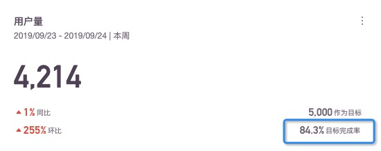

您可以看到不同周期，粒度下的KPI数据。

借助GrowingIO提供的时间范围和粒度我们可以对一个KPI看板今天、本周、本月的数据以便于了解每天、每周、每月的KPI表现情况。

同时我们可以看到的小时级别、天、周、月级别的数据，以满足不同业务场景的用户需求场景。

您可以借助时间选择器，查看相同周期下的不同KPI表现。适合做周月数据汇总分析的场景。

您可以借助和历史数据的对比，快速定位问题。

您可以借助GrowingIO提供的数据权限功能，对KPI看板进行分享，将KPI分享给你的团队、下属或领导。

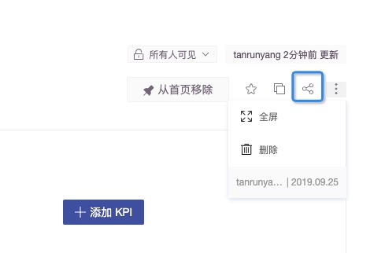

当你发现KPI符合预期，直接关闭看板，如果不符合预期，点击KPI单图进入KPI详情页，这个页面帮助你快速找到数据波动的原因。

KPI详情页构成：

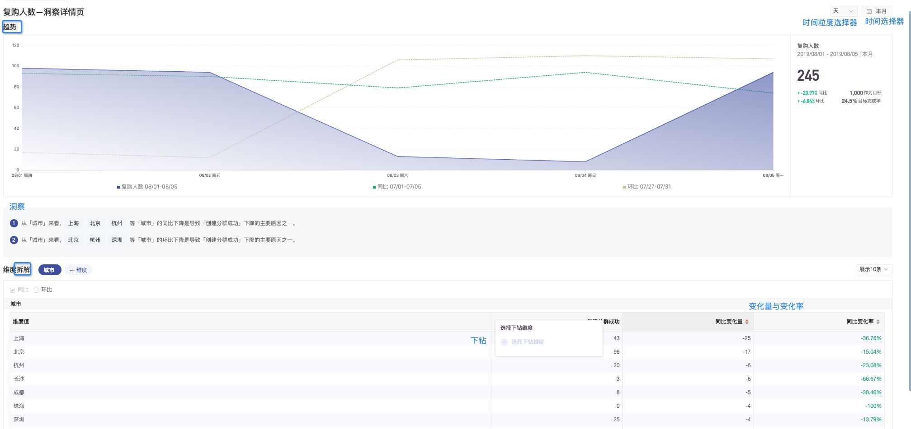

粒度选择：根据您的业务周期和频次，您可以设置不同粒度的 KPI，可以按照小时， 天， 周或者月查看。

时间范围选择：您可以调整时间范围，以便于考察KPI在不同时间范围的表现。

时间对比： 默认 本周 本月 提供同比，过去N天默认提供环比的对比，您也可以选择其他对比时间。

趋势：趋势线图，帮助您监测 KPI 趋势与波动状况。

洞察：基于您关注的业务维度，直接呈现 KPI 变化的主要影响因子。

拆解：您可以按照业务维度对您的KPI进行拆解，找到 KPI 变化的影响因子。

变化量：提供不同业务维度下的数据变化量，并默认按照绝对值从大到小排列。

变化率：提供不同业务维度下的数据变化率。

下钻：可以根据您的业务思路，不断拆解下钻找到最小粒度的原因。

在这个页面：您可以借助KPI的微幅拆解功能，快速定位KPI波动的影响因子。默认按照变化量的绝对值排序，以便于呈现出最重要的影响因子。

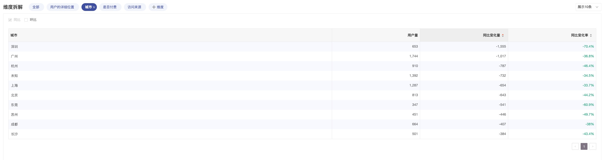

您可以借助下钻能力，层层深入，找到那个可以干预的抓手。

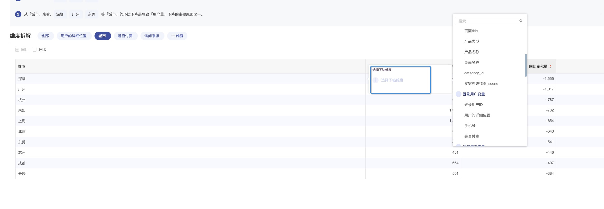

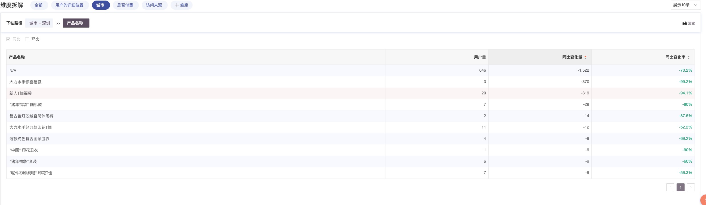

您可以借助GrowingIO的洞察模块，快速理解导致数据波动的核心原因。

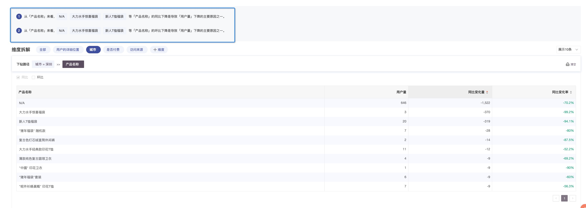

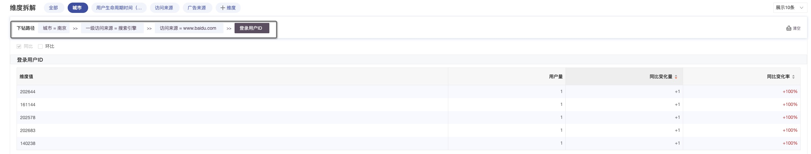

