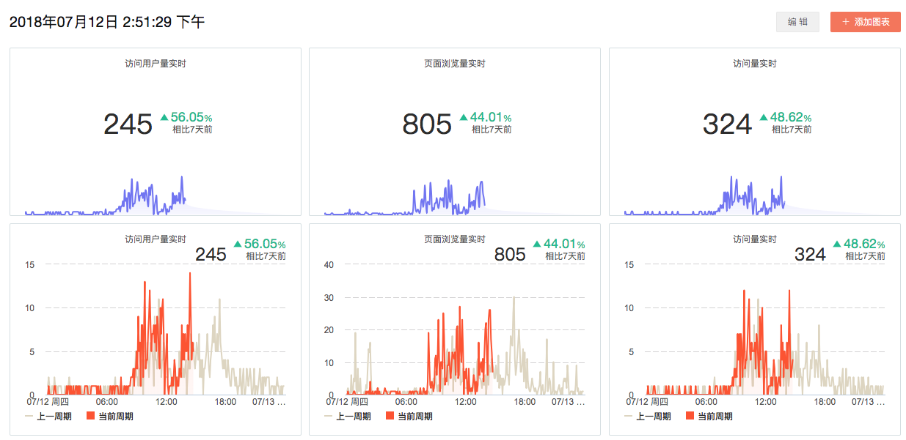
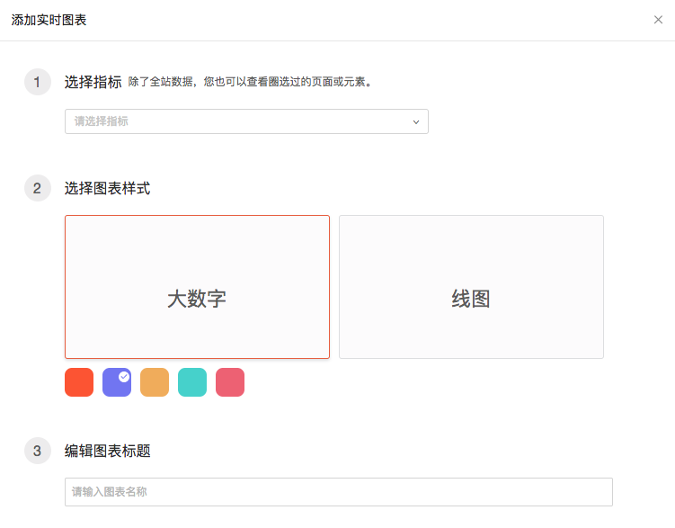

# 实时看板

* [1.简介](realtime.md#1)
* [2.应用场景](realtime.md#2-ying-yong-chang-jing)
* [3.如何使用](realtime.md#3-ru-he-shi-yong)

## 1.简介 

在实时中，你可以实时监控产品的运行状态和流量情况，每 5 分钟数据更新一次，适用于活动监控等对数据时效要求很高的业务。

默认展示 8 张图表包括：「实时访问用户量」，「实时登录用户量」，「实时页面浏览量」，「实时访问量」等，支持自定义添加实时监控指标。

## 2.应用场景

#### 案例一：通过实时功能进行活动内容优化 

对于内容媒体行业而言，某个热点事件来临之前，会准备多个头条新闻稿件，当不确定哪个内容更受读者欢迎时，可以在不同渠道发表几篇文章。通过『实时访问用户量』实时监测不同文章的访问情况，能够快速判断哪种类型的文章用户比较感兴趣，调整运营策略，撤掉其他文章，全渠道发表此篇文章，更有利短时间内提高网站的访问量。

#### 案例二：甄别作弊渠道，停止劣质渠道 

实时功能还可以用于甄别作弊渠道，企业在进行第三方付费推广后，发现用户访问量异常激增，结合『用户分群』和『用户细查』功能，若发现用户定时访问且深度极浅的行为，及时定位渠道并立即暂停，减少推广资金浪费。

#### 案例三：实时监测上线新功能的状况 

当产品上线新功能后，我们可以通过『实时访问用户量』和『实时页面浏览量』来查看用户对新功能的使用情况，初步判断产品功能是否正常运行或者新功能是否受用户欢迎。

## 3.如何使用

#### 3.1 查看 

在实时的模块上下对应：上方显示数值模块，我们可以直观的看见数据，包括相比于7天前用户上升和下降的百分比；

下方的趋势图可以看到在每个时间段内的具体表现。

颜色较淡的线是上一个周期的数据，颜色较亮的线为本周期数据，趋势图对比两个周期看出具体的变化。

#### 3.2 添加 

点击右上角「添加图表」来监控自定义指标：

* **选择指标**

选择指标，可以看到目前圈选过的所有的指标，点击您关心的指标。

了解[圈选](../data-definition/circle/)

* **选择图表样式**

在大数字和线图中选择图表样式，选择颜色。

* **编辑图表标题**

  建议为您添加的图表起个容易记忆的名字。

  **注：刚添加时，实时图表数字为0，5分钟后进行刷新并计算，显示的数据5分钟之内的总数。**

#### 3.3 编辑 

当您点击右上角的「编辑」时，每一个图表的右上方都有一个关闭的按钮，点击可以删除您不需要的图表，同时下方可以拖动大小，适用于个性化设置，设置好后，点击保存便可。

