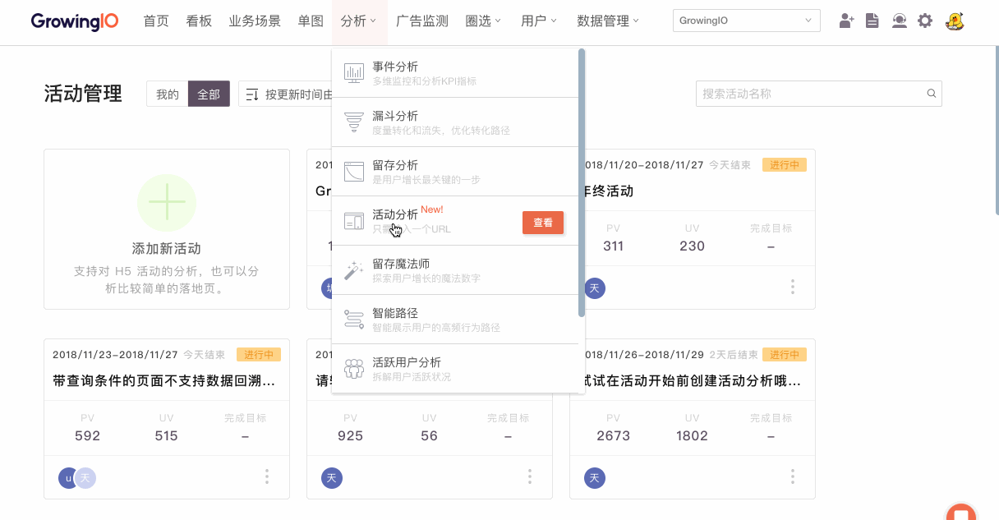
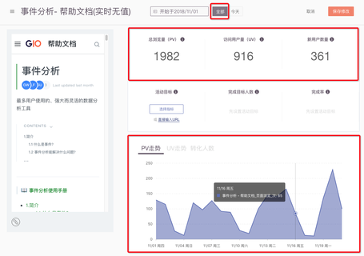
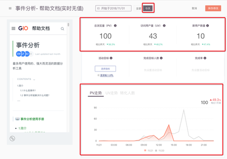
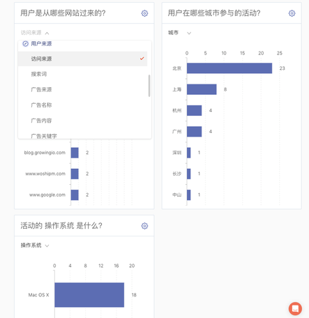
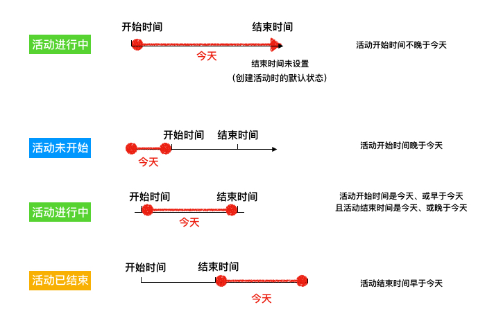
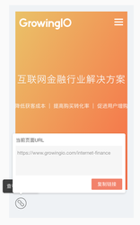

# 活动分析

### **一、介绍**

只需要输入活动的 URL ，就可以获得基本的活动数据，节约处理数据的时间，直接获得 insight ，帮助你提高活动效果，高效汇报，开心工作。

### **二、各个模块介绍**

#### 第一部分：创建活动分析

通过导航栏的分析 -&gt; 活动分析 -&gt; 进入活动分析页面，点击新建，输入活动的 URL 来创建活动分析。

#### 第二部分：数据展现

**功能1：可以满足用户对于实时数据的监控需求**

用户可以看到今天的实时数据情况，以及今天对比昨天的实时趋势，还可以知道最近几分钟里有多少人在参与活动。

时间的口径：整5分钟，比如现在是15:48，那么实时的数据是15:40-15:45。

**功能2：可以满足用户对于 H5 活动基本数据的查看需求**

提供 PV、UV 、新用户数量的数据。

活动的全部数据可以按照天来查看 PV\UV（见下图）

活动的当天数据可以按照小时查看 PV\UV 的趋势图（见下图）。

**功能3：可以满足用户查看转化人数和转化率的需求**

用户可以通过直接输入 URL 或选择转化目标的方法，来设置一个转化目标，可以查看人数和转化率。

**功能4：可以满足用户查看活动画像的需求**

用户可以查看渠道来源，包括访问来源和自定义的广告来源，用户可以查看参与活动的用户所在城市分布，以及支持其他与页面一起分析的预定义维度或页面级变量。

### 三、FAQ

**1.什么是活动的状态未开始、进行中和已结束？**

用户通过时间选择器来选择活动的时间区间，时间区间与今天的关系生成状态：  
a.活动开始时间的一定不晚于活动结束时间，颗粒度为天。（活动开始时间和活动结束时间可以是同一天）  
b.用户可以设置开始时间为未来，也可以设置结束时间为未来。  
c.当活动开始时间晚于「今天」时，则状态为活动「未开始」，（用户设置开始时间为未来）。  
d.当活动开始时间早于「今天」（或是「今天」）且活动结束时间晚于今天（或是今天）时，则状态为活动「进行中」。（用户设置结束时间为未来）  
e.当活动结束时间早于「今天」，则状态为活动已结束。

案例：活动未开始状态的一种应用方法：用户可以提前建立好活动分析，比如用户的活动有查询条件，我们是不回溯的，这时候建议用户提前建立好，活动状态可以设置成未开始。

**2.为什么我的 H5 页面输入后，告诉我没有加载 SDK 。**

想要使用 H5 活动分析，需要加载 web JS SDK。只加载了 Hybrid SDK 是暂不支持的。

**3.为什么实时没有数据？**

a.新建活动分析后，马上就进入实时，会没有数据，这是正常情况，实时数据从新建活动分析后开始统计，大约过了 5 分钟左右就会有数据了。

b.未开始和已结束的活动不提供实时数据。

**4.大数字部分的统计数据是什么时间的？**

与事件分析一致，有1-2小时的数据延时。

**5.为什么我的转化目标在选择器中无法找到？**

转化目标的事件选择控件中为漏斗事件选择控件中的事件，且平台为 web 。

**6.默认的活动分析起始时间是怎样的？**

用户填写 URL 进入到这一页后，开始时间「默认」为过去第七天，因为 GrowingIO 强大的无埋点数据采集会回溯过去七天的页面浏览数据。

注意：如果页面带有查询条件，即「?」，则开始时间默认为创建活动分析的时间，因为带有查询条件的页面不回溯数据，从创建之时开始统计。

**7.为什么活动详情页里左侧的小屏幕中，我的活动页面有点奇怪？**

可能是活动页面没有适配手机屏幕。

**8.进入活动详情页后，如何查看我的活动的 URL** 

点击左侧小屏幕下面的这个「链接」的icon就可以查看，而且这个链接是跟随小屏幕里的页面变化的，可以变化到你的转化目标页面，直接复制链接作为转化目标。想要恢复到最开始输入的URL，只要刷新页面就可以了。

#### 

