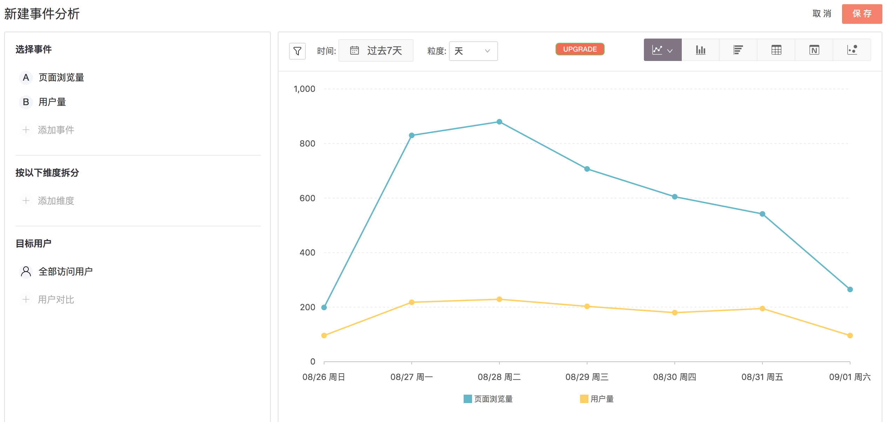
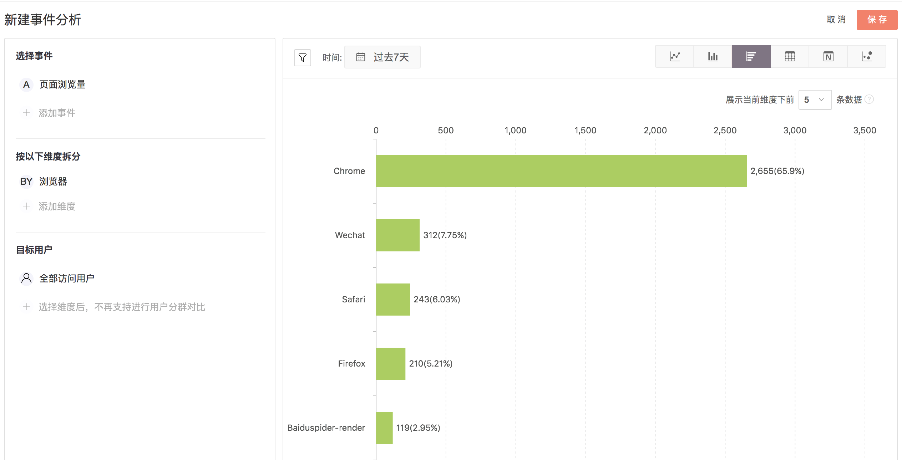
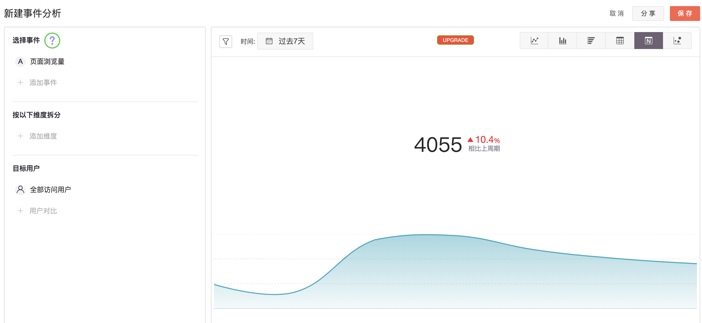
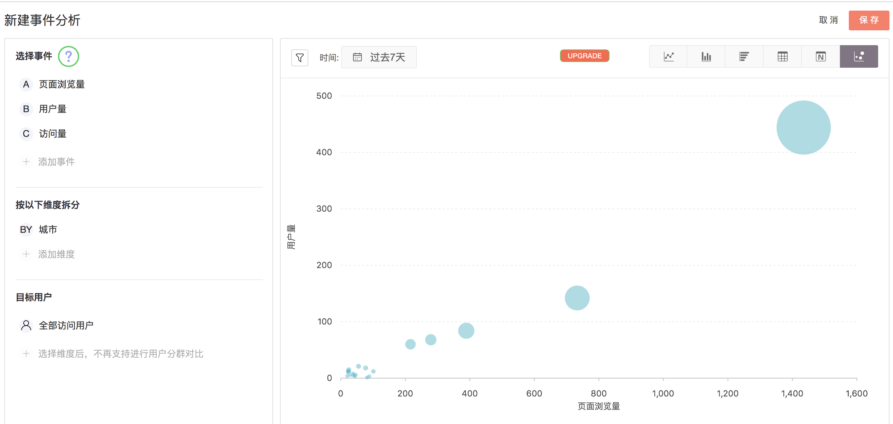

# 事件分析

> 📖 [**事件分析使用手册​**](https://s.growingio.com/nvN9MB%20)

* [1.简介](event-analysis.md#1-jian-jie)
  * [1.1 什么是事件？](event-analysis.md#1-1)
  * [1.2 事件分析能解决什么问题？](event-analysis.md#1-2)
* [2. 事件分析界面介绍](event-analysis.md#2-shi-jian-fen-xi-jie-mian-jie-shao)
  * [2.1 事件选择](event-analysis.md#21-shi-jian-xuan-ze)
  * [2.2 维度拆分](event-analysis.md#22-wei-du-chai-fen)
  * [2.3 目标用户](event-analysis.md#23-mu-biao-yong-hu)
  * [2.4 过滤条件](event-analysis.md#24-guo-lv-tiao-jian)
  * [2.5 图表选择](event-analysis.md#25-tu-biao-xuan-ze)
  * [2.6 周期对比](event-analysis.md#26-zhou-qi-dui-bi)
  * [2.7 事件保存](event-analysis.md#27-shi-jian-bao-cun)
* [3.单图列表](event-analysis.md#3-dan-tu-lie-biao)
* [4.图表介绍](event-analysis.md#4-tu-biao-jie-shao)
  * [4.1 线图](event-analysis.md#41-xian-tu)
  * [4.2 纵向柱图](event-analysis.md#42-zong-xiang-zhu-tu)
  * [4.3 表格](event-analysis.md#43-biao-ge)
  * [4.4 横向柱图](event-analysis.md#44-heng-xiang-zhu-tu)
  * [4.5 数值图](event-analysis.md#45-shu-zhi-tu)
  * [4.6 气泡图](event-analysis.md#46-qi-pao-tu)

## 1.简介 {#1-jian-jie}

### 1.1 **什么是事件？** {#1-1}

事件就是指用户在产品内做了什么事情，转义成描述性语言就是“操作+对象”。我们当前提供的事件类型包括：浏览页面，点击元素，浏览元素，修改文本框等。

我们还提供了自定义事件分析，也就是对打点指标的支持。 事件分析中供选择的是指标，指标是事件的度量方式，比如对于 “点击加入购物车按钮” 这个事件，我们可以用点击次数或者点击人数来度量，对应的指标分别是 “点击加入购物车按钮的次数” 和 “点击加入购物车按钮的人数”。

### 1.2 **事件分析能解决什么问题？** {#1-2}

 产品和运营同学如何才能对网站每天的 PV、UV、DAU \(日活跃用户数量\)等总体数据有一个直观的把握，包括它们的数值以及趋势？

面对复杂的数据，单从数字来看，不仅效率低下，而且难以直观的发现数据背后所展现的趋势，应该怎么办？

当做了第三方付费渠道推广后，运营同学如何才能有效比较不同渠道带来的流量？

针对不同场景下的数据可视化需求，我们提供了事件分析这个功能，通过事件分析创建多样的图表来满足您不同分析场景下的数据可视化需求。

\*\*\*\*

## 2.事件分析界面介绍

### 2.1 事件选择

事件是指用户在产品内做了什么事情，即“操作+对象”。我们提供的事件类型包括：浏览页面，点击元素，浏览元素，修改文本框等。我们还提供了自定义事件分析，也就是对打点指标的支持。[事件的具体定义可查看](https://docs.growingio.com/docs/data-model/event-model/event-overview)。

而事件的度量方式就是我们常提到的指标，比如我们对 “用户量” 这一事件进行分析，我们可以直接利用预定义指标来度量。

对于日常使用，我们提供了自定义指标以及预定义指标两大部分，一次事件分析可添加20个事件指标。下边对几个主要概念进行说明：

1.我的指标：

我们可以通过无埋点对特定的页面、元素进行圈选，选择我们所需的特定事件。

2.他人分享：

同项目的其他人所的指标，可用于您的图表中，省去某些自定义指标的反复设置。

3.自定义事件：

通过埋点的方式，选择实际业务所需的特定事件。

4.预定义指标：

包括用户量、浏览量、访问量等常用指标，基本能够满足日常的基本使用。[可查看具体的预定义指标的相关定义。](https://docs.growingio.com/docs/data-model/olap-model/predifined-metrics-dimensions)

重要提示：您可以选择一个或多个指标，这些指标都会在同一个坐标轴中呈现，所以建议同张图表中的事件指标，数量级是类似的。

### 2.2 维度拆分

完成事件指标的选择后，您可按维度拆分对事件指标进行更加精细化的分析。可选的拆分维度会随着事件指标的选择而产生变化。维度拆分支持添加10个维度对事件指标进行拆解。

其中可选择的包括：

1. 页面变量
2. 用户变量
3. 用户来源
4. 地域信息
5. 设备信息
6. 广告跟踪变量

如果您选择的事件指标与维度的组合无意义，系统也会进行提示。

### 2.3 目标用户

完成事件指标、维度的设置后，我们可以设置所要分析的对象人群。目前事件分析最多支持对5个不同类型的分群用户进行分析。

我们提供4种默认分群用户，包括全部访问用户、新访问用户、全部登录用户和新登录用户。也可通过用户分群功能建立特定分群用户，对特定分群用户进行分析。

特别提示，在选择不同分群用户后，不再支持进行不同维度的拆解，仅能进行二选一。

### 2.4 过滤条件

完成事件分析的基本设置后，还可借助过滤条件使分析结果更加聚焦。目前事件分析支持时间过滤及条件过滤设置。

**1.时间过滤：**包括今日、昨天、过去7天、14天、30天、180天以及365天等常用用户活动周期。颗粒度选择可选小时、天、周以及月，确保分析精细程度。

**2.条件过滤：**过滤条件可选择不同维度的特定数值或文本，从而实现模糊或精确匹配，最多可叠加5种不同过滤条件。

### 2.5 图表选择

创建不同的图表是提供数据可视化的重要工具。事件分析提供了5种不同的图表样式，依次是：1.线图 2. 纵向柱图 3.表格 4.横向柱图 5.数值 6.气泡图。

创建不同的图表是提供数据可视化的重要工具之一，用户可以通过选择指标和维度，将 GrowingIO 采集到的数据进行可视化呈现。

通过 [4.图表介绍](event-analysis.md#4-tu-biao-jie-shao) ，您可以了解事件分析种各种图表类型以及不同的图表适用的场景。

我们点击显示环比，即在图表中通过灰线展现上一周期的数据情况。系统默认对比上一周期，若改变当前周期的时间，则将重置对比周期为相应的“上一周期”。

### 2.7 事件保存

点击保存后，我们可以自定义事件分析名称，也可通过共享设置来决定可见的人群以及是否可以对该事件分析进行编辑等具体权限。

在完成保存后，建议将该图表添加到特定看板。特定看板可以是你创建的、你收藏的，或者项目内的其他指定看板。

## 3.**单图列表**

单图列表中包含了在项目下被创建的所有单图，当前包括事件分析、漏斗分析、留存分析三种图表。 

## 4.图表介绍

### 4.**1 线图**

可以用于观察一个或多个数据指标连续变化的趋势，也可以根据需要与之前周期进行同比数据分析。线图的横轴是系统默认的时间，纵轴是指标。点击选择具体指标，该指标的数据会依次添加到右侧的线图中。

您可以选择一个或多个指标，这些指标都会在同一个坐标轴中呈现，所以建议同张图表中的指标，数量级是类似的。  
  
例如：页面浏览量和访问用户量放在一起比较合适；按钮的浏览量和点击量要视情况而定，数据相差几十倍就不太合适；我们有两种数量级，量和百分比，浏览量和点击率，放在同一个坐标轴中就完全不合适。  
  
当您选择显示今天、昨天、以及最近7天之内的数据时，我们可以提供小时粒度的数据\(周期对比曲线图除外\)； 如果选择最近7天之外的日期时，无法展示小时颗粒度的数据，具体的颗粒度根据您选择的时间范围可调整为：天/周/月，便于您根据场景追踪具体指标随时间的变化。

### 4.**2 纵向柱图**

纵向柱图主要用于分析和对比各类别之间的数值大小 ，其中横轴表示需要对比的分类维度，纵轴表示相应的指标数值。您可以通过纵向柱图分析一个或多个指标在特定维度的分类表现。例如，产品经理和运营人员可以使用纵向柱图分析过去一段时间内不同访问来源过来的流量表现。

上图展示的是用户量、访问量、页面浏览量等流量指标从不同一级访问来源过来的数据表现。您可以通过纵向柱图对比不同访问来源过来的数据，进而判断哪些是高质量的渠道。

### 4.**3 表格**

表格是信息最密集的呈现方式，可以同时分析多指标和多维度的数据，您可以选择指标和维度，然后设置时间范围和展示粒度，可以进行维度过滤。

相较图表的形式，表格不那么容易看出变化趋势, 但是能更快地得到具体数值。对于核心 KPI 或您关心的指标，快速进行多维度拆解，灵活性高。图表中最多展示 100 条信息，表格进行多维度拆解时往往无法完整展示所有数据，您也可以下载表格以观测完整数据。注：下载受到权限控制。

### 4.**4 横向柱图**

横向柱图是一种频数图，主要用于观察某个指标在某个维度上的分布。根据业务需求对指标按照一定维度拆分，对比不同组别的频数，便于分清轻重缓急， 您可以选择指标以及维度，进行时间范围调整和维度过滤。

上图展示的是页面浏览量在不同浏览器下的分布。可以发现，横向柱图清晰展示了用户在不同类别上的频数，并且按照数量从大到小进行排序。在资源有限的情况下产品可以先适配 Chrome 浏览器以提升绝大部分用户的体验。 常用来细分的维度，如浏览器，操作系统，城市，App 版本，设备型号，广告来源等。 应用：您做了渠道推广后，希望查看不同访问来源的访问用户量，可以选择指标为“用户量”，维度选择为“访问来源”。

可以看到上图显示的是：在过去 7 天内访问用户数总量前 10 名的访问来源按照降序显示出来，您可以判断哪些是高质量的渠道。

### 4.**5 数值图**

数值表显示数据的方式最直观，当您想把您的核心指标通过最直观的形式展现时，建议使用数值表形式。选择具体的指标，对时间和维度进行选择，然后填写图表名称，保存即可。

上图的的意思是：在过去 7 天内，页面浏览量的总量为 4055，较上周期上升 10.4% 。

### 4.**6 气泡图**

气泡图主要是分析多个事件在一个维度上之间的关系，比如油耗，速度，价格和不同的车型之间的关系。您可以分别设置 X 轴、Y 轴的具体事件，选中具体维度，再设置大小、颜色表示的事件，对时间和维度进行筛选，然后填写图表名称，保存即可。

