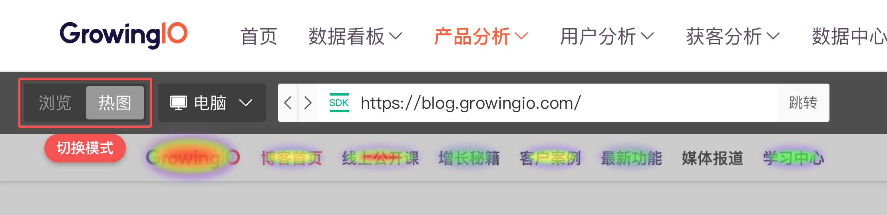

# Web 端热图

* [1. 热图分析简介](heatmap-web.md#1-re-tu-fen-xi-jian-jie)
* [2. 功能介绍](heatmap-web.md#2-gong-neng-jie-shao)
  * [2.1 功能入口](heatmap-web.md#21-gong-neng-ru-kou)
  * [2.2 绘制规则](heatmap-web.md#22-hui-zhi-gui-ze)
  * [2.3 元素点击率计算方式](heatmap-web.md#23-yuan-su-de-dian-ji-lv-ji-suan-fang-shi)
  * [2.4 功能说明](heatmap-web.md#24-gong-neng-shuo-ming)
    * [2.4.1 浏览模式和热图模式](heatmap-web.md#2-4-1-lan-mo-shi-he-re-tu-mo-shi)
    * [2.4.2 设备类型](heatmap-web.md#2-4-2-she-bei-lei-xing)
    * [2.4.3 时间](heatmap-web.md#2-4-3-shi-jian)
    * [2.4.4 用户分群](heatmap-web.md#2-4-4-yong-hu-fen-qun)
    * [2.4.5 过滤条件](heatmap-web.md#2-4-5-guo-lv-tiao-jian)
    * [2.4.6 下载](heatmap-web.md#2-4-6-xia-zai)
    * [2.4.7 热图数据说明](heatmap-web.md#2-4-7-re-tu-shu-ju-shuo-ming)
      * [1. 当前页面](heatmap-web.md#1-dang-qian-ye-mian)
      * [2. 点击率排名](heatmap-web.md#2-dian-ji-lv-pai-ming)
      * [3. 不可见元素](heatmap-web.md#3-bu-ke-jian-yuan-su)
* [3. 常见问题](heatmap-web.md#chang-jian-wen-ti)
  * [3.1 我的页面是瀑布流式布局，该如何查看未加载部分的热图呢？](heatmap-web.md#1-wo-de-ye-mian-shi-pu-bu-liu-shi-bu-ju-de-gai-ru-he-cha-kan-wei-jia-zai-bu-fen-de-re-tu-ne)
  * [3.2 我的页面有隐藏起来的弹窗，被隐藏内容的热图该怎么显示呢？](heatmap-web.md#2-wo-de-ye-mian-you-yin-cang-qi-lai-de-tan-chuang-yin-cang-bu-fen-de-re-tu-gai-zen-me-xian-shi-ne)
  * [3.3 为什么会有「不可见元素」？](heatmap-web.md#3-wei-shen-me-hui-you-bu-ke-jian-yuan-su)
  * [3.4 绘制方式的影响范围](heatmap-web.md#4-hui-zhi-fang-shi-de-ying-xiang-fan-wei)

## 1. 热图分析简介

热图是以网站页面中的元素的点击率（元素点击次数/当前页面 PV）为基础的数据的图形表示。通过聚合用户行为，热图可以让人一目了然地了解人们如何与网站页面进行交互，这有助于识别用户行为趋势并优化进一步流程。 您的网站存在以便人们可以实现特定的目标，如查找信息、注册服务、购买产品等。当人们进入您的网站但很难找到或使用他们正在寻找的东西时，他们会感到沮丧，最糟糕的情况是，他们离开你的网站不再回来。

为了让用户在访问中停留下来并进行下一步动作，也许您在关心这些问题：

* 用户是否点击了我们希望互动的内容？
* 有没有重要按钮或元素被大量点击，却被放到了不起眼的地方？
* 用户感兴趣的内容是否和我们预想的一样？
* 不同的运营位、不同的内容对用户的吸引分别是怎样的？
* 具体元素的点击数据如何？
* 不同渠道的访问者对于页面的关注点具备哪些差异和特征？
* 从重要元素的点击来看，哪个渠道质量更好？
* 「未转化」的用户与「转化」用户之间的热图表现差异如何？

热图提供了一种清晰直观的方式来帮助您解答这些问题。

## 2. 功能介绍

### 2.1 功能入口

Web 端热图进入方式：导航栏 - 产品分析 - 热图分析 - 选择你要查看的网站应用

### 2.2 绘制规则

热图模式中间的热图区域显示的是，在选定的时间段和页面（而不只是热图中的当前可视区域）中，点击量在数据总量里前 1000 的元素里，有内容或有链接的元素。没有内容和链接的元素将会被过滤，以防止混淆元素的干扰，同时，您也可以通过点击热区来进行快速圈选操作。

其他绘制规则： 在当前页面的可视区域内的元素可被绘出，如果元素有一半或一半以上超出了当前可视区域，则不绘图。 元素在浏览器层面被识别为可见，即可被绘制。（比如：页面中需要鼠标点击或悬停的下拉菜单，肉眼不可见，但浏览器可见，热图可被绘出。）

### 2.3 元素的点击率计算方式

在热图模式中，当您将鼠标悬停在页面元素上或点击右边侧边栏中的「点击率排名 TOP 15」中的元素时，会出现红色线框标记出该元素，并且显示出该元素的点击数据：点击次数、点击人数、点击率。这其中，元素点击率的计算方式均为： **元素点击率 = 元素点击次数/当前页面 PV**

注：部分情况下会出现右侧列表中的元素点击率与页面中展示的点击率有差异，如下图所示。这种情况出现的原因是：**该元素所在的位置上面在某些条件下会有其他元素的存在，界面上面展示的点击率是该元素所在位置上的所有元素点击率之和，因而有时会比点击率排名列表中该元素的点击率高。**

### 2.4 功能说明

#### 2.4.1 浏览模式和热图模式

在使用热图时，想要到达目标页面有两种方式：

1. 直接在工具栏中输入目标页面的 URL 点击「跳转」按钮前往目标页；  
2. 切换至「浏览模式」，此时界面可进行正常的网站页面交互，可通过网站的跳转路径找到目标页，再切换至「热图模式」查看；

\*注：当页面为「瀑布流式布局」时，想要看到未加载出来的内容的热图时，请先切换至「浏览模式」，将新的内容加载出来，再切换至「热图模式」查看。

#### 2.4.2 设备类型

很多网站为不同设备做了响应式设计，不同设备端查看到的页面结构可能会不同。在热图分析中，可以切换设备类型查看不同显示状态下的热图数据。

#### 2.4.3 时间

热图功能支持查看过去 30 天数据。

#### 2.4.4 用户分群

在这里选择不同的用户分群将可以看到特定人群在所选页面的热图表现。

#### 2.4.5 过滤条件

当您想要看特定渠道、设备类型等维度的用户的热图表现，可在这里添加过滤条件。例如：查看「访问来源 = www.baidu.com」的用户的热图数据，再查看广告来源=Google的用户的热图数据，可对比不同渠道来源的用户对于页面的关注点的特征和差异。

#### 2.4.6 下载

产品改版、活动对比，您可以提前将需要的热图分别保存下来，做改版前后、不同活动的效果对比。在可以在项目复盘时给项目相关人员提供非常直观的数据表现。

#### 2.4.7 热图数据说明

#### **1.当前页面**

对于页面结构一致的多个页面，可以将其定义成为一组页面，查看页面组的热图数据，例如将所有的商品详情页面定义为一个页面组「商品详情页」，选择这个页面组则可以查看所有产品详情页的总热图数据。

注意事项：如果在 A 页面中定义了一个和 A 结构不符的 B 页面的页面组，那么 B 页面组则不会在该列表中显示，需要切换到B页面查看该页面组。（比如：如果在产品详情页定义了一个产品列表页的页面组，那么在「产品详情页」作为当前页面时，定义的产品列表页面组不会被展示出来，需要将「当前页面」切换到列表页面中查看。）

#### **2.点击率排名**

所选页面中点击率前 15 的元素排名列表。点击「查看更多排名」可以查看点击率前 50 的元素排名列表。

#### **3.不可见元素**

在列表中您可能会发现存在一些用灰色文字标记的元素名称，无法点击它们找到具体元素，它们在当前页面内不可见。存在这样的元素有两种可能的原因：

1. 在所选时间、所选页面内，该元素曾被点击，但是因页面改版或因页面动态加载以致您在当前页面内看不到这些元素；
2. 在所选时间、所选页面内，该元素曾被点击，但是存在于当前页面的一些下拉菜单或者弹窗（需要交互才能展示出来的内容）中，因热图数据是依据当前 URL 一并绘制的，因此它们在列表中，但是所在的下拉菜单或者弹窗未展示出来，因此不可见。为了消除干扰，您可以点击这里的按钮选择「仅展示可见元素」隐藏不可见元素，其他元素会仍按照点击率排名进行展示。

## 常见问题

#### **1.我的页面是瀑布流式布局的，该如何查看未加载部分的热图呢？** 

当页面为「瀑布流式布局」时，想要看到未加载出来的内容的热图时，请先切换至「浏览模式」，将新的内容加载出来，再切换至「热图模式」查看。 

#### **2. 我的页面有隐藏起来的弹窗，隐藏部分的热图该怎么显示呢？** 

若该弹窗存在于当前 URL 页面下，且其内元素的点击数据在点击率前 15 名内，则在右侧可以直接看到其内部的元素点击率数据，但是当前页面内该元素不可见。若是想要查看弹窗热图，请先切换至「浏览模式」，与页面进行交互将弹窗展示出来，再切换至「热图模式」即可查看弹窗热图数据。 

#### **3. 为什么会有「不可见元素」？** 

存在这样的元素有两种可能的原因：

1. 在所选时间、所选页面内，该元素曾被点击，但是因页面改版或因页面动态加载以致您在当前页面内看不到这些元素；
2. 在所选时间、所选页面内，该元素曾被点击，但是存在于当前页面的一些下拉菜单或者弹窗（需要交互才能展示出来的内容）中，因热图数据是依据当前 URL 一并绘制的，因此它们在列表中，但是所在的下拉菜单或者弹窗未展示出来，因此不可见。为了消除干扰，您可以点击这里的按钮选择「仅展示可见元素」隐藏不可见元素，其他元素会仍按照点击率排名进行展示。 

#### **4. 绘制方式的影响范围** 

由于绘制方式的特殊性，会在不同页面结构产生以下可能发生的影响： 

1. 页面中的嵌套元素，在绘制时叠加，视觉上会产生热度误差。 
2. 页面中链接路径完全一样，热图上的元素数据也会完全一致。 
3. 页面动态内容, 导致画图定位不准确。（比如：轮播图，会导致被隐藏区域内的元素热图被绘制） 
4. 伪状态的隐藏，程序无法识别该元素为藏，绘制了热图。导致热图绘制紊乱。（比如，有交互隐藏图层，会导致被隐藏的，肉眼不可见的图层被绘制） 
5. 当特殊页面结构：导航条、tab在页面滚动后被隐藏，热点重绘有误。 
6. 用户网站 body 的positon 定位有问题，会导致热图绘制问题。 
7. URL尾参（Query）不被区分: 如果页面内容依赖于query的话，并且页面结构不同的话，那么会产生热区绘制误差的情况。

