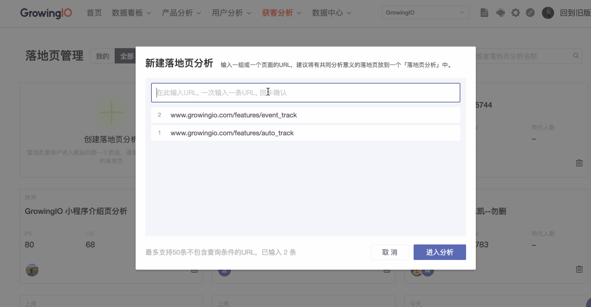
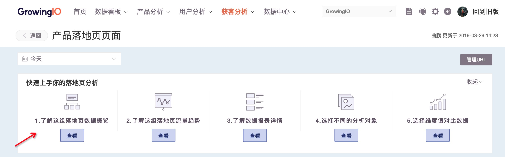
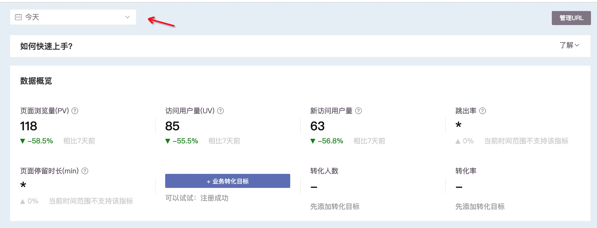
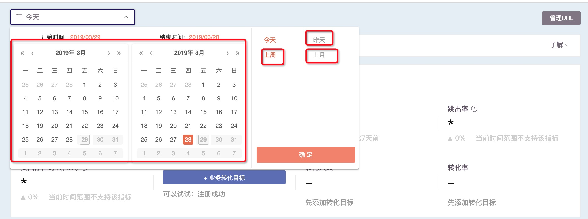
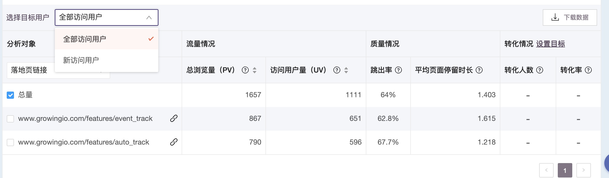
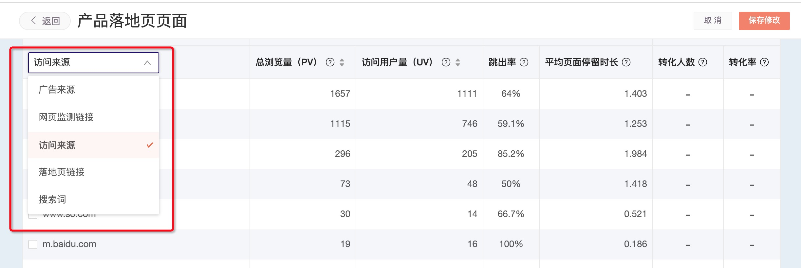
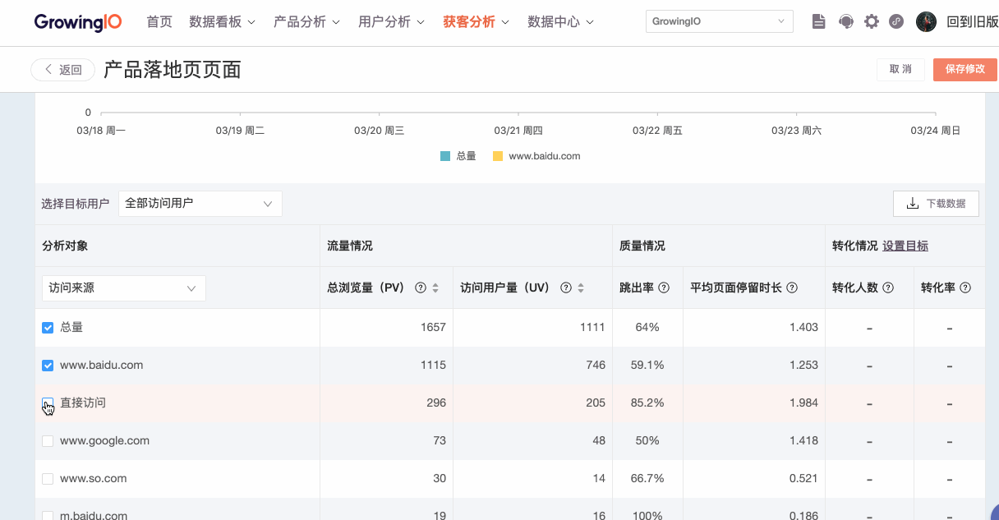
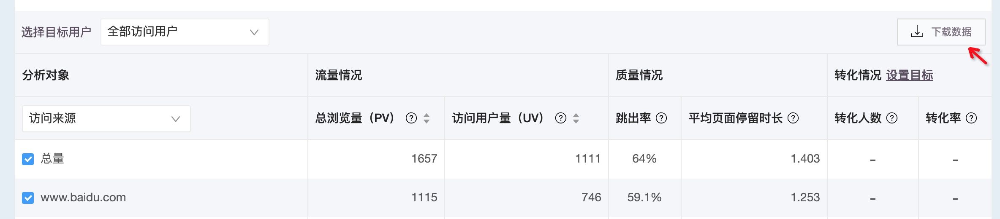
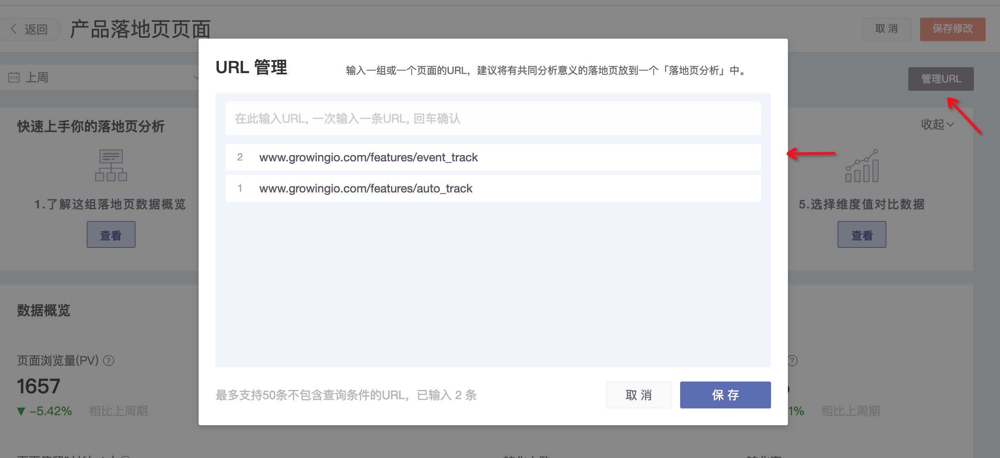

# 落地页分析

## 一、介绍 

只需要输入落地页的 URL ，就可以获得基本的活动数据，节约处理数据的时间，直接获得 insight ，帮助你监控落地页流量和来源情况，高效汇报，开心工作。

落地页分析支持：

* 查看落地页基本的数据流量和质量情况；
* 了解不同页面的转化情况；
* 了解落地页整体流量来源；
* 适于长期监控数据情况随时间的变化；

数据介绍：由于数据模型的处理方式，**新创建的落地页分析，不管是否建立过指标，统一回溯过去 31 天数据。**

## 二、各个模块介绍 

### 第一部分：创建落地页分析 

通过导航栏的获客管理 -&gt; 落地页分析 -&gt; 进入落地页分析页面，点击新建，输入落地页的 URL 来创建落地页分析。

注意⚠️：本期落地页分析**不支持带有查询条件（即原始URL中包含 ?后面的部分，且不可去掉）的页面**。因为一般官网落地页是不会用查询条件的，带有查询条件的可能是商品详情页，因为商品详情页做了广告投放，所以这也是一种分析意义上的落地页，我们建议您设置成页面级变量，在事件分析中使用，落地页分析暂时不支持这样的页面。

### 第二部分：数据展现 

**功能1：提供了便于上手的 Onboarding 步骤**

简单操作，跟着一起做一做，了解落地页基本情况。

**功能2：满足用户对于当前数据情况的整体了解（小时级别）**

当我们想要分析一段时间落地页表现情况时，可以切换时间控件，查看当前时间区间的 PV 、 UV 、新访问用户量、跳出率、页面停留时长的数据。

以页面浏览量（PV）为例，数据是这个页面被浏览过的全部次数，不限于作为进入页面。

添加转化目标后还可以看不同转化目标的完成情况，即来到落地页并完成转化目标的人。

\*当时间为今天时，不支持「跳出率」和「平均页面停留时长」，可以明天再看这两个指标。

可以切换其他时间查看不同时间区间的数据：

\*数据口径：上周是上周一到周日，上月是上月1日到月底。

**功能3：可以切换分析对象，灵活分析统计**

新访问用户和访问用户对于网站的价值是不同的，对于拉新的落地页来说，新用户是非常值得关注的，衡量了渠道的拉新能力，因此你可以切换访问用户和新访问用户，来衡量拉新的效果：

默认提供了五种分析对象，分别便于我们查看落地页的流量和质量情况：

**功能4：衡量不同分析对象随时间的流量变化趋势**

怎样知道流量变多变少呢？我们需要观察不同流量随时间的变化，落地页分析支持图表联动，可以同时对比多个渠道、页面的数据情况，支持切换 PV 和 UV  两个指标：

**功能5：管理落地页和下载落地页数据**

落地页分析提供将表格下载为 csv 文件的功能：

同时，落地页分析提供查看/增加/删除落地页分析中的页面：

