# 电脑端圈选 App （灰度功能）

在使用电脑端圈选后，请确保已经接入 SDK 2.7.0 及以上，见下面：



## 一、介绍

为了提供更有效率的便捷的数据定义工作，我们为你提供了在电脑上圈选手机 app 的功能：

1.通过机器学习提高元素定义的准确性，iOS 和 Android 支持 Pattern Server；

2.提供基本的热图功能，可以分别查看过去7天、昨天和今天的热图；

3.支持 H5 页面的快捷定义，同平台不同原生页面中使用的 H5 一次定义完成；

4.在电脑上进行便捷的操作，右侧动态展示区详细解释「你在定义的是什么」；

5.与 web 端圈选的 UI / UX 保持一致，降低不同平台圈选的学习成本。

## 二、准备工作

### **1.SDK 版本要求**

将想要圈选的 App 升级到 2.7.0 版本，（不需要也不建议发版），可以看[这里](https://growingio.atlassian.net/wiki/spaces/PROD/pages/822116505)。

### **2.使用方法**

通过 GrowingIO 圈选入口，在下拉列表中找到需要定义的 App，进入圈选扫码页面，使用手机扫码，选择手机中右边的按钮「 web 端圈选」即可进入电脑圈选，唤醒手机上相对应的 App （加载了 2.7.0 版本的 SDK ），操作手机进入到想要定义的页面进行圈选。


请确保手机和电脑在同一个 wifi 局域网下。


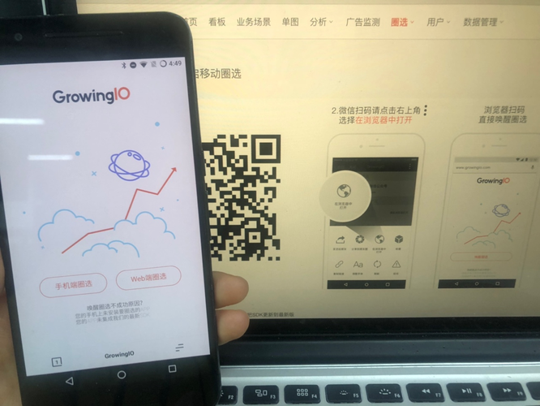

### **3.查看基本信息**

可以在左侧看到当前圈选的元素的包名、版本信息以及app和电脑的连接状态。

**示意1** :

在这里查找 App 版本信息和 SDK 版本

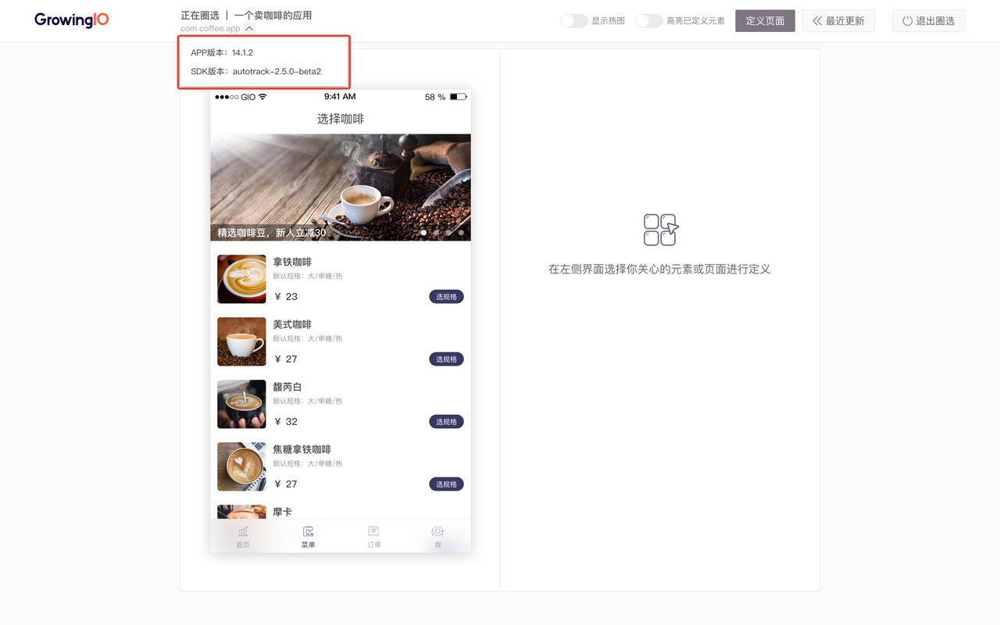

**示意2 :** 

圈选手机和电脑的连接状态

【连接正常】

【界面停止同步】

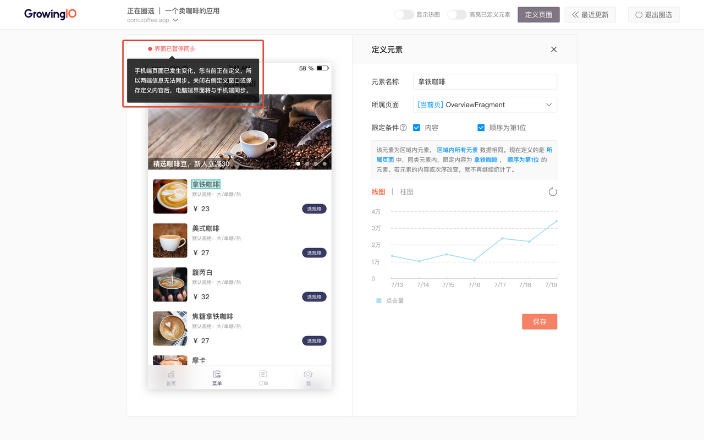

这个情况出现是因为电脑端正处于定义的过程中，此时手机端界面若发生变化，为保证定义内容准确性，会暂停界面的同步。当结束定义后会将手机端的界面再次同步至电脑端。

【设备断开连接】

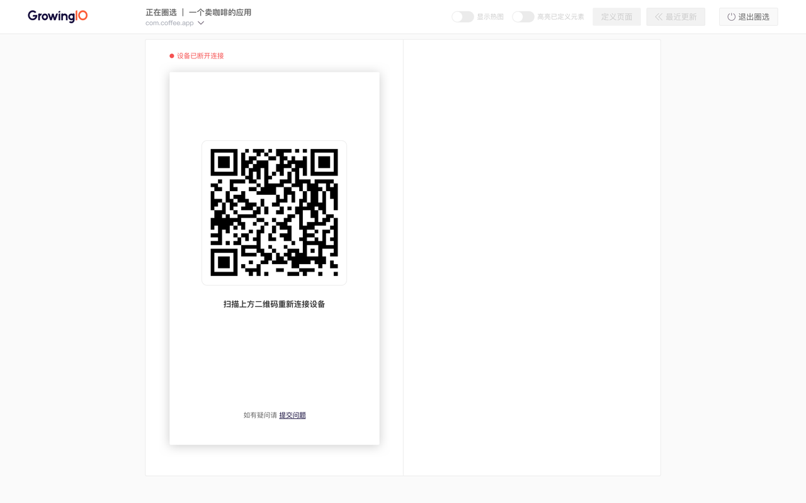

当手机端退出正在圈选的应用或无线网断开等情况出现时，可能会导致两端设备连接断开，中断圈选。如要继续圈选可重新扫码进行连接。如要结束圈选，可点击右上角“退出圈选”。

### **4.异常情况处理**

如果扫码失败，可能是手机 App 与在电脑端选择的应用不符，检查后仍然无法解决可以联系技术支持。

## 三、圈选元素

不管是 app 的原生元素还是 H5 页面上的元素，在 GrowingIO 元素定义的过程中，既需要定义元素本身的条件，也需要定义元素所在的页面，这两个部分在下面进行详细的介绍。

### **1.元素的限定条件**

当我们对一个元素进行定义时，往往是想要知道「某个按钮被点了多少次」，因为“点击”的动作在开发时加在了这个按钮上，于是你的用户点击时就会触发跳转等操作，GrowingIO 的圈选定义是基于 app 开发的实现方式，如果使用了不同的实现方式，数据的呈现往往也会有不同，但是这并不影响你定义元素的操作。

在电脑上点击你想要圈选的元素，然后查看右侧的文案，来理解自己定义的是什么。

根据不同的实现方式，对于不同元素之间的关系，主要有 3 种定义形式：

#### 情况1：多个元素共用一个“点击”动作，常见于商品列表和商品详情等

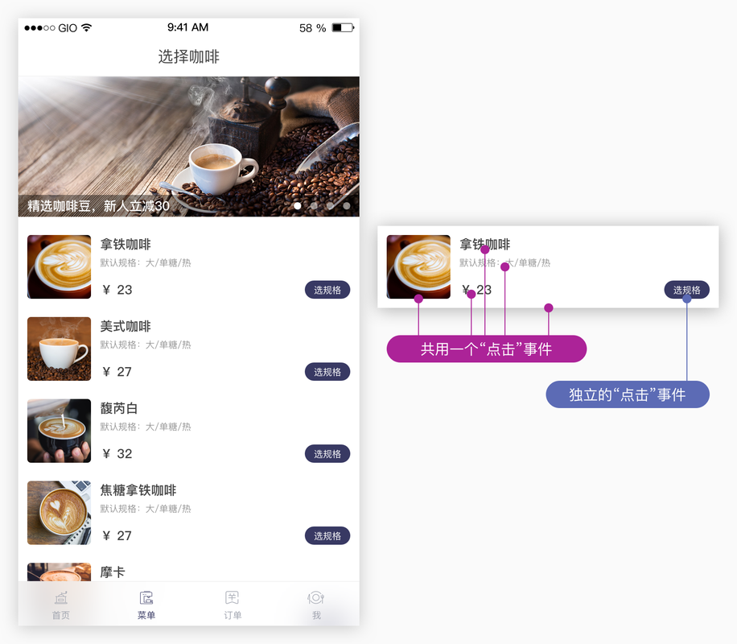

这种情况是因为在这个 app 开发的时候，就把这些元素“绑定”在了一起。你会在右侧的文案中看到“区域”的字样，可以将鼠标移到“所有元素”上面，你将会看到左侧高亮的元素，他们的点击都是一样的，圈哪个元素的数据都是一样的。

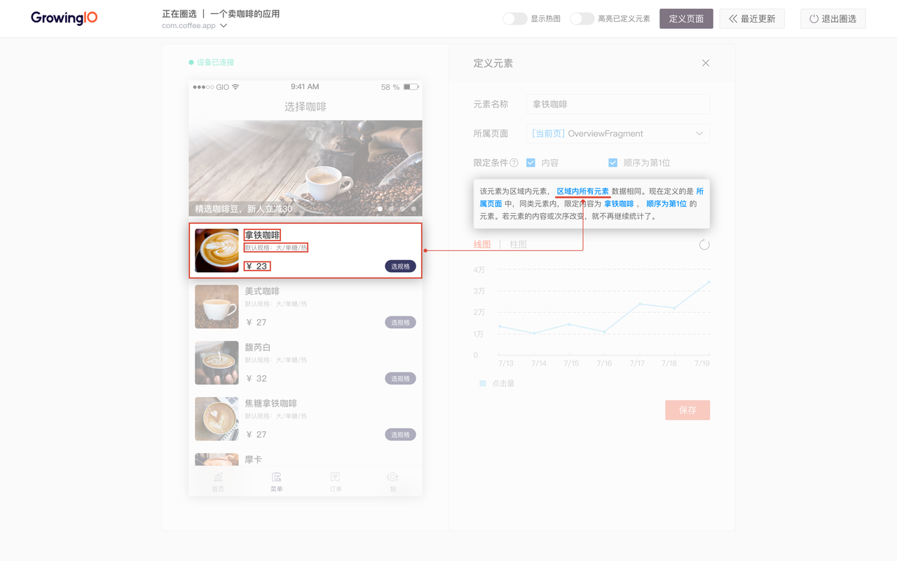

我们建议你按照分析的需求来定义这样的元素。

**案例 1：**

你想要知道不同咖啡的点击情况，这里的元素有很多种“拿铁咖啡”、“23元”、“图片名称”，因为他们共用一个点击的动作，不管点到哪个元素，点击的数据都是一样的，所以你其实只需要定义任意一个元素都可以拿到这个区域的数据；

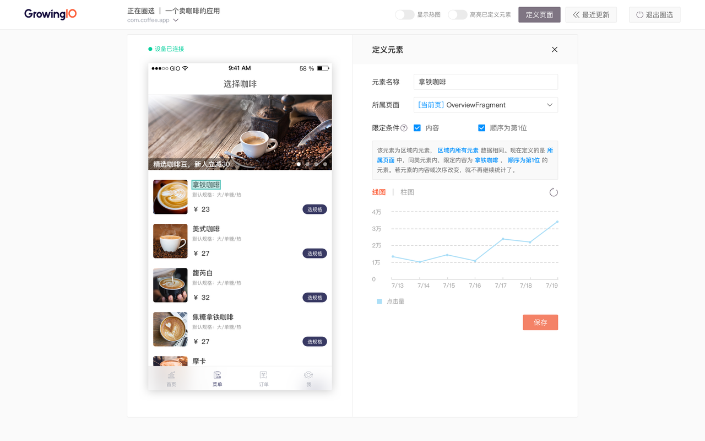

**案例 2:**

你想知道“拿铁咖啡”、“美式咖啡”和“馥芮白”等咖啡的点击情况，每个定义一遍太麻烦了，可以只定义一次。依然是选择“拿铁咖啡”这个元素，然后在右侧选择「不限制内容」，不管咖啡名称是什么，所有的咖啡商品都会统计进来。这时定义的这个元素，我们叫做“同类元素”。

接下来在「事件分析」中选择这个指标，通过“元素内容”维度来区分，就像定义元素时右侧下面展示的柱图一样。

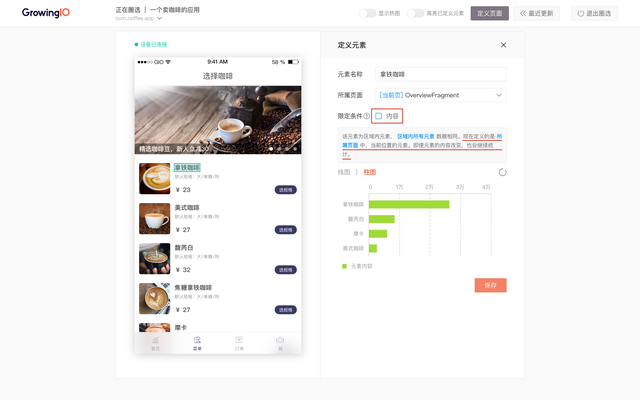

**案例 3:**

你想要知道这个列表不同位置的商品点击情况，也可以用与案例 2 相似的做法，选择这个区域的元素中，带有顺序标示的元素，在这里是外面的框，「不限定顺序」，统计所有位置的总数，然后也是定义“同类元素”，然后在「事件分析」中通过“元素位置”维度来区分。

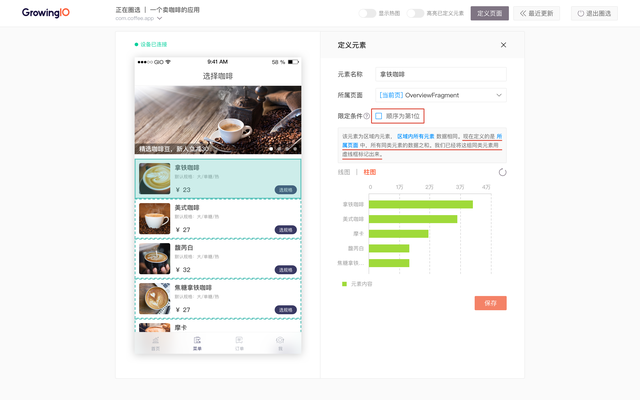

#### 情况2：一个元素有独立的“点击”动作，常见于菜单按钮等 ****

这种情况是因为在这个 app 开发的时候，给每个元素单独设置了“点击”的动作，需要单独圈选。

如果一个列表里既有区域圈选的元素也有单个圈选的元素，需要单独圈选单个圈选的元素，因为他们的数据是单独统计的。

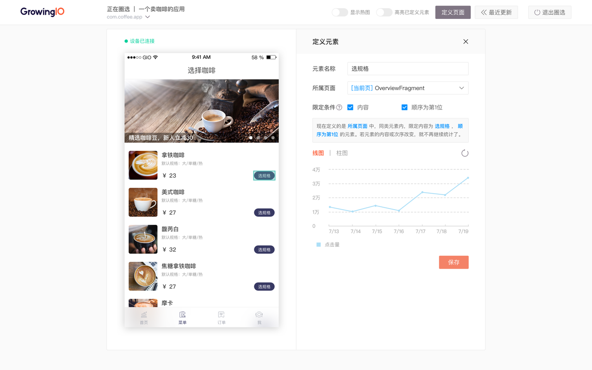

单个元素的圈选也可以像区域圈选一样定义同类元素，统计多个元素之和，在「事件分析」中通过“元素内容”和“元素位置”维度来区分。

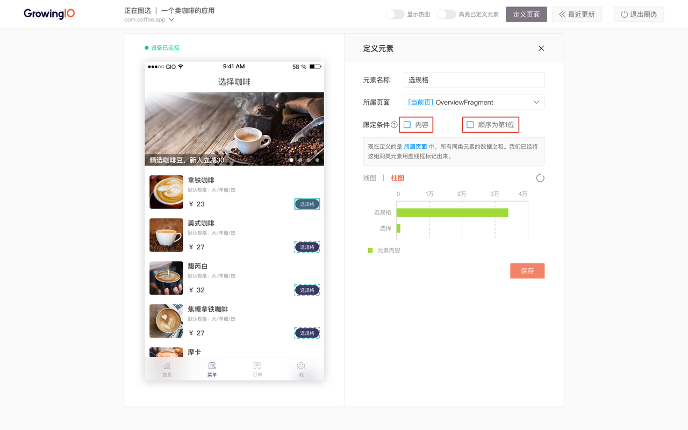

【对于 H5 元素的圈选方法详见 [https://docs.growingio.com/docs/data-definition/circle/web](https://docs.growingio.com/docs/data-definition/circle/web) 】

#### 情况3：存在父子结构的元素 —— **容器圈选**

容器元素的数据是容器内所有元素的数据之和，在 H5 页面中，a 标签和 button 标签会默认作为容器，你可以通过查看不同元素的数据，看到这种差异。

### **2.元素的所属页面**

在定义元素的过程中，你会发现元素默认会有一个所属页面：

因为一个元素可能会同时在多个页面上，所以你可以调整元素的所属页面范围，以确保定义符合自己需要的数据。

原生元素的默认所属页面是此时元素所在的最小的页面部分，H5 元素的默认所属页面是 H5 。

在这个例子中，「加入购物车」元素在当前商品详情页的点击数据：

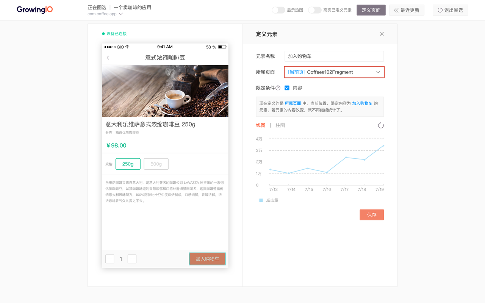

但是更多情况下，你其实是想统计所有页面中，不管这个按钮在哪些商品详情页，都要统计为「加入购物车」按钮的点击次数，这时就需要把元素所属页面改为所有页面。

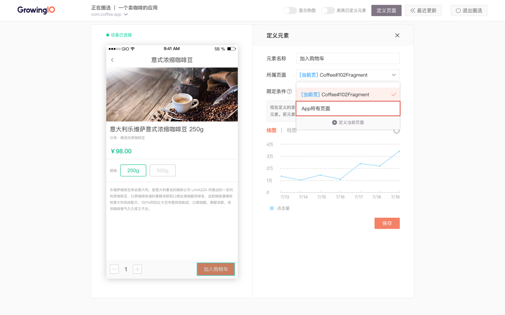

### **3.在热图模式下圈选元素**

可以在圈选时开启热图模式，来查看点击热度：

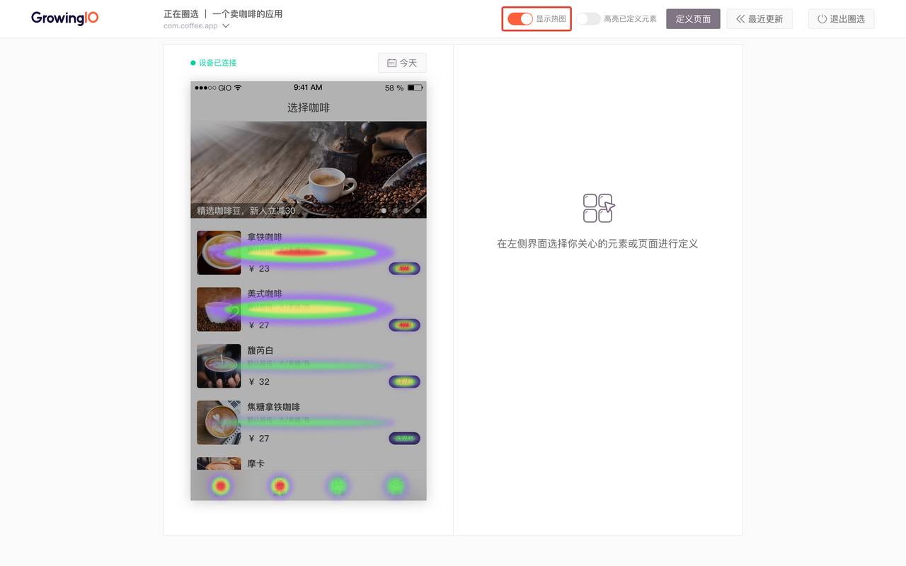

## 四、圈选页面

### **1.原生页面**

在 App 中，「原生页面」其实更像是 App 的「组成部分」，每个部分上有承载着不同功能的元素，帮助用户完成在 App 中的操作。

你可以定义你关心的元素页面，以此来统计这些页面被浏览的次数。

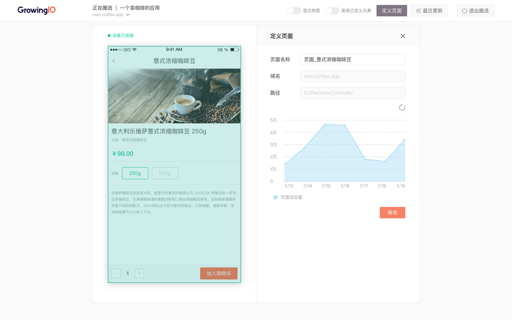

### **2.H5 页面**

为了更方便地定义 H5 页面，页面选择中提供快捷模式和自定义模式

**快捷模式 ：该 H5 在本应用内的全部数据**

一个 H5 页面可能会在这个 App 的不同页面下加载出来，在这个模式下，这个 H5 不管在哪个页面被打开，只要在 App 中被浏览就统计进来。

**自定义模式：该 H5 在该原生部分下的数据**

一个 H5 页面可能会在这个 App 的不同页面下加载出来，在这个模式下，这个 H5 不管在哪个页面被打开，只统计在当前原生页面下被加载的数据。

## 五、FAQ

**1.App 的 H5 页面圈选的数据是怎样的？**  
如果只加载了 Android 和 iOS 的 SDK ，就只能是 App 圈选，H5 在 App 外面的数据是统计不到的；  
如果加载了JS SDK ，是可以在 web 圈选的，App 上圈的就是在 App 的数据，web 里圈的还会包含 App 外的数据。

