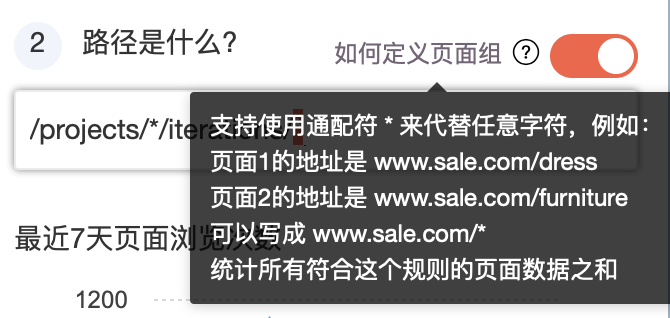

# 微信内嵌页数据定义（beta）

GrowingIO 微信内嵌页SDK采集用户的行为数据，你可以通过「无埋点数据定义」来定义元素和页面，作为数据分析的基础指标。

**在没有定义行为事件的情况下，GrowingIO 保留和回溯过去 7 天的元素点击事件和页面浏览事件，带query的页面不进行事件回溯**。

通过导航栏进入「数据管理-无埋点数据定义」，选择您需要定义的应用，选择您自己的头像，就可以在「交互定义」功能中，通过和产品交互，定义您产品和运营关注的浏览核心页面、页面组事件，以及页面或页面组上的元素点击事件或者输入事件等。

## **1.0 页面需要了解的基本知识**

\*\*\*\*

## **定义事件**

### **1.1 进入数据定义功能**

点击导航-数据管理-无埋点数据定义，选择微信内嵌页应用，进入交互式数据定义界面。

进入后，需要您进行以下操作：1、您的手机打开，处于和打开GrowingIO的电脑同一个网络环境下（公司wifi）；如果不能满足这个网络环境要求，可以点击“请扫码”，打开微信，扫描二维码。

2、打开集成了微信内嵌页SDK的应用，会有一个用户标识出现在说明下方，最新进入的用户会被高亮且排在左边第一个。如果您的微信内嵌页有微信用户授权，可以将[微信用户信息上传](../../sdk-integration/wei-xin-nei-qian-ye-sdk.md#sdk-wei-xin-yong-hu-shu-xing-she-zhi)，则在此，当您在微信内嵌页打开授权信息后，会显示您的具体的微信头像，方便您进行使用。

点击“开始圈选”进入下一步操作。

进入圈选页面后，页面中会实时展示您在微信内嵌页中的操作，如下图。

可以看到几个内容：

* 浏览页面：即目前展示的是一个页面打开/浏览页面的事件；
* 点击元素：展示的是某个元素被点击的事件；
* 已定义：即这个事件目前已在项目中被定义过了，您可以直接在分析模块中使用。已定义的事件展示的是这个事件在GrowingIO中已被定义的名称。
* 未定义元素/页面：即目前这个事件在项目中没有被定义过。

对于未被定义的元素，鼠标移到右边，即会出现“定义事件”的按钮。

### 1.2 定义页面浏览事件

#### **在定义页面之前需要理解的基本规则：**

URL**示意：**m.xxx.com **/** details **?** id=1&ig=2

**拆分：**域名 **/** 路径 **?** 查询条件

**即** m.xxx.com **为域名，**details  **为路径，**?id=1&ig=2 **为查询条件**

如果页面路径中有 **\#**，请先设置后再进行数据采集和分析：我们默认不会把 hashtag 识别成页面 URL 的一部分。对于使用 hashtag 作为单页应用页面切换的网站来说，请在工程师的帮助下，在SDK中将hashtag的参数打开，具体请见[微信内嵌页SDK文档-hashtag参数](../../sdk-integration/wei-xin-nei-qian-ye-sdk.md#hashtag-can-shu)，每次 hashtag 改变都会触发一次PV，hashtag 的信息也会记录在页面 URL 中。

#### 定义“浏览页面”事件

对页面浏览事件，点击“定义事件”后，会从右边划出一个侧边栏定义区。

按照页面结构，我们把一个完整的 url 拆解成了：**域名、路径、查询条件**（如有查询条件则显示，如果没有查询条件就不会显示），可以分别编辑。默认展示的是当前页面浏览事件的所在页面的域名、路径和查询条件（如有）。

如果集成SDK超过7日，则会显示这个页面事件过去7天的每日的PV回溯数据。

但有时，可能并不需要定义一个单独的页面，而是要定义一组页面来代表用户浏览了某个功能事件。

例如，GrowingIO 博客文章内容的地址都是这样的 **https://blog.growingio.com/posts/123456** 、 **https://blog.growingio.com/posts/14562**、 **https://blog.growingio.com/posts/1264**......

我们有几百篇播客文章，希望了解的是用户每日访问博客文章页的事件，则可以定义访问博客文章**页面组**事件。

> **！如何定义一组页面？**

a.「路径」最右侧的开关开启时，可以通过在「路径」中使用「\*」来做通配符，达到圈选多个类似页面的目的：

例如，GrowingIO 博客文章内容的地址都是这样的 **https://blog.growingio.com/posts/123456** 、 **https://blog.growingio.com/posts/14562**、 **https://blog.growingio.com/posts/1264**......

那么我们在路径中输入 /posts/\* 就会圈选出所有的博客单篇文章的页面。

定义页面组示例如下：

您也可以

b.「路径」右侧的开关关闭时，意味着要圈选出所有符合域名为 xxx.xxxxx.com 的一组页面，不管后面的路径是什么。

默认页面query关闭，如果您需要定义带query的页面，则需要打开query。query也同样支持使用「\*」来做通配符。

**注意**：带query的页面浏览事件默认不进行回溯，会从您定义或者修改保存后，才开始进行页面浏览事件的计算。

给事件命名，一般推荐按照“产品名称+页面名称”的方式来命名。然后点击“保存”。

### 1.3 定义元素

#### **在定义元素之前需要理解的基本规则**

元素分为单个元素和嵌套元素：

* 单个元素：较好理解，即某个单独的按钮等。
* 嵌套元素：即一个具有多级节点（例如一个文章列表）的嵌套元素。点击时，由于存在多级节点，故有几种可能的对象：1、某个具体的内容；2、整个列表；3、列表中其他。对于嵌套元素来说，我们将采集到的对象，直接展示出来，如下图：

* 元素是由页面、元素标识（xpath\)、内容和位置几个限定条件来唯一定义的。

嵌套元素的前端HTML标签可以参考：[http://www.w3school.com.cn/tags/index.asp](http://www.w3school.com.cn/tags/index.asp)

#### **定义“点击元素”事件**

**第一步：确认元素所在的页面是什么。**

如果这个元素出现在多个页面同样的位置，想要统计所有的数据，可以直接按照定义页面组的方式，进行页面路径的通配

**第二步：确定元素统计的规则。**

设置元素当前的文本 / 位置等限定条件，确定元素统计的规则。

**第三步：通过勾选内容等checkbox，从数据展示区确认是不是自己想要定义的元素和规则。**

  
如果不勾选内容保存，则默认会将元素的文本作为一个维度。可以在维度选择、或者过滤功能中，使用“元素内容”。

### 1.4 使用事件

保存后，事件可以在“数据管理-无埋点事件管理”中查看。

可以在事件分析、漏斗分析、留存分析、用户分群等分析功能中使用。

