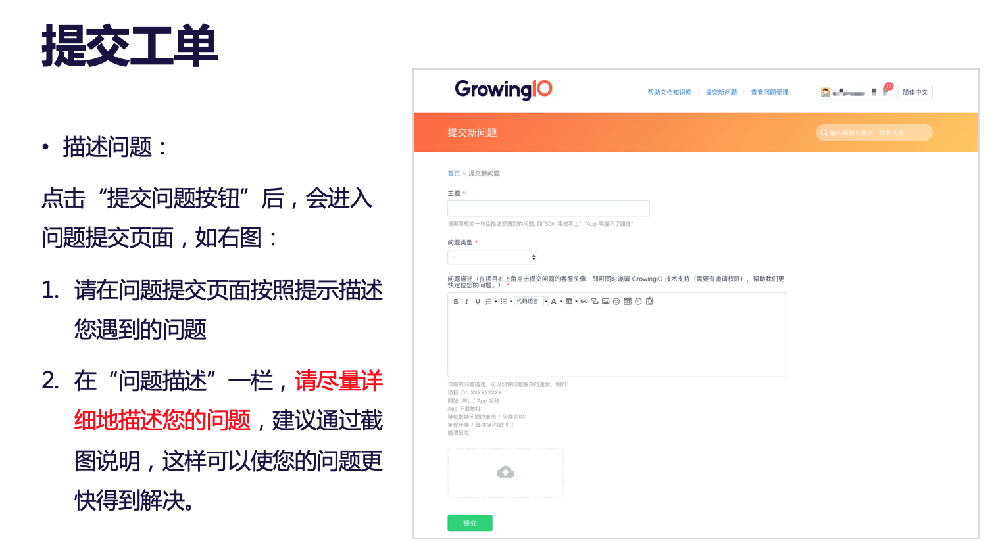

# 快速提交工单


提交问题不受权限控制，只要在您项目中的账号都可以进行问题提交。


提交工单入口（项目中点击右上角客服图标）

描述问题

描述问题样例

查看工单处理进度及回复

第一种方式，工单平台和邮件中提醒。

第二种方式，GIO系统内提醒


如何获取邀请技术支持权限。


默认所有账号都有提交问题的权限，但部分账号没有邀请技术支持权限（即授权 GIO进入您的项目）获取方式如下。

对于没有【邀请技术支持】权限的同事，可以请公司内部负责分配账号（管理员）或者有邀请技术支持权限的同事，帮您在【用户权限管理】中，勾选一下技术支持【邀请】权限即可。

之后提交问题时，默认勾选【同时邀请技术支持】，直接提交问题即可。


邀请技术支持权限，可以授权 GIO技术支持拥有临时权限来访问您的项目，以便更快速定位问题所以该权限开启，对于核查问题至关重要。


