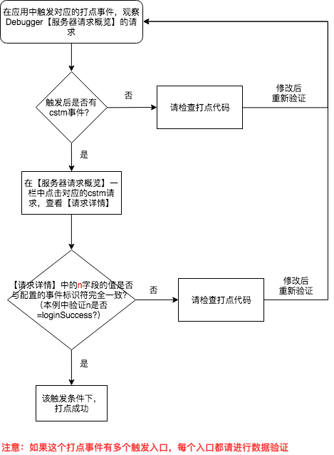
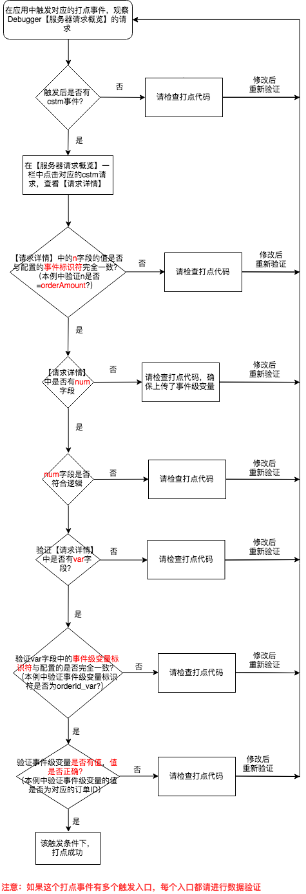
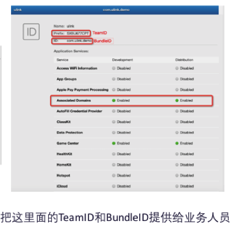

# 验证打点事件

* [概述](best-practice.md#gai-shu)
* [cstm \(事件以及关联的事件级变量\) 事件](best-practice.md#cstm-shi-jian-yi-ji-guan-lian-de-shi-jian-ji-bian-liang-shi-jian)
  * [场景一：无关联事件级变量的计数器类型场景](best-practice.md#chang-jing-yi-wu-guan-lian-shi-jian-ji-bian-liang-de-ji-shu-qi-lei-xing-chang-jing)
  * [场景二：有关联事件级变量的计数器类型场景](best-practice.md#chang-jing-er-you-guan-lian-shi-jian-ji-bian-liang-de-ji-shu-qi-lei-xing-chang-jing)
  * [场景三：无关联事件级变量的数值类型场景](best-practice.md#chang-jing-san-wu-guan-lian-shi-jian-ji-bian-liang-de-shu-zhi-lei-xing-chang-jing)
  * [场景四：有关联事件级变量的数值类型场景](best-practice.md#chang-jing-si-you-guan-lian-shi-jian-ji-bian-liang-de-shu-zhi-lei-xing-chang-jing)
* [pvar\(页面级变量\) 事件](best-practice.md#pvar-ye-mian-ji-bian-liang-shi-jian)
  * [场景](best-practice.md#chang-jing)
  * [页面级变量配置方式示例](best-practice.md#ye-mian-ji-bian-liang-pei-zhi-fang-shi-shi-li)
  * [对应的代码](best-practice.md#dui-ying-de-dai-ma-2)
  * [数据验证方法](best-practice.md#shu-ju-yan-zheng-fang-fa-2)
* [evar \(转化变量\) 事件](best-practice.md#evar-zhuan-hua-bian-liang-shi-jian)
  * [场景](best-practice.md#chang-jing-1)
  * [转化变量配置方式示例](best-practice.md#zhuan-hua-bian-liang-pei-zhi-fang-shi-shi-li)
  * [对应的代码](best-practice.md#dui-ying-de-dai-ma-2)
  * [数据验证方法](best-practice.md#shu-ju-yan-zheng-fang-fa-2)
* [ppl \(用户变量\) 事件](best-practice.md#ppl-yong-hu-bian-liang-shi-jian)
  * [场景一：用户变量之登录用户ID](best-practice.md#chang-jing-yi-yong-hu-bian-liang-zhi-deng-lu-yong-hu-id)
  * [场景二：其他用户变量](best-practice.md#chang-jing-er-qi-ta-yong-hu-bian-liang)

## 概述

GrowingIO Debugger 工具能够帮助工程师、技术实施顾问清楚地看到发送出去的服务器请求是什么？发送的时机是什么？数据是不是按照实施方案中所描述的那样进行发送。有了 GrowingIO Debugger 的帮助，实施工程师可以通过高质量的实施，给数据需求方带来高质量高准确性的数据。

本文主要讲述如何使用 GrowingIO Debugger 工具验证打点数据。

打点数据分为 cstm、pvar、evar、ppl 四种数据类型，本文将通过场景化及流程图的形式详细介绍每种打点数据的验证方式。

Debugger 安装/打开方式请见：[Web Debugger](./#growingio-web-debugger)（用于验证网站、H5、M站的数据） 、[Mobile Debugger](./#growingio-mobile-debugger)（用于验证 App 的数据）

## **cstm \(**事件以及关联的事件级变量**\) 事件**

验证“事件以及关联的事件级变量” 数据

### **场景一：无关联事件级变量的计数器类型场景**

需求：以“登录成功”这个事件为例，打点记录登录成功的次数

#### **事件配置方式示例**

| **标识符** | **名称** | **事件级变量** | **类型** | **描述** |
| --- | --- |
| loginSuccess | 登录成功 | 无 | 计数器 | 登录成功次数 |

#### **对应的代码**

| 平台 | 方法原型 | 代码示例 |
| --- | --- | --- | --- |
| JS SDK | gio\('track', eventId\) ; | gio\('track', 'loginSuccess'\); |
| Android SDK | GrowingIO.getInstance\(\).track\(`String` eventId\); | GrowingIO.getInstance\(\).track\("loginSuccess"\); |
| iOS SDK | + \(void\)track:\(NSString \*\)eventId; | \[Growing track: @"loginSuccess"\]; |

#### **数据验证方法**

在对应的应用（网站、Android 或者 iOS App）中触发登录成功事件，通过 Debugger 工具验证数据准确性

按照如下流程图验证

在本例中，如下图的数据请求说明打点代码生效

### **场景二：有关联事件级变量的计数器类型场景**

需求：以“登录成功”这个事件为例，打点记录登录成功的次数，同时需要区分不同登录方式对应的登录成功次数

那么登录方式就作为“登录成功”这个事件的属性，也就是事件级变量

#### **事件配置方式示例**

| **标识符** | **名称** | **事件级变量** | **类型** | **描述** |
| --- | --- |
| loginSuccess | 登录成功 | 登录方式 | 计数器 | 登录成功次数 |

#### **事件级变量配置方式示例**

| 标识符 | 名称 | 类型 | 描述 |
| --- | --- |
| loginWay\_var | 登录方式 | 字符串 | 登录方式，取值包括QQ、微信、手机等 |

#### **对应的代码**

此示例中的自定义事件为“登录成功（loginSuccess）”，关联一个事件级变量为“登录方式（loginWay\_var）”

| 平台 | 方法原型 | 代码示例 |
| --- | --- | --- | --- |
| JS SDK | gio\('track', eventId, eventLevelVariables\); | gio\('track', 'loginSuccess', {loginWay\_var':'QQ'}\) |
| Android SDK | GrowingIO.getInstance\(\).track\(`String` eventId, `JSONObject`  eventLevelVariables\); | GrowingIO.getInstance\(\).track\("loginSuccess", new JSONObject\(\).put\("loginWay\_var","QQ"\)\); |
| iOS SDK | + \(void\)track:\(NSString \*\)eventId withVariable:  \(NSDictionary&lt;NSString \*, NSObject \*&gt; \*\)variable; | \[Growing track:@"loginSuccess" withVariable:  @{@"loginWay\_var":@"QQ"}\]; |

#### **数据验证方法**

在对应的应用（网站、Android 或者 iOS App）中触发登录成功事件，通过 Debugger 工具验证数据准确性

按照如下流程图验证

在本例中，如下图的数据请求说明打点代码生效

### **场景三：无关联事件级变量的数值类型场景**

需求：以“订单支付金额”这个事件为例，打点记录每个订单的金额

**事件配置方式示例**

| **标识符** | **名称** | **事件级变量** | **类型** | **描述** |
| --- | --- |
| orderAmount | 订单支付金额 | 无 | 数值 | 订单的金额 |

#### **对应的代码**

此示例中的自定义事件为“订单支付金额（orderAmount）”，此处的 number 参数值 98.77 为此订单中所支付金额

| 平台 | 方法原型 | 代码示例 |
| --- | --- | --- | --- |
| JS SDK | gio\('track', eventId, number\); | gio\('track', 'orderAmount', 98.77\); |
| Android SDK | GrowingIO.getInstance\(\).track\(String eventId, Number eventNumber\); | GrowingIO.getInstance\(\).track\("orderAmount", 98.77\); |
| iOS SDK | + \(void\)track:\(NSString \*\)eventId withNumber:\(NSNumber \*\)number; | \[Growing track: @"orderAmount" withNumber:@98.77\]; |

#### **数据验证方法**

在对应的应用（网站、Android 或者 iOS App）中触发支付订单金额事件，通过 Debugger 工具验证数据准确性

按照如下流程图验证

在本例中，如下图的数据请求说明打点代码生效

### **场景四：有关联事件级变量的数值类型场景**

需求：以“订单支付金额”这个事件为例，打点记录每个订单的金额，同时需要区分不同订单ID对应的订单支付金额

那么订单ID就作为“订单支付金额”这个事件的属性，也就是事件级变量

#### **事件配置方式示例**

| **标识符** | **名称** | **事件级变量** | **类型** | **描述** |
| --- | --- |
| orderAmount | 订单支付金额 | 订单ID | 数值 | 订单的金额 |

#### **事件级变量配置方式示例**

| 标识符 | 名称 | 类型 | 描述 |
| --- | --- |
| orderId\_var | 订单ID | 字符串 | 订单ID |

#### **对应的代码**

此示例中的自定义事件为“订单支付金额（orderAmount）”，此处的 number 参数值 98.77 为此订单中所支付金额，\#123 为此订单ID

| 平台 | 方法原型 | 代码示例 |
| --- | --- | --- | --- |
| JS SDK | gio\('track', eventId, number, eventLevelVariables\); | gio\('track', 'orderAmount', 98.77,  {'orderId\_var':'\#123'}\) |
| Android SDK | GrowingIO.getInstance\(\).track\(`String` eventId, `Number` eventNumber, `JSONObject`  eventLevelVariables\); | GrowingIO.getInstance\(\).track\("orderAmount", 98.77, new JSONObject\(\).put\("orderId\_var","\#123"\)\); |
| iOS SDK | + \(void\)track:\(NSString \*\)eventId withNumber:\(NSNumber \*\)number andVariable:\(NSDictionary&lt;NSString \*, NSObject \*&gt; \*\)variable; | \[Growing track: @"orderAmount" withNumber:  @98.77 andVariable:@ {@"orderId\_var":@"\#123"}\] |

#### **数据验证方法**

在对应的应用（网站、Android 或者 iOS App）中触发支付订单金额事件，通过 Debugger 工具验证数据准确性

按照如下流程图验证

在本例中，如下图的数据请求说明打点代码生效

## **pvar\(**页面级变量**\) 事件**

验证 “页面级变量” 数据

### **场景**

在商品详情页，设置“商品名称”、“商品品类”作为页面级变量

### **页面级变量配置方式示例**

| 标识符 | 名称 | 描述 |
| --- | --- | --- |
| skuName\_pvar | 商品名称 | 商品名称 |
| skuCategory\_pvar | 商品品类 | 商品品类，例如裙子、鞋靴等 |

### **对应的代码**

此示例中的页面级变量为“商品名称（skuName\_pvar）”、“商品品类（skuCategory\_pvar）”，在商品详情页面上设置了这两个页面级变量

| 平台 | 方法原型 | 代码示例 |
| --- | --- | --- | --- |
| JS SDK | gio\('page.set', key, value\);或gio\('page.set', pageLevelVariables\); | gio\('page.set', {'skuName\_pvar': '女士中跟凉鞋', 'skuCategory\_pvar': '鞋靴'}\); |
| Android SDK | GrowingIO.getInstance\(\).setPageVariable\(`Activity` activity, `String`key, `String` value\);或GrowingIO.getInstance\(\).setPageVariable\(`Activity` activity, `JSONObject` pageLevelVariables\); | JSONObject jsonObject = new JSONObject\(\); jsonObject.put\("skuName\_pvar", "女士中跟凉鞋"\); jsonObject.put\("skuCategory\_pvar", "鞋靴"\);GrowingIO.getInstance\(\).setPageVariable\(GoodsDetailActivity, jsonObject\); |
| iOS SDK | + \(void\)setPageVariableWithKey:\(NSString \*\)key andStringValue:\(NSString \*\)stringValue toViewController:\(UIViewController\*\)viewController;或+ \(void\)setPageVariable:\(NSDictionary&lt;NSString \*, NSObject \*&gt; \*\)variable toViewController: \(UIViewController \*\)viewController; | \[Growing setPageVariable:@{@"skuName\_pvar":@"女士中跟凉鞋", @"skuCategory\_pvar":@"鞋靴"} toViewController:GoodsDetailViewController\]; |

### **数据验证方法**

在对应的应用（网站、Android 或者 iOS App）中打开设置了页面级变量的商品详情页，通过 Debugger 工具验证数据准确性

按照如下流程图验证

在本例中，如下图的数据请求说明打点代码生效

## **evar \(**转化变量**\) 事件**

验证 “转化变量” 数据

### **场景**

在购物场景中，用户可以通过首页Banner、商品列表页等方式进入某个商品详情页，进而产生下单行为，想要知道不同的前序行为对于下单的贡献，就可以将商品详情页的入口来源定义为转化变量，用于分解下单行为（埋点事件）

### **转化变量配置方式示例**

| 标识符 | 名称 | 描述 | 归因 | 失效 |
| --- | --- |
| enterSource\_evar | 商品详情页的入口来源 | 取值包括首页Banner、商品列表页等 | 根据需求选择（不涉及数据验证） | 根据需求选择（不涉及数据验证） |

### **对应的代码**

此示例中的转化变量为“商品详情页的入口来源（enterSource\_evar）”，当进入详情页时设置了这个转化变量

| 平台 | 方法原型 | 代码示例 |
| --- | --- | --- | --- |
| JS SDK | gio\('evar.set', key, value\);或gio\('evar.set', conversionVariables\); | gio\('evar.set', 'enterSource\_evar', '首页Banner'\);或gio\('evar.set', {'enterSource\_evar': '首页Banner'}\); |
| Android SDK | GrowingIO.getInstance\(\).setEvar\(String key, String value\);或GrowingIO.getInstance\(\).setEvar\(JSONObject conversionVariables\); | GrowingIO.getInstance\(\).setEvar\("enterSource\_evar", "首页Banner"\);或JSONObject jsonObject = new JSONObject\(\);jsonObject.put\("enterSource\_evar", "首页Banner"\);GrowingIO.getInstance\(\).setEvar\(jsonObject\); |
| iOS SDK | + \(void\)setEvarWithKey:\(NSString \*\)key andStringValue:\(NSString \*\)stringValue;或+ \(void\)setEvar:\(NSDictionary&lt;NSString \*, NSObject \*&gt; \*\)variable; | \[Growing setEvarWithKey:@"enterSource\_evar"  andStringValue:@"首页Banner"\];或\[Growing setEvar:@{@"enterSource\_evar":@"首页Banner"}\]; |

### **数据验证方法**

在对应的应用（网站、Android 或者 iOS App）中触发设置了转化变量的时机，通过 Debugger 工具验证数据准确性

按照如下流程图验证

在本例中，如下图的数据请求说明打点代码生效

## **ppl \(**用户变量**\) 事件**

验证 “用户变量” 数据

### **场景一：用户变量之登录用户ID**

验证上传的登录用户ID数据（因登录用户ID是主键，因此若未上传登录用户ID，其他任何上传的用户变量都是无效的。）

#### **登录用户ID配置方式**

#### **对应的代码**

此示例中的用户变量为登录用户ID，在用户登录时设置

| 平台 | 方法原型 | 代码示例 |
| --- | --- | --- | --- |
| JS SDK | // 用户登录时，设置登录用户IDgio\('setUserId', userId\);// 用户退出登录时，清除登录用户IDgio\('clearUserId'\); | // 用户登录时，设置登录用户IDgio\('setUserId', '123456'\);// 用户退出登录时，清除登录用户IDgio\('clearUserId'\); |
| Android SDK | //用户登录时，设置登录用户IDGrowingIO.getInstance\(\).setUserId\(String userId\);//用户退出登录时，清除登录用户IDGrowingIO.getInstance\(\).clearUserId\(\); | //用户登录时，设置登录用户IDGrowingIO.getInstance\(\).setUserId\("123456"\);//用户退出登录时，清除登录用户IDGrowingIO.getInstance\(\).clearUserId\(\); |
| iOS SDK | //用户登录时，设置登录用户ID+ \(void\)setUserId:\(NSString \*\)userId;//用户退出登录时，清除登录用户ID+ \(void\)clearUserId; | //用户登录时，设置登录用户ID\[Growing setUserId:@"123456"\];//用户退出登录时，清除登录用户ID\[Growing clearUserId\]; |

#### **数据验证方法**

在对应的应用（网站、Android 或者 iOS App）中的进行登录、退出登录、切换账号登录的操作，通过 Debugger 工具验证数据准确性

按照如下流程图验证

在本例中，如下图的数据请求说明打点代码生效

### **场景二：其他用户变量**

验证上传的除登录用户ID之外的其他用户变量数据（因登录用户ID是主键，因此若未上传登录用户ID，其他任何上传的用户变量都是无效的，所以请确保已经上传登录用户ID）

本例中除登录用户ID之外，还上传了用户性别、用户年龄这两个用户变量

#### **其他用户变量配置方式示例**

| 标识符 | 名称 | 描述 | 归因 |
| --- | --- | --- |
| gender\_ppl | 用户性别 | 用户性别 | 根据需求选择（不涉及数据验证） |
| age\_ppl | 用户年龄 | 用户年龄 | 根据需求选择（不涉及数据验证） |

#### **对应的代码**

此示例中的用户变量为“用户性别（gender\_ppl）”、“用户年龄（age\_ppl）”，在用户登录或者变量值发生变化时进行设置

| 平台 | 方法原型 | 代码示例 |
| --- | --- | --- | --- |
| JS SDK | gio\('people.set', key, value\);或gio\('people.set', customerVariables\); | gio\('people.set', {'gender\_ppl': '男', 'age\_ppl': 25}\); |
| Android SDK | GrowingIO.getInstance\(\).setPeopleVariable\(String key, String value\);或GrowingIO.getInstance\(\).setPeopleVariable\(JSONObject peopleVariables\); | JSONObject jsonObject = new JSONObject\(\);jsonObject.put\("gender\_ppl", "男"\);jsonObject.put\("age\_ppl", 25\);GrowingIO.getInstance\(\).setPeopleVariable\(jsonObject\); |
| iOS SDK | + \(void\)setPeopleVariableWithKey:\(NSString \*\)key  andStringValue:\(NSString \*\)stringValue; 或+ \(void\)setPeopleVariable:\(NSDictionary&lt;NSString \*, NSObject \*&gt; \*\)variable; | \[Growing setPeopleVariable:@{@"gender\_ppl":@"男", @"age\_ppl":@25}\]; |

#### **数据验证方法**

在对应的应用（网站、Android 或者 iOS App）中触发对应的用户变量，通过 Debugger 工具验证数据准确性

按照如下流程图验证

在本例中，如下图的数据请求说明打点代码生效

